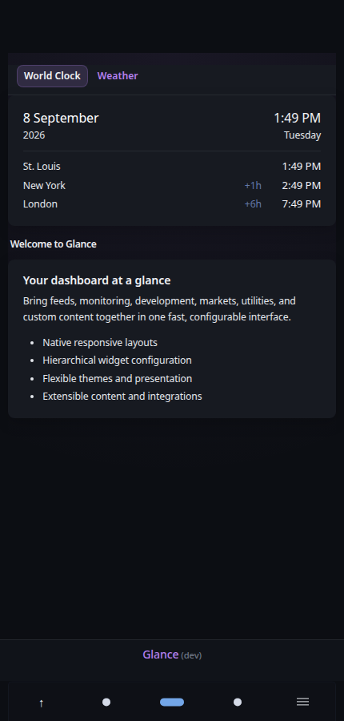
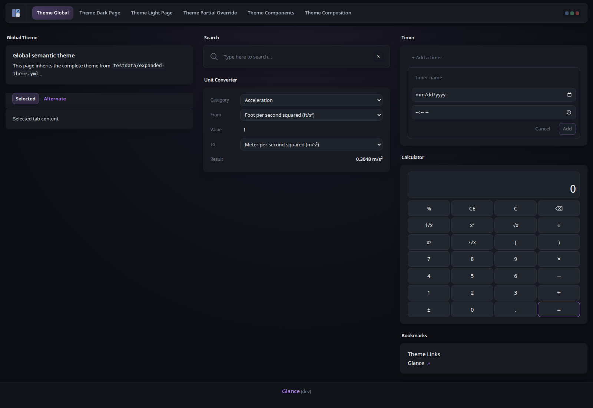

<p align="center"></p>
<h1 align="center">Glance</h1>
<p align="center">
  <a href="#installation">Install</a> •
  <a href="docs/configuration.md#configuring-glance">Configuration</a> •
  <a href="docs/widgets.md">Widgets</a> •
  <a href="docs/fork.md">About this fork</a>
</p>
<p align="center">
  <a href="docs/examples.md">Examples</a> •
  <a href="docs/preconfigured-pages.md">Preconfigured pages</a> •
  <a href="docs/themes.md">Themes</a>
</p>

<p align="center">A lightweight, highly customizable dashboard that displays<br>your feeds and services in a beautiful, streamlined interface.</p>


## About this fork

This repository is a maintained, substantially extended distribution of [Glance](https://github.com/glanceapp/glance). It preserves the familiar Glance configuration model and user experience while adding functionality, reliability and lifecycle improvements, operational diagnostics, expanded regression and visual testing, and controlled development, release, and deployment tooling.

Existing upstream Glance configurations are intended to remain compatible with this fork. Fork-specific configuration is additive unless explicitly documented otherwise, allowing existing installations to adopt the fork without requiring a configuration migration.

The fork continues to track upstream Glance while intentionally minimizing **unnecessary** divergence. Its internal implementation and engineering infrastructure have evolved substantially where additional functionality, production reliability, maintainability, observability, or regression protection provide concrete benefit. Upstream changes continue to be reviewed and incorporated deliberately so those guarantees are preserved.

Formal fork releases retain the incorporated upstream release version and add a fork-specific revision, using the format `v<upstream-version>-samcro1967.r<revision>`.

See **[About the samcro1967 Glance fork](docs/fork.md)** for the complete record of fork-specific functionality, architectural and reliability work, testing and CI practices, security maintenance, release and container-image lifecycle, production deployment safeguards, and upstream synchronization.

### What this fork adds

The fork extends Glance across several areas while preserving upstream-compatible defaults and configuration where practical:

* **Dashboard functionality** — additional native widgets, nested groups, stacks, medium columns, named dashboards, bottom widgets, footer micro-widgets, status bars, page navigation icons, and expanded Weather and Calendar functionality.
* **Configuration and presentation** — hierarchical widget defaults, widget title icons, a comprehensive semantic theme system, page-level theme overrides, named theme presets, density controls, and shared native presentation primitives.
* **Custom API capabilities** — expanded template helpers, Sprout functions, dynamic request controls, stale-content fallback, lifecycle-aware subrequests, and opt-in native metrics, cards, tables, charts, controls, and state presentation.
* **Refresh and runtime reliability** — automatic background widget recovery, progressive retry behavior, stale and degraded-state handling, cancellation-aware refreshes, bounded concurrency, live widget updates, configuration reload hardening, and explicit lifecycle ownership.
* **Provider and HTTP hardening** — shared request infrastructure, bounded provider responses, connection reuse controls, failure classification, partial-result handling, safer parsing, and targeted provider correctness fixes.
* **Diagnostics and observability** — structured operational logging, authenticated runtime diagnostics, frontend diagnostics, performance telemetry, browser performance capture, Go profiling, and repeatable benchmarks.
* **Regression protection** — extensive Go and race-detector coverage, deterministic desktop and mobile browser regression testing, visual QA contracts, managed documentation screenshots, frontend execution coverage, static analysis, vulnerability analysis, and informational Lighthouse testing.
* **Controlled delivery** — Makefile-managed development, validation, pull requests, CI, container publication, formal releases, guarded production deployment, verification, and upstream synchronization.

The detailed implementation history, provenance, compatibility contracts, and lifecycle architecture are maintained in **[About this fork](docs/fork.md)** rather than duplicated here.

## Features

### Dashboard and widgets

* RSS feeds, Reddit, Hacker News, Lobsters, YouTube, Twitch, releases, markets, weather, calendars, bookmarks, search, server statistics, Docker monitoring, and many more
* Native Custom API, Extension, HTML, iframe, and Markdown options for custom content
* Multiple pages, flexible column layouts, groups, nested groups, stacks, split columns, head widgets, and bottom widgets
* Fork widgets including ICS Events, Timer, Stopwatch, Torrenting, ARR, Unit Converter, Calculator, Analog Clock, Status Bar, and additional layout and utility components
* [Complete widget catalog](docs/widgets.md)

### Fast and resilient

* Low memory usage, few dependencies, and minimal client-side JavaScript
* Server-side background refresh and automatic recovery for updateable widgets
* Live delivery of refreshed widget content to open browsers without full-page reloads
* Shared provider resources where equivalent requests can safely reuse data
* Stale-data preservation where supported so temporary dependency failures do not unnecessarily replace useful content
* Formal container images for 64-bit Linux AMD64 and ARM64 platforms
* Integrated runtime diagnostics, frontend performance telemetry, Go profiling, and repeatable benchmarks for investigating production performance without relying on speculative optimization

### Highly customizable

* Multiple dashboards, pages, layouts, columns, groups, and tabs
* Hierarchical widget defaults for sharing common configuration globally or by widget type
* Extensive per-widget configuration
* Native semantic themes covering colors, typography, backgrounds, navigation, widgets, cards, controls, surfaces, and more
* Global themes with optional page-level overrides and named theme presets
* Custom CSS for presentation beyond the native theme system

See the **[configuration documentation](docs/configuration.md)** and **[theme documentation](docs/themes.md)** for the complete configuration surface.

### Mobile friendly

Glance adapts its dashboard layouts and navigation for smaller screens while retaining the same configured pages and content.



### Themeable

Native themes can customize Glance without requiring CSS, while custom CSS remains available when deeper presentation control is needed.



## Configuration

Glance is configured with YAML. A minimal dashboard can be as small as:

```yaml
pages:
  - name: Home
    columns:
      - size: small
        widgets:
          - type: calendar

          - type: weather
            location: New York, United States

      - size: full
        widgets:
          - type: hacker-news

      - size: small
        widgets:
          - type: markets
            markets:
              - symbol: SPY
                name: S&P 500
```

The repository provides several levels of configuration documentation:

* [`docs/glance.yml`](docs/glance.yml) — a fuller starting configuration that can be copied and customized.
* [Configuration documentation](docs/configuration.md) — page structure, shared configuration, widget defaults, server settings, branding, themes, and other top-level options.
* [Widget catalog](docs/widgets.md) — configuration and examples for individual widgets.
* [Theme documentation](docs/themes.md) — native themes, presets, page overrides, and custom styling.
* [`test-instance.yml`](test-instance.yml) — the comprehensive development, regression, and visual-QA fixture. It demonstrates a broad portion of the supported configuration surface, but is intended for testing and reference rather than as a production starting configuration.

## Installation

This fork is distributed as a Docker container through GitHub Container Registry. Formal release images support Linux AMD64 and ARM64.

### Docker Compose

Create a `docker-compose.yml` file:

```yaml
services:
  glance:
    container_name: glance
    image: ghcr.io/samcro1967/glance:latest
    restart: unless-stopped
    volumes:
      - ./config:/app/config
    ports:
      - 8080:8080
```

Create the configuration directory and download the starting configuration:

```bash
mkdir -p config
wget -O config/glance.yml https://raw.githubusercontent.com/samcro1967/glance/refs/heads/main/docs/glance.yml
```

Then start Glance:

```bash
docker compose up -d
```

Glance will be available on port `8080`. To inspect its logs:

```bash
docker compose logs glance
```

### Container tags

Two container-image channels serve different purposes:

* `ghcr.io/samcro1967/glance:latest` — the latest formal, stable fork release.
* `ghcr.io/samcro1967/glance:dev` — the current integrated development build from the `dev` branch.

Formal releases also publish immutable versioned tags such as:

```text
ghcr.io/samcro1967/glance:v<upstream-version>-samcro1967.r<revision>
```

For normal installations, use `latest`. The `dev` image may contain functionality that has not yet completed formal release.

Standalone precompiled binaries are not published by this fork. See [About this fork](docs/fork.md) for complete versioning, release, and container-image details.

### Updating

To update an installation using `latest`:

```bash
docker compose pull glance
docker compose up -d glance
```

## FAQ

<details>
<summary><strong>Does the information on the page update automatically?</strong></summary>
<br>

Yes. Updateable widgets are refreshed and recovered server-side when their cached data expires, even when no page is open. When a page is open, refreshed widget content is automatically delivered to the browser without requiring a full-page reload. Client-side information such as clocks and relative times also updates dynamically where appropriate.

</details>

<details>
<summary><strong>How frequently do widgets update?</strong></summary>
<br>

Updateable widgets refresh after their cached data expires. The normal interval is determined by each widget's cache lifetime and can be configured where supported. Failed refreshes use progressive retry backoff so temporary dependency or network failures can recover automatically.

</details>

<details>
<summary><strong>Can I create my own widgets?</strong></summary>
<br>

Yes. Glance provides several ways to add custom content:

* `iframe` — embed content from another website.
* `html` — render configured static HTML.
* `extension` — fetch rendered HTML from an external endpoint.
* `custom-api` — fetch JSON and render it with a Go template.
* `markdown` — render configured Markdown using native Glance styling.

See the [widget catalog](docs/widgets.md) for configuration details.

</details>

<details>
<summary><strong>How closely does this fork track upstream Glance?</strong></summary>
<br>

The fork continues to track upstream Glance while minimizing unnecessary divergence. Upstream changes are reviewed and integrated deliberately so fork-specific functionality, reliability improvements, architectural contracts, and regression protection can be preserved.

Although the fork's internal implementation and engineering infrastructure have evolved substantially, upstream configuration compatibility remains an explicit goal. See [About this fork](docs/fork.md) for the current upstream-maintenance model and the detailed list of changes from upstream.

</details>

<details>
<summary><strong>What is the difference between `latest` and `dev`?</strong></summary>
<br>

`latest` identifies the most recent formal fork release. `dev` identifies the current integrated development build from the protected `dev` branch. Changes can therefore appear in `dev` before they are promoted to `main` and formally released.

</details>

<details>
<summary><strong>Can existing Glance configurations be used with this fork?</strong></summary>
<br>

Yes. The fork is designed to preserve compatibility with upstream Glance configuration while adding optional functionality. Existing configurations should not require migration simply to run this fork, and fork-specific configuration features are additive unless explicitly documented otherwise.

</details>

## Feature requests

Issues and feature requests related to functionality specific to this fork can be submitted to the [fork's issue tracker](https://github.com/samcro1967/glance/issues).

For requests concerning upstream Glance rather than fork-specific functionality, use the [upstream Glance issue tracker](https://github.com/glanceapp/glance/issues).

## Development and contributing

Contributions and fork development follow a controlled `development branch → dev → main → formal release → explicit production deployment → main-to-dev synchronization` workflow.

The repository Makefile is the authoritative interface for normal development, testing, validation, visual QA, pull-request, release, and deployment operations. Changes should preserve existing behavior and upstream compatibility where practical, reuse established Glance architecture and semantic presentation primitives, and include appropriate regression tests and documentation updates.

See **[CONTRIBUTING.md](CONTRIBUTING.md)** for development practices, implementation expectations, testing requirements, frontend and visual-QA workflows, documentation screenshots, and pull-request validation.

See **[About this fork](docs/fork.md#development-and-ci-validation)** for the complete branch, CI, release, image-publication, deployment, and upstream-maintenance architecture.
