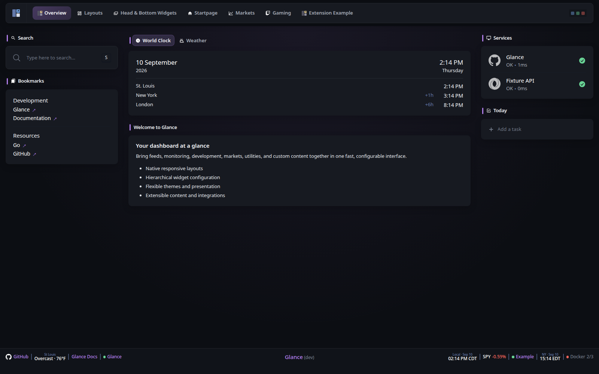
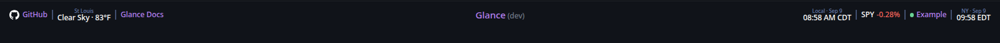
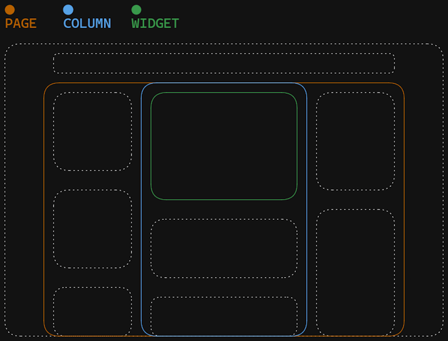

# Configuring Glance

> Configure Glance itself: files, secrets, authentication, server settings, branding, pages, columns, dashboards, and widget defaults.

[Glance README](../README.md) · [Widgets](widgets.md) · [Themes](themes.md) · [Preconfigured pages](preconfigured-pages.md)

## On this page

- [Getting started](#preconfigured-page)
- [Configuration file](#the-config-file)
  - [Auto reload](#auto-reload)
  - [Environment variables & secrets](#environment-variables)
  - [Including other config files](#including-other-config-files)
  - [Widget defaults](#widget-defaults)
  - [Icons](#icons)
  - [Config schema](#config-schema)
- [Authentication](#authentication)
- [Server](#server)
- [Document](#document)
- [Branding](#branding)
- [Theme](#theme)
- [Pages & columns](#pages--columns)
  - [Named dashboards](#named-dashboards)
  - [Columns](#columns)
- [Widgets](#widgets)
- [Footer micro-widgets](#footer-micro-widgets)

---

## Preconfigured page
If you don't want to spend time reading through all the available configuration options and just want something to get you going quickly you can use [this `glance.yml` file](glance.yml) and make changes to it as you see fit. It will give you a page that looks like the following:



Configure the widgets, add more of them, add extra pages, etc. Make it your own!

## The config file


### Auto reload
Automatic config reload is supported, meaning that you can make changes to the config file and have them take effect on save without having to restart the container/service. Making changes to environment variables does not trigger a reload and requires manual restart. Deleting a config file will stop that file from being watched, even if it is recreated.

> [!NOTE]
>
> If you attempt to start Glance with an invalid config it will exit with an error outright. If you successfully started Glance with a valid config and then made changes to it which result in an error, you'll see that error in the console and Glance will continue to run with the old configuration. You can then continue to make changes and when there are no errors the new configuration will be loaded.

> [!CAUTION]
>
> Reloading the configuration file clears your cached data, meaning that you have to request the data anew each time you do this. This can lead to rate limiting for some APIs if you do it too frequently. Having a cache that persists between reloads will be added in the future.

### Environment variables
Inserting environment variables is supported anywhere in the config. This is done via the `${ENV_VAR}` syntax. Attempting to use an environment variable that doesn't exist will result in an error and Glance will either not start or load your new config on save. Example:

```yaml
server:
  host: ${HOST}
  port: ${PORT}
```

Can also be in the middle of a string:

```yaml
- type: rss
  title: ${RSS_TITLE}
  feeds:
    - url: http://domain.com/rss/${RSS_CATEGORY}.xml
```

Works with any type of value, not just strings:

```yaml
- type: rss
  limit: ${RSS_LIMIT}
```

If you need to use the syntax `${NAME}` in your config without it being interpreted as an environment variable, you can escape it by prefixing with a backslash ``:

```yaml
something: \${NOT_AN_ENV_VAR}
```

#### Other ways of providing tokens/passwords/secrets

You can use [Docker secrets](https://docs.docker.com/compose/how-tos/use-secrets/) with the following syntax:

```yaml
# This will be replaced with the contents of the file /run/secrets/github_token
# so long as the secret `github_token` is provided to the container
token: ${secret:github_token}
```

Alternatively, you can load the contents of a file who's path is provided by an environment variable:

`docker-compose.yml`
```yaml
services:
  glance:
    image: glanceapp/glance
    environment:
      - TOKEN_FILE=/home/user/token
    volumes:
      - /home/user/token:/home/user/token
```

`glance.yml`
```yaml
token: ${readFileFromEnv:TOKEN_FILE}
```

> [!NOTE]
>
> The contents of the file will be stripped of any leading/trailing whitespace before being used.

### Including other config files
Including config files from within your main config file is supported. This is done via the `$include` directive along with a relative or absolute path to the file you want to include. If the path is relative, it will be relative to the main config file. Additionally, environment variables can be used within included files, and changes to the included files will trigger an automatic reload. Example:

```yaml
pages:
  - $include: home.yml
  - $include: videos.yml
  - $include: homelab.yml
```

The file you are including should not have any additional indentation, its values should be at the top level and the appropriate amount of indentation will be added automatically depending on where the file is included. Example:

`glance.yml`

```yaml
pages:
  - name: Home
    columns:
      - size: full
        widgets:
          - $include: rss.yml
  - name: News
    columns:
      - size: full
        widgets:
          - type: group
            widgets:
              - $include: rss.yml
              - type: reddit
                subreddit: news
```

`rss.yml`

```yaml
- type: rss
  title: News
  feeds:
    - url: ${RSS_URL}
```

The `$include` directive can be used anywhere in the config file, not just in the `pages` property, however it must be on its own line and have the appropriate indentation.

If you encounter YAML parsing errors when using the `$include` directive, the reported line numbers will likely be incorrect. This is because the inclusion of files is done before the YAML is parsed, as YAML itself does not support file inclusion. To help with debugging in cases like this, you can use the `config:print` command and pipe it into `less -N` to see the full config file with includes resolved and line numbers added:

```sh
glance --config /path/to/glance.yml config:print | less -N
```

This is a bit more convoluted when running Glance inside a Docker container:

```sh
docker run --rm -v ./glance.yml:/app/config/glance.yml glanceapp/glance config:print | less -N
```

This assumes that the config you want to print is in your current working directory and is named `glance.yml`.

### Widget defaults

The optional top-level `widget-defaults` property lets you define shared widget settings once and inherit them across the dashboard. Existing configurations do not need to use `widget-defaults`; when it is omitted, existing widget syntax and built-in behavior remain unchanged.

Defaults can be defined globally and refined for a particular widget type:

```yaml
widget-defaults:
  global:
    cache: 30m
    new-tab: true

  types:
    rss:
      cache: 15m
      collapse-after: 8
    monitor:
      timeout: 5s
```

#### Resolution and precedence

Defaults are resolved from least specific to most specific:

```text
built-in widget default
        ↓
widget-defaults.global
        ↓
widget-defaults.types.<widget-type>
        ↓
widget instance
        ↓
child/source setting, where supported
```

The most specific explicitly configured value wins. Explicit widget and child/source settings therefore continue to override inherited defaults.

For example:

```yaml
widget-defaults:
  global:
    cache: 30m
  types:
    rss:
      cache: 15m

pages:
  - name: Home
    columns:
      - size: full
        widgets:
          - type: rss
            feeds:
              - url: https://example.com/news.xml

          - type: rss
            cache: 5m
            feeds:
              - url: https://example.com/updates.xml
```

The first RSS widget uses the RSS type default of `15m`. The second uses `5m` because the widget instance is more specific.

Container widgets do not implicitly pass their type defaults to their children. Each child widget resolves defaults according to its own widget type. For example, an RSS widget inside a Status Bar, Group, or Stack still resolves RSS defaults independently.

#### Common capabilities

The following capabilities are common to registered widgets and may be configured under `widget-defaults.global` or `widget-defaults.types.<type>`:

| Name | Type | Description |
| ---- | ---- | ----------- |
| `title` | string | Default widget title |
| `title-url` | string | Default URL opened by the widget title |
| `hide-header` | boolean | Whether the widget header is hidden |
| `css-class` | string | Default custom CSS class |
| `cache` | duration | Default refresh/cache interval where the widget supports configurable caching |
| `new-tab` | boolean | Whether links governed by the widget's common link policy open in a new tab |

`new-tab` is the canonical hierarchical setting for link destination. Existing widget-specific properties such as `same-tab` remain supported and are not deprecated. Where a widget or child exposes one of those existing controls, the more specific setting wins.

#### Capability-specific defaults

Some capabilities are meaningful only for particular widget types. They can be configured under `widget-defaults.types.<type>` and, where supported, directly on widget instances or their child/source entries.

| Name | Type | Description |
| ---- | ---- | ----------- |
| `limit` | integer | Maximum number of displayed items |
| `collapse-after` | integer | Number of visible items before the remainder is collapsed |
| `collapse-after-rows` | integer | Number of visible rows before the remainder is collapsed |
| `timeout` | duration | HTTP request timeout |
| `allow-insecure` | boolean | Allow invalid/self-signed TLS certificates |
| `headers` | map | HTTP request headers |
| `basic-auth` | object | HTTP Basic Authentication credentials |
| `proxy` | string or object | HTTP proxy configuration where supported |

Applicability and inheritance scope are validated. A capability is applied only to widget types and scopes for which it has defined semantics; unsupported combinations are rejected rather than silently changing unrelated behavior.

List capabilities such as `limit` and `collapse-after` are not global defaults. They are available only for compatible widget types. `basic-auth` is also intentionally not global and is available only for compatible type, instance, or child/source scopes.

HTTP defaults apply only to widgets whose endpoint semantics support them. Provider-owned services do not automatically inherit generic HTTP configuration merely because they perform network requests.

#### Child and source settings

Some widgets contain child entries or independently configurable remote sources. Supported defaults can flow to those entries while preserving explicit child/source overrides.

For example:

```yaml
widget-defaults:
  global:
    timeout: 10s
    headers:
      User-Agent: Glance

  types:
    rss:
      timeout: 5s
      basic-auth:
        username: reader
        password: ${RSS_PASSWORD}

pages:
  - name: Home
    columns:
      - size: full
        widgets:
          - type: rss
            feeds:
              - url: https://example.com/feed.xml
              - url: https://example.com/private.xml
                timeout: 15s
```

The first feed inherits the RSS type timeout of `5s`. The second explicitly uses `15s`.

Inherited HTTP headers are merged with more-specific headers, with the more-specific value winning when the same header name is configured at multiple levels. Dedicated authentication settings take precedence over an inherited or custom `Authorization` header.

#### Backward compatibility

`widget-defaults` is additive and optional. A valid configuration that does not use it continues to use the existing widget-specific syntax and built-in defaults. Existing names such as `same-tab` remain valid and do not produce deprecation warnings merely because `new-tab` is the canonical hierarchical capability name.

## Icons

For widgets which provide you with the ability to specify icons such as the monitor, bookmarks, docker containers, etc, you can use the `icon` property to specify a URL to an image or use icon names from multiple libraries via prefixes:

```yml
icon: si:immich # si for Simple icons https://simpleicons.org/
icon: sh:immich # sh for selfh.st icons https://selfh.st/icons/
icon: di:immich # di for Dashboard icons https://github.com/homarr-labs/dashboard-icons
icon: mdi:camera # mdi for Material Design icons https://pictogrammers.com/library/mdi/
```

The `sh:` and `di:` prefixes request SVG icons by default. If an icon is only available as a PNG, add the extension to its name:

```yaml
icon: sh:unmanic.png
```

> [!NOTE]
>
> The icons are loaded externally and are hosted on `cdn.jsdelivr.net`, if you do not wish to depend on a 3rd party you are free to download the icons individually and host them locally.

Icons from the Simple icons library as well as Material Design icons will automatically invert their color to match your light or dark theme, however you may want to enable this manually for other icons. To do this, you can use the `auto-invert` prefix:

```yaml
icon: auto-invert https://example.com/path/to/icon.png # with a URL
icon: auto-invert sh:glance-dark # with a selfh.st icon
```

This expects the icon to be black and will automatically invert it to white when using a dark theme.

If there is no `.svg` version available for a `selfh.st` or `Dashboard` icon, then you can add the image extension of the format you wish to use.
```yaml
icon: sh:glance.png # use the .png version of the icon
icon: sh:glance.webp # use the .webp version of the icon
```

## Config schema

For property descriptions, validation and autocompletion of the config within your IDE, @not-first has kindly created a [schema](https://github.com/not-first/glance-schema). Massive thanks to them for this, go check it out and give them a star!

## Authentication

To make sure that only you and the people you want to share your dashboard with have access to it, you can set up authentication via username and password. This is done through a top level `auth` property. Example:

```yaml
auth:
  secret-key: # this must be set to a random value generated using the secret:make CLI command
  users:
    admin:
      password: 123456
    svilen:
      password: 123456
```

To generate a secret key, run the following command:

```sh
./glance secret:make
```

Or with Docker:

```sh
docker run --rm glanceapp/glance secret:make
```

### Using hashed passwords

If you do not want to store plain passwords in your config file or in environment variables, you can hash your password and provide its hash instead:

```sh
./glance password:hash mysecretpassword
```

Or with Docker:

```sh
docker run --rm glanceapp/glance password:hash mysecretpassword
```

Then, in your config file use the `password-hash` property instead of `password`:

```yaml
auth:
  secret-key: # this must be set to a random value generated using the secret:make CLI command
  users:
    admin:
      password-hash: $2a$10$o6SXqiccI3DDP2dN4ADumuOeIHET6Q4bUMYZD6rT2Aqt6XQ3DyO.6
```

### Preventing brute-force attacks

Glance will automatically block IP addresses of users who fail to authenticate 5 times in a row in the span of 5 minutes. In order for this feature to work correctly, Glance must know the real IP address of requests. If you're using a reverse proxy such as nginx, Traefik, NPM, etc, you must set the `proxied` property in the `server` configuration to `true`:

```yaml
server:
  proxied: true
```

When set to `true`, Glance will use the `X-Forwarded-For` header to determine the original IP address of the request, so make sure that your reverse proxy is correctly configured to send that header.

## Server
Server configuration is done through a top level `server` property. Example:

```yaml
server:
  port: 8080
  assets-path: /home/user/glance-assets
```

### Properties

| Name | Type | Required | Default |
| ---- | ---- | -------- | ------- |
| host | string | no |  |
| port | number | no | 8080 |
| proxied | boolean | no | false |
| base-url | string | no | |
| assets-path | string | no |  |

#### `host`
The address which the server will listen on. Setting it to `localhost` means that only the machine that the server is running on will be able to access the dashboard. By default it will listen on all interfaces.

#### `port`
A number between 1 and 65,535, so long as that port isn't already used by anything else.

#### `proxied`
Set to `true` if you're using a reverse proxy in front of Glance. This will make Glance use the `X-Forwarded-*` headers to determine the original request details.

#### `base-url`
The base URL that Glance is hosted under. No need to specify this unless you're using a reverse proxy and are hosting Glance under a directory. If that's the case then you can set this value to `/glance` or whatever the directory is called. Note that the forward slash (`/`) in the beginning is required unless you specify the full domain and path.

> [!IMPORTANT]
> You need to strip the `base-url` prefix before forwarding the request to the Glance server.
> In Caddy you can do this using [`handle_path`](https://caddyserver.com/docs/caddyfile/directives/handle_path) or [`uri strip_prefix`](https://caddyserver.com/docs/caddyfile/directives/uri).

#### `assets-path`
The path to a directory that will be served by the server under the `/assets/` path. This is handy for widgets like the Monitor where you have to specify an icon URL and you want to self host all the icons rather than pointing to an external source.

> [!IMPORTANT]
>
> When installing through docker the path will point to the files inside the container. Don't forget to mount your assets path to the same path inside the container.
> Example:
>
> If your assets are in:
> ```
> /home/user/glance-assets
> ```
>
> You should mount:
> ```
> /home/user/glance-assets:/app/assets
> ```
>
> And your config should contain:
> ```
> assets-path: /app/assets
> ```

##### Examples

Say you have a directory `glance-assets` with a file `gitea-icon.png` in it and you specify your assets path like:

```yaml
assets-path: /home/user/glance-assets
```

To be able to point to an asset from your assets path, use the `/assets/` path like such:

```yaml
icon: /assets/gitea-icon.png
```

## Document
If you want to insert custom HTML into the `<head>` of the document for all pages, you can do so by using the `document` property. Example:

```yaml
document:
  head: |
    <script src="/assets/custom.js"></script>
```

## Branding
You can adjust the various parts of the branding through a top level `branding` property. Example:

```yaml
branding:
  custom-footer: |
    <p>Powered by <a href="https://github.com/glanceapp/glance">Glance</a></p>
  logo-url: /assets/logo.png
  favicon-url: /assets/logo.png
  app-name: "My Dashboard"
  app-icon-url: "/assets/app-icon.png"
  app-background-color: "#151519"
```

### Properties

| Name | Type | Required | Default |
| ---- | ---- | -------- | ------- |
| hide-footer | bool | no | false |
| custom-footer | string | no |  |
| logo-text | string | no | G |
| logo-url | string | no | |
| favicon-url | string | no | |
| app-name | string | no | Glance |
| app-icon-url | string | no | Glance's default icon |
| app-background-color | string | no | Glance's default background color |

#### `hide-footer`
Hides the footer when set to `true`.

#### `custom-footer`
Specify custom HTML to use for the footer.

#### `logo-text`
Specify custom text to use instead of the "G" found in the navigation.

#### `logo-url`
Specify a URL to a custom image to use instead of the "G" found in the navigation. If both `logo-text` and `logo-url` are set, only `logo-url` will be used.

#### `favicon-url`
Specify a URL to a custom image to use for the favicon.

#### `app-name`
Specify the name of the web app shown in browser tab and PWA.

#### `app-icon-url`
Specify URL for PWA and browser tab icon (512x512 PNG).

#### `app-background-color`
Specify background color for PWA. Must be a valid CSS color.

## Theme

Glance includes a native theme system for customizing colors, typography, page backgrounds, headers, navigation, widgets, cards, groups and tabs, controls, footers, surfaces, and other visual presentation through YAML configuration.

A top-level `theme` defines the default appearance. Individual pages can provide partial theme overrides, and the theme picker can switch between the built-in Glance Dark and Glance Light themes and explicitly named user themes. Custom CSS remains available for advanced styling beyond the native theme options.

See the **[Themes documentation](themes.md)** for the complete theme reference, supported values, inheritance and page overrides, theme picker behavior, custom CSS, examples, and ready-to-use themes.

## Footer micro-widgets

Footer micro-widgets provide compact page-level information and shortcuts on the left and right sides of the standard Glance footer. They do not occupy page columns or count as normal page widgets.



`max-per-side` defaults to `5` and may be set from `1` through `10`. Each micro-widget requires a `position` between `1` and `max-per-side`. Positions must be unique within each side; the same position may be used once on the left and once on the right.

Supported types are `bookmark`, `clock`, `weather`, `markets`, `monitor`, and `link`.

### Configuration

```yaml
footer-micro-widgets:
  max-per-side: 5
  left:
    - type: bookmark
      position: 1
      title: GitHub
      url: https://github.com/glanceapp/glance
      icon: si:github
    - type: weather
      position: 2
      location: St. Louis, Missouri
      units: imperial
    - type: link
      position: 3
      title: Glance Docs
      url: https://github.com/glanceapp/glance/tree/main/docs
  right:
    - type: clock
      position: 1
      hour-format: 12h
      label: Local
    - type: markets
      position: 2
      markets:
        - symbol: SPY
    - type: monitor
      position: 3
      sites:
        - title: Example
          url: https://example.com
```

Items are displayed in position order. Footer micro-widgets are hidden at viewport widths of 1190px and below and are suppressed whenever the normal footer is hidden with `branding.hide-footer`.

### Bookmark

Displays a titled link with an optional Glance icon.

```yaml
- type: bookmark
  position: 1
  title: GitHub
  url: https://github.com/glanceapp/glance
  icon: si:github
  same-tab: false
```

`title` and `url` are required. `icon` is optional. `same-tab` defaults to `false`.

### Link

Displays a simple titled link without an icon.

```yaml
- type: link
  position: 3
  title: Glance Docs
  url: https://github.com/glanceapp/glance/tree/main/docs
  same-tab: true
```

`title` and `url` are required. `same-tab` defaults to `false`.

### Clock

Displays a compact date and time. When `timezone` is omitted, the browser local timezone is used.

```yaml
- type: clock
  position: 1
  hour-format: 12h
  timezone: America/Chicago
  label: Local
```

`hour-format` defaults to `24h` and accepts `12h` or `24h`. `timezone` is optional and accepts an IANA timezone such as `America/Chicago`. `label` is optional.

### Weather

Displays compact current weather using the shared Open-Meteo weather resources.

```yaml
- type: weather
  position: 2
  location: St. Louis, Missouri
  units: imperial
  show-area-name: false
  hide-location: false
```

`location` is required. `units` defaults to `metric` and accepts `metric` or `imperial`. `show-area-name` optionally includes the returned area name, while `hide-location` suppresses the location line.

Weather refreshes on the hourly boundary and equivalent Open-Meteo requests share the existing resource cache.

### Markets

Displays compact market symbols and percentage changes using the shared Yahoo Markets resources.

```yaml
- type: markets
  position: 2
  markets:
    - symbol: SPY
    - symbol: QQQ
  sort-by: absolute-change
```

At least one market symbol is required. `stocks` is accepted as a compatibility alias when `markets` is not configured. The optional `sort-by` setting supports `change` and `absolute-change`; when omitted, market results retain their returned order. `chart-link-template` and `symbol-link-template` are also supported and may contain `{SYMBOL}`.

Market data uses a one-hour cache and equivalent Yahoo Markets requests share the existing resource cache.

### Monitor

Displays compact site status using the same site configuration and status behavior as the Monitor widget.

```yaml
- type: monitor
  position: 3
  show-failing-only: false
  sites:
    - title: Example
      url: https://example.com
```

At least one site is required. Site entries use the Monitor widget site configuration. When `show-failing-only` is enabled and every configured site is healthy, the micro-widget displays an all-online state.

Monitor data uses a five-minute cache. Equivalent Monitor requests share cached results rather than issuing duplicate requests.

Dynamic Weather, Markets, and Monitor micro-widgets participate in the normal Glance initialization, refresh, recovery, and live-update lifecycle. Bookmark, Clock, and Link require no provider refresh.


## Pages & Columns


Using pages and columns is how widgets are organized. Each page contains up to 3 columns and each column can have any number of widgets.

### Pages
Pages are defined through a top level `pages` property.

When `dashboards` is not configured, Glance uses its standard page behavior: the page defined first becomes the home page and all pages are automatically added to the navigation bar in the order that they were defined.

```yaml
pages:
  - name: Home
    columns: ...

  - name: Page 2
    columns: ...

  - name: Page 3
    columns: ...
```

When [named dashboards](#named-dashboards) are configured, pages are still defined only once under `pages`, but each dashboard controls which pages appear in its navigation and in what order.

### Properties
| Name | Type | Required | Default |
| ---- | ---- | -------- | ------- |
| name | string | yes | |
| slug | string | no | |
| width | string | no | |
| desktop-navigation-width | string | no | |
| center-vertically | boolean | no | false |
| hide-desktop-navigation | boolean | no | false |
| show-mobile-header | boolean | no | false |
| head-widgets | array | no | |
| bottom-widgets | array | no | |
| columns | array | yes | |

#### `name`
The name of the page which gets shown in the navigation bar.

#### `slug`
The URL friendly version of the title which is used to access the page. For example if the title of the page is "RSS Feeds" you can make the page accessible via `localhost:8080/feeds` by setting the slug to `feeds`. If not defined, it will automatically be generated from the title.

#### `width`
The maximum width of the page on desktop. Possible values are `default`, `slim` and `wide`.

#### `desktop-navigation-width`
The maximum width of the desktop navigation. Useful if you have a few pages that use a different width than the rest and don't want the navigation to jump abruptly when going to and away from those pages. Possible values are `default`, `slim` and `wide`.

Here are the pixel equivalents for each value:

* default: `1600px`
* slim: `1100px`
* wide: `1920px`

> [!NOTE]
>
> When using `slim`, the maximum number of columns allowed for that page is `2`.

#### `center-vertically`
When set to `true`, vertically centers the content on the page. Has no effect if the content is taller than the height of the viewport.

#### `hide-desktop-navigation`
Whether to show the navigation links at the top of the page on desktop.

#### `show-mobile-header`
Whether to show a header displaying the name of the page on mobile. The header purposefully has a lot of vertical whitespace in order to push the content down and make it easier to reach on tall devices.

Preview:


#### `head-widgets`

Head widgets will be shown at the top of the page, above the columns, and take up the combined width of all columns. You can specify any widget, though some will look better than others, such as the markets, RSS feed with `horizontal-cards` style, and videos widgets. Example:


```yaml
pages:
  - name: Home
    head-widgets:
      - type: markets
        hide-header: true
        markets:
          - symbol: SPY
            name: S&P 500
          - symbol: BTC-USD
            name: Bitcoin
          - symbol: NVDA
            name: NVIDIA
          - symbol: AAPL
            name: Apple
          - symbol: MSFT
            name: Microsoft

    columns:
      - size: small
        widgets:
          - type: calendar
      - size: full
        widgets:
          - type: hacker-news
      - size: small
        widgets:
          - type: weather
            location: London, United Kingdom
```

#### `bottom-widgets`

Bottom widgets will be shown at the bottom of the page, below the columns, and take up the combined width of all columns. As with `head-widgets`, you can specify any widget, though widgets designed for wider layouts will generally work best.

Example:

```yaml
pages:
  - name: Home
    columns:
      - size: small
        widgets:
          - type: calendar
      - size: full
        widgets:
          - type: hacker-news
      - size: small
        widgets:
          - type: weather
            location: London, United Kingdom

    bottom-widgets:
      - type: videos
        channels:
          - UC_x5XG1OV2P6uZZ5FSM9Ttw
```

Preview:


### Named dashboards

Named dashboards allow the same configured pages to be organized into multiple independently addressable navigation sets.

Pages continue to be defined once under the top-level `pages` property. The optional top-level `dashboards` property selects which pages belong to each dashboard and controls their navigation order.

A page can belong to multiple dashboards. The page itself is not duplicated: each dashboard uses the same underlying page, widgets, cached data, and update lifecycle.

Example:

```yaml
pages:
  - name: Home
    slug: home
    columns: ...

  - name: Page 2
    slug: page2
    columns: ...

  - name: Page 3
    slug: page3
    columns: ...

  - name: Shared
    slug: shared
    columns: ...

dashboards:
  Default:
    - home
    - page2
    - page3
    - shared

  Personal:
    - home
    - page2
    - shared

  Family:
    - home
    - page3
    - shared
```

Dashboard entries reference pages by their slug. If a page does not explicitly define a `slug`, its automatically generated slug is used.

Preview:


#### Default dashboard

When `dashboards` is configured, a dashboard named `Default` is required.

The `Default` dashboard controls the standard Glance routes. Its first page becomes the home page at `/`, and its pages use their normal top-level paths.

Using the example above:

```text
/          -> Home
/page2     -> Page 2
/page3     -> Page 3
/shared    -> Shared
```

Only pages assigned to `Default` appear in the default navigation.

#### Named dashboard routes

Every dashboard other than `Default` receives its own URL prefix generated from the dashboard name.

The first page assigned to the dashboard becomes its dashboard home page.

For example, the `Personal` dashboard above is available at:

```text
/personal/         -> Home
/personal/page2    -> Page 2
/personal/shared   -> Shared
```

The `Family` dashboard is available at:

```text
/family/         -> Home
/family/page3    -> Page 3
/family/shared   -> Shared
```

#### Dashboard switcher

When named dashboards are configured, the application logo in the desktop navigation acts as a dashboard switcher.

Selecting the logo opens a menu containing all available dashboards in the same order they are defined under `dashboards`. The currently active dashboard is indicated in the menu.

Selecting a dashboard navigates to that dashboard's home page:

```text
Default  -> /
Personal -> /personal/
Family   -> /family/
```

The switcher can be closed by selecting the logo again, clicking outside the menu, or pressing <kbd>Escape</kbd>. When the logo is focused using keyboard navigation, <kbd>Enter</kbd> or <kbd>Space</kbd> opens or closes the switcher.

On mobile, the available dashboards are shown with the other mobile navigation actions.

When `dashboards` is not configured, the application logo retains the standard Glance behavior and no dashboard switcher is shown.

Navigation within a named dashboard remains inside that dashboard. For example, selecting Shared while viewing the `Family` dashboard links to `/family/shared` rather than `/shared`.

A page that exists globally but is not assigned to a particular dashboard cannot be accessed through that dashboard's route.

#### Shared pages

Pages referenced by multiple dashboards are shared rather than copied.

For example, because `shared` belongs to `Default`, `Personal`, and `Family`, all three dashboard routes render the same configured Shared page:

```text
/shared
/personal/shared
/family/shared
```

This means you do not need separate page configurations for each dashboard, and widgets retain the same caching and update behavior regardless of which dashboard is used to view the page.

#### Backward compatibility

The `dashboards` property is optional.

If it is omitted, Glance behaves exactly as it does without this feature:

- the first configured page is the home page;
- all configured pages appear in navigation;
- pages use their normal top-level routes.

Existing configurations therefore continue to work without modification.

#### Validation

When `dashboards` is configured:

- a `Default` dashboard is required;
- each dashboard must contain at least one page;
- every referenced page slug must exist;
- the same page cannot be listed more than once in a dashboard;
- dashboard names must generate unique URL slugs;
- dashboard slugs cannot conflict with reserved Glance routes.

Named dashboard slugs also cannot conflict with page slugs. If a named dashboard generates the same slug as an existing page, that dashboard is ignored and a warning is logged. Glance continues running with the remaining valid dashboards and pages.

For example, if a page uses the slug `personal`, a named dashboard that also generates the slug `personal` will be ignored. The existing `/personal` page route remains available.

The order of pages in each dashboard determines both the navigation order and which page becomes that dashboard's home page.

### Columns
Columns are defined for each page using a `columns` property. There are three column sizes: `full`, `medium` and `small`.

A `small` column has a fixed width of 300px. A `full` column takes up the remaining available width. A `medium` column is used for proportional layouts: three `medium` columns divide the available width evenly, while a `medium` column paired with a `full` column uses approximately one third and two thirds of the available width, respectively.

Pages can have up to 3 columns. Traditional layouts using only `small` and `full` columns must contain either 1 or 2 `full` columns. When using `medium`, the supported layouts are three `medium` columns, or one `medium` column paired with one `full` column in either order.

When the page is displayed using the mobile layout, one column is shown at a time regardless of its configured size.

Example:

```yaml
pages:
  - name: Home
    columns:
      - size: small
        widgets: ...
      - size: full
        widgets: ...
      - size: small
        widgets: ...
```

### Properties
| Name | Type | Required |
| ---- | ---- | -------- |
| size | string | yes |
| widgets | array | no |

The `size` property accepts `small`, `medium` or `full`.

Here are some of the possible traditional column configurations:


```yaml
columns:
  - size: small
    widgets: ...
  - size: full
    widgets: ...
  - size: small
    widgets: ...
```


```yaml
columns:
  - size: full
    widgets: ...
  - size: small
    widgets: ...
```


```yaml
columns:
  - size: full
    widgets: ...
  - size: full
    widgets: ...
```

Three equal-width columns can be configured using `medium`:

```yaml
columns:
  - size: medium
    widgets: ...
  - size: medium
    widgets: ...
  - size: medium
    widgets: ...
```

Preview:


A one-third/two-thirds layout can be configured with `medium` and `full`:

```yaml
columns:
  - size: medium
    widgets: ...
  - size: full
    widgets: ...
```

Preview:


The order can be reversed to place the wider column first:

```yaml
columns:
  - size: full
    widgets: ...
  - size: medium
    widgets: ...
```


## Widgets

Widgets are the individual components used to build Glance pages. See the [widget catalog and reference](widgets.md) for available widgets, shared widget properties, examples, and configuration details.

---

[Glance README](../README.md) · [Widgets](widgets.md) · [Back to top](#configuring-glance)
