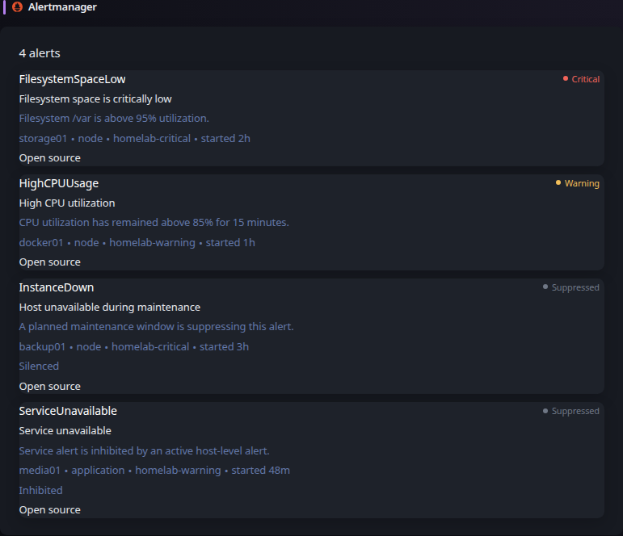

# Alertmanager

[Glance README](../../../../README.md) · [Configuration](../../../configuration.md) · [Widgets](../../../widgets.md) · [Examples](../../../examples.md) · [Custom API](../../../widgets/custom-api.md)

This example displays Prometheus Alertmanager alerts directly through the Custom API widget. No external producer or native Alertmanager widget is required: Glance consumes Alertmanager API v2 JSON directly.



## Files

- `example.yml` shows the Custom API configuration.
- `template.yml` renders the native Alertmanager response.
- `example.json` provides deterministic representative Alertmanager API data for testing and visual documentation.

## Alertmanager API

The widget uses `GET /api/v2/alerts`. Alertmanager returns an array containing alert labels, annotations, receivers, timestamps, status information, fingerprints, and optional generator URLs.

Alertmanager can perform filtering before the response reaches Glance. The endpoint supports controls for active, silenced, inhibited, and unprocessed alerts, repeated label matchers through `filter`, receiver filtering, and receiver label matchers.

## Glance configuration

```yaml
- type: custom-api
  title: Alertmanager
  icon: sh:prometheus
  url: ${ALERTMANAGER_URL}/api/v2/alerts
  cache: 1m
  headers:
    Accept: application/json
  template: |
    $include: path/to/alertmanager/template.yml
```

Set `ALERTMANAGER_URL` to the base URL of the Alertmanager instance reachable by Glance.

The template displays the alert name, severity or suppression state, summary, description, instance, job, receivers, relative start time, suppression reason, and a source link when `generatorURL` is present.

An empty alert array renders a healthy `No alerts` state.

## Authentication

If Alertmanager is protected by a reverse proxy or authentication layer, use the Custom API widget headers or authentication options appropriate for that environment. Keep credentials in environment variables or another secret-management mechanism rather than committing them to configuration.

---

[Glance README](../../../../README.md) · [Configuration](../../../configuration.md) · [Widgets](../../../widgets.md) · [Examples](../../../examples.md) · [Custom API](../../../widgets/custom-api.md) · [Back to top](#alertmanager)
