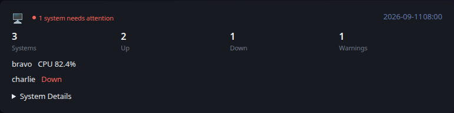

# Beszel

[Glance README](../../../../../../README.md) · [Configuration](../../../../../configuration.md) · [Widgets](../../../../../widgets.md) · [Examples](../../../../../examples.md) · [Custom API Monitoring](../../README.md)

This integration retrieves system information from Beszel and converts it to the shared [Custom API Monitoring](../../README.md) JSON contract.

The example keeps data collection separate from Glance. `fetch.py` queries Beszel, writes a JSON file, and Glance consumes that file through a URL served by your environment.



## Files

- [fetch.py](fetch.py) retrieves Beszel system data and produces the monitoring JSON.
- [example.json](example.json) shows representative output produced by the integration and can be used as a static test fixture.
- [template.yml](../../template.yml) provides the shared Custom API monitoring presentation.

## Requirements

- Python 3
- The `requests` Python package
- A Beszel instance accessible from the system running the producer
- A Beszel API token with access to the systems collection

## Configuration

The producer is configured with environment variables:

- `BESZEL_URL` — Beszel base URL. Defaults to `http://localhost:8090`.
- `BESZEL_TOKEN` — bearer token used to authenticate with Beszel. Required.
- `OUTPUT_FILE` — path where the generated JSON is written. Defaults to `beszel_metrics.json`.

## Usage

Install the Python dependency:

```bash
python3 -m pip install requests
```

Run the producer with your Beszel URL and API token:

```bash
BESZEL_URL=https://beszel.example.com BESZEL_TOKEN=replace-me python3 fetch.py
```

By default, the producer writes `beszel_metrics.json` in the current directory. Set `OUTPUT_FILE` to change the destination.

The generated JSON file must be served over HTTP from a location reachable by Glance. The Custom API widget URL should point to that served JSON file.

Do not store a real Beszel API token in `fetch.py`, Glance configuration, or files committed to source control. Supply the token through the environment or another secret-management mechanism appropriate for your environment.

## Reported data

The producer reports the total number of Beszel systems and the number that are up or down. When one or more running systems exceed the warning threshold, a Warnings metric is also included.

Each system is classified using its Beszel status and CPU, memory, and disk utilization:

- A system whose Beszel status is not `up` is an error.
- CPU, memory, or disk utilization at or above 90% is an error.
- CPU, memory, or disk utilization at or above 80% is a warning.
- Otherwise, the system is healthy.

The overall widget state is `error` when any system has an error, `warning` when there are warnings but no errors, and `ok` when every system is healthy. An empty systems collection produces a warning with the message `No Beszel systems found`.

Non-healthy systems are included in the details section. The expandable System Details section contains every system, sorted by name, with resource utilization and available host, uptime, and version information.

## Glance configuration

After the generated JSON is available through an HTTP endpoint, configure a Custom API widget to consume it:

```yaml
- type: custom-api
  title: Beszel Metrics
  url: https://example.com/beszel_metrics.json
  cache: 5m
  headers:
    Accept: application/json
  template: |
    $include: path/to/monitoring/template.yml
```

Adjust the URL and template path for your environment.

## Scheduling

`fetch.py` is an external producer and is not executed by Glance. Run it periodically using cron, a systemd timer, a container scheduler, or another scheduling mechanism appropriate for your environment.

The producer schedule controls how often `beszel_metrics.json` is regenerated. The Custom API `cache` controls how often Glance requests that JSON endpoint. These are independent intervals; the producer should normally run at least as often as the freshness you want Glance to display.

The example intentionally leaves scheduling, alert delivery, extensive retry behavior, and other environment-specific operations outside the producer.

---

[Glance README](../../../../../../README.md) · [Configuration](../../../../../configuration.md) · [Widgets](../../../../../widgets.md) · [Examples](../../../../../examples.md) · [Custom API Monitoring](../../README.md) · [Back to top](#beszel)
