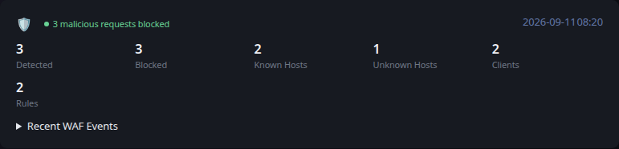

# Coraza

[Glance README](../../../../../../README.md) · [Configuration](../../../../../configuration.md) · [Widgets](../../../../../widgets.md) · [Examples](../../../../../examples.md) · [Custom API Monitoring](../../README.md)

This integration retrieves monitoring information from Coraza / OWASP CRS and converts it to the shared [Custom API Monitoring](../../README.md) JSON contract.

The example keeps data collection separate from Glance. `fetch.py` produces a JSON file, and Glance consumes that file through a URL served by your environment.

The producer reads an existing Caddy/Coraza log file. It does not modify Caddy, Coraza, or firewall state.



## Files

- [fetch.py](fetch.py) reads and normalizes Coraza / OWASP CRS events from a Caddy log.
- [example.json](example.json) provides deterministic representative output and is also used by Glance's visual test fixture.
- [template.yml](../../template.yml) provides the shared Custom API monitoring presentation.

## Requirements

- Python 3
- Caddy with Coraza / OWASP CRS enabled
- A Caddy log file containing the WAF events consumed by the producer
- Read access to that log file for the account or container running `fetch.py`

The public producer uses a simplified single-log design. The configured log must contain the Coraza or OWASP event together with the request information used by the parser. For each event, the producer looks for a Coraza rule ID and, when available, the JSON fields `host`, `remote_ip`, and `status`.

An HTTP `403` status is treated as a blocked request. If your Caddy deployment writes WAF events and access information to separate logs, this simplified producer will need to be adapted to correlate those sources.

## Configuration

The producer is configured with environment variables:

- `CORAZA_LOG_FILE` — path to the Caddy/Coraza log consumed by the producer. Defaults to `/var/log/caddy/caddy.log`.
- `CORAZA_KNOWN_HOSTS` — optional comma-separated hostnames used to distinguish known and unknown hosts.
- `OUTPUT_FILE` — path where the generated monitoring JSON is written. Defaults to `monitoring.json`.

`CORAZA_KNOWN_HOSTS` is optional. When it is omitted, all detected hosts are counted as unknown.

## Usage

First verify that the configured log exists, contains Coraza / OWASP CRS events, and is readable by the account that will run the producer.

Run the producer using the default log path:

```bash
python3 fetch.py
```

Or specify the log and known hosts for your environment:

```bash
CORAZA_LOG_FILE=/path/to/caddy.log CORAZA_KNOWN_HOSTS=app.example.com,api.example.com python3 fetch.py
```

By default the example writes `monitoring.json` in the current directory. Set `OUTPUT_FILE` when another destination is required.

Serve the generated JSON over HTTP from a location reachable by Glance.

## Reported data

The producer reads Coraza WAF events from the configured Caddy log and reports detected requests, blocked requests, known and unknown hosts, unique clients, and unique rules.

A request with an HTTP 403 status is classified as blocked. Rule 949110 is excluded when selecting the reported rule so the underlying detection rule is preferred over the final anomaly-score rule.

The overall widget state is `ok` when no WAF activity is present or when detected malicious requests were blocked. It is `warning` when detections are present but none were blocked. Detected activity and unknown hosts are also highlighted as warning metrics when nonzero.

Recent WAF events are included in the expandable section with the host, client address, rule, and whether the request was blocked.

This public example intentionally uses a simplified single-log parser. More complex deployments may need to correlate WAF and access logs separately.

## Glance configuration

```yaml
- type: custom-api
  title: Coraza
  url: https://example.com/coraza_metrics.json
  cache: 5m
  headers:
    Accept: application/json
  template: |
    $include: path/to/monitoring/template.yml
```

Adjust the URL and template path for your environment.

## Scheduling

`fetch.py` is an external producer and is not executed by Glance. Run it periodically using cron, a systemd timer, a container scheduler, or another scheduler appropriate for your environment.

The producer schedule and the Custom API `cache` interval are independent. The example intentionally leaves alert delivery and environment-specific operational automation outside the producer.

---

[Glance README](../../../../../../README.md) · [Configuration](../../../../../configuration.md) · [Widgets](../../../../../widgets.md) · [Examples](../../../../../examples.md) · [Custom API Monitoring](../../README.md) · [Back to top](#coraza)
