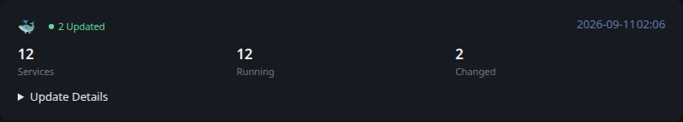

# Docker Updates

[Glance README](../../../../../../README.md) · [Configuration](../../../../../configuration.md) · [Widgets](../../../../../widgets.md) · [Examples](../../../../../examples.md) · [Custom API Monitoring](../../README.md)

This integration displays the results of an existing Docker update workflow using the shared [Custom API Monitoring](../../README.md) JSON contract.

Unlike the other monitoring examples, Docker Updates does not require a separate data collection script. The mechanism that already performs your Docker updates knows which services were inspected, which are running, and which changed. Have that workflow generate JSON matching the structure shown in [example.json](example.json), then serve that JSON from a URL reachable by Glance.

This keeps operational Docker changes outside Glance while avoiding an unnecessary intermediate step.



## Files

- [example.json](example.json) documents the expected JSON structure, provides representative output, and is also used by Glance's visual test fixture.
- [template.yml](../../template.yml) provides the shared Custom API monitoring presentation.

## Requirements

- An existing Docker update workflow or other mechanism that can determine Docker service state and update results.
- A way to write and serve the resulting JSON over HTTP to Glance.

## Output

Have your existing Docker update workflow generate JSON matching this structure:

```json
{
  "icon": "🐳",
  "updated": "2026-09-11 02:06",
  "state": "ok",
  "message": "2 Updated",
  "metrics": [
    {
      "label": "Services",
      "value": "12",
      "state": "neutral"
    },
    {
      "label": "Running",
      "value": "12",
      "state": "ok"
    },
    {
      "label": "Changed",
      "value": "2",
      "state": "neutral"
    }
  ],
  "details": [],
  "expandable_label": "Update Details",
  "expandable_items": [
    {
      "label": "example-api",
      "value": "Updated",
      "state": "neutral"
    },
    {
      "label": "example-worker",
      "value": "Updated",
      "state": "neutral"
    }
  ]
}
```

The exact implementation is intentionally left to your existing Docker update mechanism. For example, a shell script, CI/CD workflow, or container update tool can write this JSON after completing its normal update process.

Serve the generated JSON over HTTP from a location reachable by Glance.

## Reported data

The example reports the number of configured services, running services, and services changed by the most recent Docker update workflow.

When changes are present, the status summarizes how many were updated and the expandable Update Details section identifies the affected services.

`example.json` demonstrates an `ok` result with two updated services. Your update workflow can use the shared monitoring contract's `state` values to represent other conditions when appropriate.

## Glance configuration

```yaml
- type: custom-api
  title: Docker Updates
  url: https://example.com/docker-updates.json
  cache: 5m
  headers:
    Accept: application/json
  template: |
    $include: path/to/monitoring/template.yml
```

Adjust the URL and template path for your environment.

## Scheduling

No separate data collection step needs to be scheduled for this example. Generate or refresh the JSON as part of the Docker update workflow that already knows the update result.

The update workflow schedule and the Custom API `cache` interval are independent.

---

[Glance README](../../../../../../README.md) · [Configuration](../../../../../configuration.md) · [Widgets](../../../../../widgets.md) · [Examples](../../../../../examples.md) · [Custom API Monitoring](../../README.md) · [Back to top](#docker-updates)
