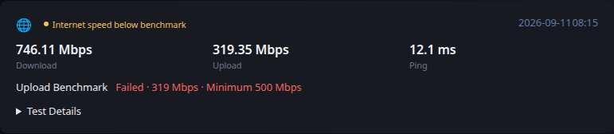

# Internet Speed

[Glance README](../../../../../../README.md) · [Configuration](../../../../../configuration.md) · [Widgets](../../../../../widgets.md) · [Examples](../../../../../examples.md) · [Custom API Monitoring](../../README.md)

This integration retrieves monitoring information from Speedtest Tracker and converts it to the shared [Custom API Monitoring](../../README.md) JSON contract.

The example keeps data collection separate from Glance. `fetch.py` produces a JSON file, and Glance consumes that file through a URL served by your environment.



## Files

- [fetch.py](fetch.py) retrieves and normalizes the monitoring data.
- [example.json](example.json) provides deterministic representative output and is also used by Glance's visual test fixture.
- [template.yml](../../template.yml) provides the shared Custom API monitoring presentation.

## Requirements

- Python 3
- The `requests` Python package
- A Speedtest Tracker API accessible from the system running the producer

## Configuration

The producer is configured with environment variables:

- `SPEEDTEST_TRACKER_URL` — Speedtest Tracker base URL. Defaults to `http://localhost:8765`.
- `SPEEDTEST_TRACKER_TOKEN` — Speedtest Tracker API token.
- `OUTPUT_FILE` — generated JSON path. Defaults to `monitoring.json`.

## Usage

Run the producer after supplying the configuration required by your environment:

```bash
python3 fetch.py
```

By default the example writes `monitoring.json` in the current directory. Set `OUTPUT_FILE` when another destination is required.

Serve the generated JSON over HTTP from a location reachable by Glance. Keep credentials outside the script and outside files committed to source control.

## Reported data

The producer reports the latest download speed, upload speed, and ping returned by Speedtest Tracker.

Download and upload benchmark results determine their metric states. A failed benchmark or an explicitly unhealthy result produces an overall `warning` state. A healthy result with no failed benchmark produces `ok`; otherwise the result remains neutral when health cannot be determined.

Failed benchmarks are included in the details section. The expandable Test Details section includes the download and upload benchmark results together with ISP, server, jitter, packet loss, and test time when available.

If Speedtest Tracker reports a transient or incomplete test, the producer does not replace the previous completed monitoring document. This prevents an in-progress test from temporarily replacing useful monitoring data.

## Glance configuration

```yaml
- type: custom-api
  title: Internet Speed
  url: https://example.com/internet_speed.json
  cache: 5m
  headers:
    Accept: application/json
  template: |
    $include: path/to/monitoring/template.yml
```

Adjust the URL and template path for your environment.

## Scheduling

`fetch.py` is an external producer and is not executed by Glance. Run it periodically using cron, a systemd timer, a container scheduler, or another scheduler appropriate for your environment.

The producer schedule and the Custom API `cache` interval are independent. The example intentionally leaves alert delivery and environment-specific operational automation outside the producer.

---

[Glance README](../../../../../../README.md) · [Configuration](../../../../../configuration.md) · [Widgets](../../../../../widgets.md) · [Examples](../../../../../examples.md) · [Custom API Monitoring](../../README.md) · [Back to top](#internet-speed)
