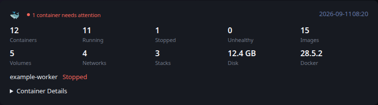

# Portainer

[Glance README](../../../../../../README.md) · [Configuration](../../../../../configuration.md) · [Widgets](../../../../../widgets.md) · [Examples](../../../../../examples.md) · [Custom API Monitoring](../../README.md)

This integration retrieves monitoring information from Portainer and converts it to the shared [Custom API Monitoring](../../README.md) JSON contract.

The example keeps data collection separate from Glance. `fetch.py` produces a JSON file, and Glance consumes that file through a URL served by your environment.



## Files

- [fetch.py](fetch.py) retrieves and normalizes the monitoring data.
- [example.json](example.json) provides deterministic representative output and is also used by Glance's visual test fixture.
- [template.yml](../../template.yml) provides the shared Custom API monitoring presentation.

## Requirements

- Python 3
- The `requests` Python package
- A Portainer API accessible from the system running the producer

## Configuration

The producer is configured with environment variables:

- `PORTAINER_URL` — Portainer base URL. Defaults to `http://localhost:9000`.
- `PORTAINER_USERNAME / PORTAINER_PASSWORD` — Portainer credentials used to obtain an API authentication token.
- `OUTPUT_FILE` — generated JSON path. Defaults to `monitoring.json`.
- `PORTAINER_ENDPOINT_ID` — optional endpoint ID; the first endpoint is used when omitted.

## Usage

Run the producer after supplying the configuration required by your environment:

```bash
python3 fetch.py
```

By default the example writes `monitoring.json` in the current directory. Set `OUTPUT_FILE` when another destination is required.

Serve the generated JSON over HTTP from a location reachable by Glance. Keep credentials outside the script and outside files committed to source control.

## Reported data

The producer reports container, image, volume, network, stack, Docker disk-usage, and Docker-version information for the selected Portainer endpoint.

Container state determines the overall widget state. An unhealthy container produces `error`. Stopped containers produce `warning` when no containers are unhealthy. When containers are present and all are running and healthy, the widget is `ok`. An endpoint with no containers produces a warning.

Stopped containers are highlighted as warning metrics and unhealthy containers as errors. The expandable Container Details section contains only containers that are stopped or unhealthy.

`PORTAINER_ENDPOINT_ID` can be used to select an endpoint explicitly. When it is omitted, the first endpoint returned by Portainer is used.

## Glance configuration

```yaml
- type: custom-api
  title: Portainer
  url: https://example.com/portainer_metrics.json
  cache: 5m
  headers:
    Accept: application/json
  template: |
    $include: path/to/monitoring/template.yml
```

Adjust the URL and template path for your environment.

## Scheduling

`fetch.py` is an external producer and is not executed by Glance. Run it periodically using cron, a systemd timer, a container scheduler, or another scheduler appropriate for your environment.

The producer schedule and the Custom API `cache` interval are independent. The example intentionally leaves alert delivery and environment-specific operational automation outside the producer.

---

[Glance README](../../../../../../README.md) · [Configuration](../../../../../configuration.md) · [Widgets](../../../../../widgets.md) · [Examples](../../../../../examples.md) · [Custom API Monitoring](../../README.md) · [Back to top](#portainer)
