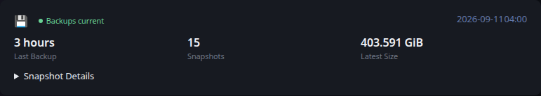

# Restic

[Glance README](../../../../../../README.md) · [Configuration](../../../../../configuration.md) · [Widgets](../../../../../widgets.md) · [Examples](../../../../../examples.md) · [Custom API Monitoring](../../README.md)

This integration retrieves monitoring information from Restic and converts it to the shared [Custom API Monitoring](../../README.md) JSON contract.

The example keeps data collection separate from Glance. `fetch.py` produces a JSON file, and Glance consumes that file through a URL served by your environment.

The producer invokes the local `restic` CLI. Restic repository credentials remain in the normal Restic environment rather than being embedded in the example.



## Files

- [fetch.py](fetch.py) reads Restic snapshot metadata and produces the monitoring JSON.
- [example.json](example.json) provides deterministic representative output and is also used by Glance's visual test fixture.
- [template.yml](../../template.yml) provides the shared Custom API monitoring presentation.

## Requirements

- Python 3
- The `restic` CLI available in `PATH`
- An existing Restic repository accessible from the system running the producer
- Working Restic repository authentication

The producer does not create repositories or perform backups. It reads snapshot metadata from an existing repository by running `restic snapshots --json`.

## Configuration

The producer is configured with environment variables:

- `RESTIC_REPOSITORY` — Restic repository to inspect. Required.
- `RESTIC_PASSWORD_FILE` — optional Restic password-file path. Other authentication supported by Restic can remain in the normal Restic environment.
- `OUTPUT_FILE` — path where the generated monitoring JSON is written. Defaults to `monitoring.json`.

Repository credentials should remain in your normal Restic environment rather than being embedded in `fetch.py` or Glance configuration.

## Usage

Before running the producer, verify that Restic can access the repository with the same environment and credentials:

```bash
restic -r "$RESTIC_REPOSITORY" snapshots --json
```

Once that succeeds, run the producer:

```bash
python3 fetch.py
```

For example, when using a password file:

```bash
RESTIC_REPOSITORY=/path/to/repository RESTIC_PASSWORD_FILE=/path/to/password-file python3 fetch.py
```

By default the example writes `monitoring.json` in the current directory. Set `OUTPUT_FILE` when another destination is required.

Serve the generated JSON over HTTP from a location reachable by Glance.

## Reported data

The producer reads Restic snapshot metadata for the configured repository and reports the age of the latest backup, total snapshot count, and latest snapshot size when that information is available.

A latest snapshot less than 24 hours old produces an overall `ok` state. A snapshot from 24 to less than 48 hours ago produces `warning`, and a snapshot 48 hours old or older produces `error`.

The expandable section identifies the latest snapshot time, snapshot ID, and repository. Collection failures do not intentionally replace a previously valid monitoring document.

## Glance configuration

```yaml
- type: custom-api
  title: Restic
  url: https://example.com/restic_metrics.json
  cache: 5m
  headers:
    Accept: application/json
  template: |
    $include: path/to/monitoring/template.yml
```

Adjust the URL and template path for your environment.

## Scheduling

`fetch.py` is an external producer and is not executed by Glance. Run it periodically using cron, a systemd timer, a container scheduler, or another scheduler appropriate for your environment.

The producer schedule and the Custom API `cache` interval are independent. The example intentionally leaves alert delivery and environment-specific operational automation outside the producer.

---

[Glance README](../../../../../../README.md) · [Configuration](../../../../../configuration.md) · [Widgets](../../../../../widgets.md) · [Examples](../../../../../examples.md) · [Custom API Monitoring](../../README.md) · [Back to top](#restic)

