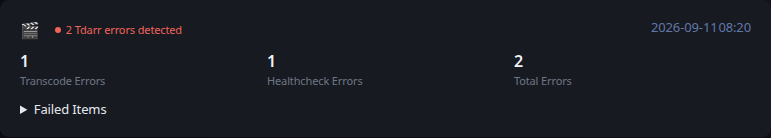

# Tdarr

[Glance README](../../../../../../README.md) · [Configuration](../../../../../configuration.md) · [Widgets](../../../../../widgets.md) · [Examples](../../../../../examples.md) · [Custom API Monitoring](../../README.md)

This integration retrieves monitoring information from Tdarr and converts it to the shared [Custom API Monitoring](../../README.md) JSON contract.

The example keeps data collection separate from Glance. `fetch.py` produces a JSON file, and Glance consumes that file through a URL served by your environment.



## Files

- [fetch.py](fetch.py) retrieves and normalizes the monitoring data.
- [example.json](example.json) provides deterministic representative output and is also used by Glance's visual test fixture.
- [template.yml](../../template.yml) provides the shared Custom API monitoring presentation.

## Requirements

- Python 3
- The `requests` Python package
- A Tdarr API accessible from the system running the producer

## Configuration

The producer is configured with environment variables:

- `TDARR_URL` — Tdarr base URL. Defaults to `http://localhost:8265`.
- `OUTPUT_FILE` — generated JSON path. Defaults to `monitoring.json`.

## Usage

Run the producer after supplying the configuration required by your environment:

```bash
python3 fetch.py
```

By default the example writes `monitoring.json` in the current directory. Set `OUTPUT_FILE` when another destination is required.

Serve the generated JSON over HTTP from a location reachable by Glance. Keep credentials outside the script and outside files committed to source control.

## Reported data

The producer reports Tdarr transcode errors, health-check errors, and the combined total number of failures.

Any reported failure produces an overall `error` state. When no transcode or health-check failures are present, the widget is `ok`.

When failures exist, the producer queries Tdarr file records and includes matching files in the expandable Failed Items section. Transcode and health-check failures are identified separately so a file can expose both conditions when applicable.

## Glance configuration

```yaml
- type: custom-api
  title: Tdarr
  url: https://example.com/tdarr_metrics.json
  cache: 5m
  headers:
    Accept: application/json
  template: |
    $include: path/to/monitoring/template.yml
```

Adjust the URL and template path for your environment.

## Scheduling

`fetch.py` is an external producer and is not executed by Glance. Run it periodically using cron, a systemd timer, a container scheduler, or another scheduler appropriate for your environment.

The producer schedule and the Custom API `cache` interval are independent. The example intentionally leaves alert delivery and environment-specific operational automation outside the producer.

---

[Glance README](../../../../../../README.md) · [Configuration](../../../../../configuration.md) · [Widgets](../../../../../widgets.md) · [Examples](../../../../../examples.md) · [Custom API Monitoring](../../README.md) · [Back to top](#tdarr)
