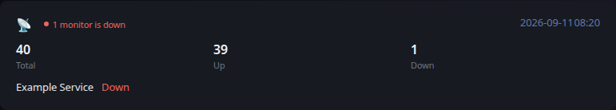

# Uptime Kuma

[Glance README](../../../../../../README.md) · [Configuration](../../../../../configuration.md) · [Widgets](../../../../../widgets.md) · [Examples](../../../../../examples.md) · [Custom API Monitoring](../../README.md)

This integration retrieves monitoring information from Uptime Kuma and converts it to the shared [Custom API Monitoring](../../README.md) JSON contract.

The example keeps data collection separate from Glance. `fetch.py` produces a JSON file, and Glance consumes that file through a URL served by your environment.



## Files

- [fetch.py](fetch.py) retrieves and normalizes the monitoring data.
- [example.json](example.json) provides deterministic representative output and is also used by Glance's visual test fixture.
- [template.yml](../../template.yml) provides the shared Custom API monitoring presentation.

## Requirements

- Python 3
- The `requests` Python package
- A Uptime Kuma Prometheus metrics endpoint accessible from the system running the producer

## Configuration

The producer is configured with environment variables:

- `UPTIME_KUMA_METRICS_URL` — Uptime Kuma Prometheus metrics URL. Defaults to `http://localhost:3001/metrics`.
- `UPTIME_KUMA_USERNAME / UPTIME_KUMA_PASSWORD` — optional credentials for the metrics endpoint.
- `OUTPUT_FILE` — generated JSON path. Defaults to `monitoring.json`.

## Usage

Run the producer after supplying the configuration required by your environment:

```bash
python3 fetch.py
```

By default the example writes `monitoring.json` in the current directory. Set `OUTPUT_FILE` when another destination is required.

Serve the generated JSON over HTTP from a location reachable by Glance. Keep credentials outside the script and outside files committed to source control.

## Reported data

The producer reads Uptime Kuma Prometheus monitoring data and reports the total number of monitors together with the number that are up and down. Pending or unknown monitors are also reported when present.

One or more down monitors produce an overall `error` state. Pending or unknown monitors produce `warning` when no monitor is down. An empty monitor data set also produces a warning. When every reported monitor is up, the widget is `ok`.

Monitors that are not up are included in the details section so the affected monitor and its current state remain immediately visible.

## Glance configuration

```yaml
- type: custom-api
  title: Uptime Kuma
  url: https://example.com/uptime_kuma.json
  cache: 5m
  headers:
    Accept: application/json
  template: |
    $include: path/to/monitoring/template.yml
```

Adjust the URL and template path for your environment.

## Scheduling

`fetch.py` is an external producer and is not executed by Glance. Run it periodically using cron, a systemd timer, a container scheduler, or another scheduler appropriate for your environment.

The producer schedule and the Custom API `cache` interval are independent. The example intentionally leaves alert delivery and environment-specific operational automation outside the producer.

---

[Glance README](../../../../../../README.md) · [Configuration](../../../../../configuration.md) · [Widgets](../../../../../widgets.md) · [Examples](../../../../../examples.md) · [Custom API Monitoring](../../README.md) · [Back to top](#uptime-kuma)
