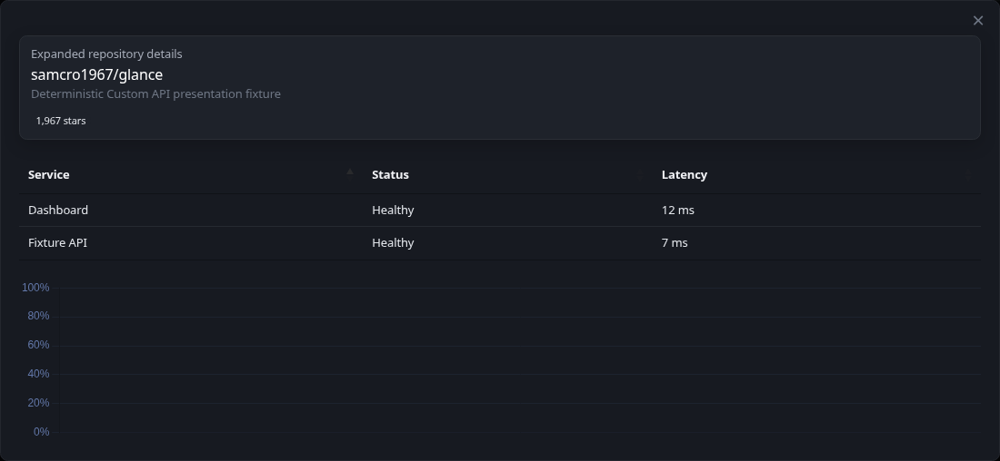

# Expanded widget views

[Glance README](../README.md) · [Widgets](widgets.md) · [Adding a widget](adding-a-widget.md)

Expanded widget views let a widget expose additional detail without permanently increasing its dashboard footprint. Widgets that support the capability show an expand action in the widget header and open their expanded presentation in a responsive Glance dialog.

Expanded views are part of the normal widget lifecycle. They are not a second widget and do not introduce a separate provider-refresh schedule.

## Behavior

- On desktop, the expanded view opens in a centered responsive dialog.
- On mobile, the expanded view uses the available screen as a full-screen presentation.
- The expand action appears only when that widget instance has expanded content available.
- `hide-header: true` also hides the expand action because the widget header is hidden.
- Opening an expanded view loads the widget's latest expanded presentation through Glance's authenticated widget-content API.
- Opening or closing the dialog does not start another provider refresh.
- Live replacement of the owning widget closes an open expanded view so detached stale content is not left visible.
- Browser-side presentation behavior is initialized when expanded content is inserted and cleaned up when the dialog closes.

Authentication and widget access rules are the same as for the owning widget.

## Data and refresh ownership

The widget owns acquisition and rendering of its expanded content. The shared expanded-view framework owns the dialog, authenticated content request, browser initialization, cancellation, cleanup, responsive behavior, and frontend diagnostics.

This distinction keeps expanded content synchronized with the widget's normal refresh lifecycle rather than creating a second source of provider requests.

The exact expanded content is widget-specific. Consult the individual widget documentation for what its compact and expanded presentations contain.

## Supported widgets

### Weather

[Weather](widgets/weather.md) uses its expanded view for additional weather detail beyond the normal dashboard presentation.

### Environment

[Environment](widgets/environment.md) keeps the compact view focused on current environmental conditions and uses the expanded view for the complete pollutant set, multi-day AQI and UV trends, pollen forecast, and active pollen species.

### Custom API

[Custom API](widgets/custom-api.md) supports an optional `expanded-template`. The normal `template` and `expanded-template` are rendered during the same widget refresh from the same acquired primary response, configured subrequest responses, and options.

If `expanded-template` is omitted, Custom API behaves as before and no expand action is shown.

Opening a Custom API expanded view does not fetch the configured API again and does not execute the template again. The dialog receives the expanded HTML that was already rendered by the latest successful widget refresh.

See the Custom API documentation for data-shaping guidance, stale behavior, native tables and charts, and the separate behavior of dynamic `getResponse` requests.

## Adding expanded support to a widget

Expanded support should extend the existing widget lifecycle rather than create a parallel refresh mechanism. A widget should acquire its data through its normal update path, prepare the expanded presentation there, and expose that presentation through the shared expanded-view capability.

Reuse the shared dialog and frontend lifecycle. Do not add widget-specific modal infrastructure, independent refresh scheduling, or browser-side provider fetching merely to support an expanded presentation.

See [Adding a widget](adding-a-widget.md) for the repository's general widget-development requirements.

---

[Glance README](../README.md) · [Widgets](widgets.md) · [Back to top](#expanded-widget-views)
