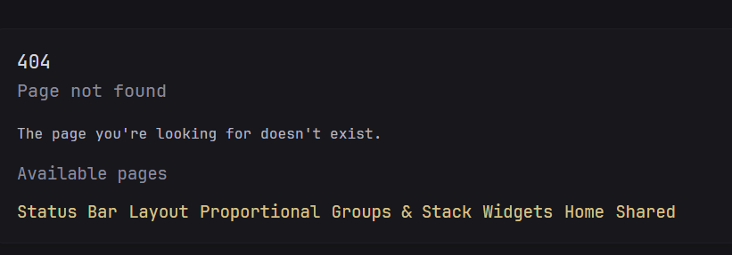

# About this fork

This repository is a fork of [Glance](https://github.com/glanceapp/glance) maintained by [samcro1967](https://github.com/samcro1967/glance).

It tracks the upstream Glance project while incorporating additional functionality, reliability fixes, operational hardening, expanded regression testing, and deployment tooling not currently available in the upstream release.

The goal of the fork is to remain compatible with upstream Glance where practical while providing additional functionality and addressing reliability or operational issues encountered in production use. Changes incorporated from existing upstream pull requests or other Glance-derived projects are identified below where applicable.

**Fork module identity** — Uses `github.com/samcro1967/glance` as the Go module and build identity while retaining `github.com/glanceapp/glance` as the upstream project for attribution and ongoing upstream synchronization.

## Versioning and releases

Fork releases preserve the latest incorporated upstream Glance release version and append a fork-specific release revision.

Release tags use the following format:

`v<upstream-version>-samcro1967.r<revision>`

For example:

`v0.8.5-samcro1967.r001`

`v0.8.5-samcro1967.r002`

The three-digit fork revision identifies formal releases of this fork against the same upstream release line. It is not a commit count. The revision begins at `001` for the first fork release associated with an upstream release and increments for subsequent fork releases.

When a newer upstream Glance release is incorporated, the fork revision resets to `001`. For example, after incorporating upstream `v0.8.6`, the first corresponding fork release would be `v0.8.6-samcro1967.r001`.

The upstream version component represents the latest formal upstream release incorporated by the fork. The fork may also incorporate commits from upstream `main` made after that release. Therefore, each fork release records both the upstream release version and the exact upstream baseline commit for reproducibility.

The Git tag is the authoritative release version. Source builds default to the development version `dev`, while the formal release process injects the exact Git release tag into the Glance binary at build time. This avoids maintaining a separate version file that could drift from Git release history.

Formal releases are created only from a clean, synchronized `main` branch after repository validation. Repository Makefile targets derive and validate the next fork release version before creating and pushing the release tag. Pushing the release tag invokes the repository's existing GitHub Actions and GoReleaser release workflow.

Development changes first integrate through the protected `dev` branch. After validation, `dev` is promoted to the protected `main` branch through a pull request. Merging into `main` does not itself create a release or update the `latest` container image. A formal release is created explicitly from `main` with the repository release tooling.

Because the fork identifier follows the hyphen in the tag, fork releases are prerelease versions of the corresponding upstream version under Semantic Versioning precedence rules. Within this fork, these tags nevertheless represent formal fork releases rather than development or test builds.

## Changes from upstream

- **Stack widget** — Adds the `stack` widget from upstream [PR #765](https://github.com/glanceapp/glance/pull/765), allowing multiple widgets to be stacked vertically and treated as a single widget.
- **Analog clock widget** — Adds an `analog-clock` widget based on upstream [PR #747](https://github.com/glanceapp/glance/pull/747), providing a theme-aware analog clock with optional date and AM/PM indicators, configurable numerical dial markers, and additional clocks for configured timezones.
- **Nested groups** — Allows `group` widgets to contain other `group` widgets, enabling multiple levels of tabbed navigation.
- **Timer widget** — Adds a browser-local `timer` widget for creating countdowns to specific dates and times. Timers can be added, edited, deleted, and reordered directly in the widget, persist in the browser's local storage, and update automatically as their target times approach or pass.
- **ICS Events widget** — Adds a native `ics-events` widget for displaying events from iCalendar (ICS) feeds. The widget fetches and parses calendar data server-side, supports configurable date ranges and event limits, handles recurring events and timezone-aware dates, and participates in the standard Glance caching, refresh, recovery, and live-update lifecycle.
- **Markdown widget** — Adds a native `markdown` widget for rendering configured Markdown content using Glance styling. Markdown is rendered server-side with HTML sanitization and supports standard Markdown formatting without requiring an external service or Custom API endpoint.
- **Unit Converter widget** — Adds a native `unit-converter` widget for performing unit conversions directly in the browser without requiring an external service or network request. The widget provides 35 conversion categories and 379 units spanning common measurement, scientific, digital-information, electrical, and fuel-economy conversions. Category and unit selections update the result immediately as the input value changes. Conversion definitions are embedded with Glance and use scale, affine, and reciprocal transforms to support standard linear conversions, temperature conversions, and fuel-economy conversions while remaining fully self-contained.
- **Calculator widget** — Adds a native `calculator` widget for performing calculations directly in the browser without requiring an external service or network request. The calculator provides standard arithmetic operations, percentage, reciprocal, square, square root, exponent, nth-root, parentheses, sign change, clear-entry, clear, and backspace controls, with operator precedence and keyboard input support.
- **Named dashboards** — Allows configured pages to be organized into multiple independently addressable dashboards with dashboard-specific navigation.
- **Medium page columns** — Adds a `medium` page column size for proportional desktop layouts. Three `medium` columns create an equal three-column layout, while `medium` + `full` creates an approximately one-third/two-thirds layout and can be reversed as `full` + `medium`. Existing `small` and `full` layouts remain unchanged, and medium columns use the standard one-column-at-a-time navigation on mobile.
- **Fixed desktop navigation** — Keeps the global desktop page navigation fixed to the top of the viewport while scrolling, independent of page length and surrounding layout. Dedicated document-flow spacing prevents page content from being obscured beneath the fixed navigation, while the configured header appearance and existing mobile navigation behavior are preserved.
- **Bottom widgets** — Adds a `bottom-widgets` page section that mirrors `head-widgets`, allowing standard Glance widgets to span the full page width below the configured columns. Bottom widgets participate in the same initialization, provider setup, refresh, caching, and recovery lifecycle as widgets elsewhere on the page. Existing configurations without `bottom-widgets` remain unchanged.
- **Status Bar widget** — Adds a compact full-width `status-bar` widget for presenting existing Weather, Markets, and RSS data in either a continuously scrolling `ticker` or static wrapping `wrap` layout. Status bars can be placed only directly in `head-widgets` or `bottom-widgets`; supported child widgets retain their normal configuration, provider fetching, caching, refresh, recovery, and error behavior while using dedicated compact renderers. Equivalent underlying Markets, Weather, and RSS resource requests are shared where applicable so adding a status bar does not unnecessarily duplicate provider requests already being made by another configured widget.
- **Hierarchical widget defaults** — Adds optional `widget-defaults` configuration for defining shared widget settings once and inheriting them across the dashboard. Defaults can be defined globally and per widget type, with more specific configuration taking precedence over broader defaults and explicit widget or child/source settings taking precedence over inherited values. Supported shared capabilities include common widget presentation and caching settings, link behavior, list sizing and collapsing, and applicable HTTP request settings such as timeouts, TLS handling, headers, and authentication. Capabilities are applied only to widget types and configuration scopes for which they are semantically valid. Existing Glance configurations remain fully compatible: `widget-defaults` is optional, existing widget-specific properties retain their current behavior, and built-in widget defaults remain unchanged when no hierarchical defaults are configured.
- **Custom API timeouts** — Adds configurable request timeouts to `custom-api` widgets based on upstream [PR #997](https://github.com/glanceapp/glance/pull/997), with independent timeout settings for primary requests and subrequests.
- **Custom API string helpers** — Adds template helpers for common string operations in `custom-api` widgets, including case conversion, substring checks, prefix and suffix checks, case-insensitive comparison, splitting, and joining.
- **Custom API dynamic request methods** — Adds `withMethod` for dynamically created Custom API requests, allowing templates to explicitly select the HTTP request method while preserving the existing GET default and body-implies-POST behavior.
- **Custom API stale fallback** — Preserves the last successfully rendered `custom-api` content when a refresh fails, displays a visible stale indicator with the age of the last successful update, and automatically clears the stale state after a successful refresh.
- **Automatic widget recovery** — Adds server-side background refresh and recovery for updateable widgets. Expired or previously failed widgets are retried automatically without requiring a page to be open or manually refreshed. Refreshes are synchronized per widget to prevent duplicate concurrent updates while preserving parallel updates across different widgets, use bounded concurrency and progressive retry backoff after failures, and are cancelled cleanly during shutdown and configuration reloads. Normal successful refresh timing continues to respect each widget's configured cache duration. The `custom-api` widget additionally preserves its last successfully rendered content while a refresh is failing.
- **Live widget updates** — Addresses upstream [issue #1042](https://github.com/glanceapp/glance/issues/1042) by automatically updating visible widgets in the browser when their server-side refresh completes, without requiring a full page reload. Live updates reuse the existing widget refresh scheduler and cache timing rather than introducing a separate polling cycle. The server sends lightweight widget ID notifications over Server-Sent Events (SSE), and the browser fetches and replaces only the affected widget while preserving surrounding page and container state such as selected group tabs. Nested refreshable widgets are supported, concurrent notifications are coalesced safely, and browser-side behaviors are reinitialized only within replaced widget content. The feature requires no additional configuration and falls back to existing static page behavior when SSE is unavailable.
- **Versioned asset base URL fix** — Corrects versioned asset paths when Glance is configured with a base URL, ensuring assets such as the web manifest resolve beneath the configured base path instead of producing malformed paths or HTTP 404 responses.
- **HTTP server startup failure handling** — Incorporates upstream [PR #1047](https://github.com/glanceapp/glance/pull/1047), causing Glance to exit with a nonzero status when the HTTP server fails to start instead of remaining running in a broken state. This allows container restart policies and external monitoring to correctly detect and respond to startup failures.
- **Mountpoint CLI fix** — Incorporates upstream [PR #1065](https://github.com/glanceapp/glance/pull/1065), fixing the `mountpoint:info <path>` command so it can be invoked as documented instead of being rejected as an unknown command.
- **Mountpoint auto-detection fix** — Incorporates upstream [PR #1070](https://github.com/glanceapp/glance/pull/1070), fixing automatic mountpoint discovery in plain containers by including Docker `overlay` filesystems while filtering out virtual filesystems such as proc, sysfs, tmpfs, and cgroups.
- **IPv6 Docker remote sources** — Incorporates upstream [PR #1064](https://github.com/glanceapp/glance/pull/1064), correctly formatting IPv6 addresses used by remote Docker sources while preserving TCP, HTTP, HTTPS, explicit-port, and default-port behavior.
- **YAML comment variable parsing** — Incorporates upstream [PR #965](https://github.com/glanceapp/glance/pull/965), preventing configuration variables inside YAML comments from being expanded while correctly preserving hashes inside quoted values and handling escaped or doubled quotes.
- **Search autofocus fix** — Incorporates upstream [PR #885](https://github.com/glanceapp/glance/pull/885), ensuring search widgets configured with `autofocus` reliably receive focus after dynamic initialization, including in browsers such as Firefox.
- **Structured operational logging and diagnostics** — Adds structured lifecycle, failure, recovery, configuration, and runtime diagnostics for improved container and service observability without turning normal refresh activity into log noise. Glance logs meaningful application and lifecycle events, reports the first transition of a widget into a failed or degraded state with an actionable failure classification, and records recovery without repeatedly logging the same continuing failure. Refreshable widgets use a common failure, partial-content, cancellation, retry, degraded-state, stale-content, and recovery lifecycle. An authenticated `/api/diagnostics` endpoint exposes current in-memory operational state including per-widget refresh attempts and outcomes, last success and failure times, refresh duration, active refresh state, consecutive failures, failure classification, refresh-lock skips, scheduler lag, maximum observed scheduler lag, and next scheduled update, together with aggregate refresh state. Configuration diagnostics expose the active configuration path and load time, the latest reload attempt and result, and retain the most recent rejected reload with source file, line, and message where available even after a later successful reload. Invalid reloads leave the currently running application active. The public `/api/healthz` endpoint remains a lightweight liveness check rather than depending on provider or widget health. HTTP and provider diagnostics are sanitized to avoid exposing configured URLs, query strings, response bodies, authentication credentials, tokens, cookies, and other potentially sensitive values. Internal template-rendering failures are logged server-side while clients receive a generic HTTP 500 response.
- **Configuration watcher reliability** — Hardens configuration file watching and reload behavior against concurrent shutdown and configuration-change activity. Debounce timer ownership is synchronized to prevent races between pending configuration notifications and watcher cleanup. Watcher shutdown also prevents new debounce work and waits for an already-running configuration callback to finish before returning, preventing configuration callbacks from continuing to mutate application state after watcher shutdown or during application teardown.
- **Runtime lifecycle hardening** — Expands synchronization and regression protection around application startup, shutdown, configuration reloads, background refresh scheduling, and watcher cleanup. Background scheduler cancellation propagates cleanly to active work and shutdown waits for scheduler workers to finish. Configuration watcher cleanup waits for active callbacks, and server lifecycle behavior is protected for cases including shutdown before startup and HTTP bind failures.
- **DNS statistics zero-value handling** — Prevents invalid percentage values when DNS providers return zero queries or zero blocked queries. Graph normalization and blocked-domain percentages safely remain at zero when their denominator is zero, covering AdGuard Home, Pi-hole v5, Pi-hole v6, and Technitium DNS Server.
- **Themed page-not-found response** — Addresses upstream [issue #1062](https://github.com/glanceapp/glance/issues/1062) by replacing the plain-text response for unknown page URLs with a themed Glance 404 page that preserves HTTP 404 semantics and provides links to the configured pages available in the current dashboard. Dashboard paths and configured base URLs are preserved, while API page-content requests continue to return a plain HTTP 404.

  
- **RSS parsing and rendering hardening** — Improves RSS title and image parsing based on upstream [PR #1044](https://github.com/glanceapp/glance/pull/1044) and addresses upstream [issue #1011](https://github.com/glanceapp/glance/issues/1011), including HTML title sanitization, image discovery from item metadata and feed content, and safe resolution of relative image URLs. Also addresses upstream [issue #919](https://github.com/glanceapp/glance/issues/919) by removing embedded HTML comments from feed descriptions, and [issue #962](https://github.com/glanceapp/glance/issues/962) by validating and resolving RSS item links before rendering so malformed or unsafe URLs cannot produce Go template `ZgotmplZ` output.
- **GitHub release fetching optimization** — Optimizes GitHub release requests for repositories configured with `include-prereleases: true` by requesting only the single release that Glance consumes instead of GitHub's default page of results, reducing response size and processing overhead without changing release selection behavior. Based on [Dynacat PR #97](https://github.com/Panonim/dynacat/pull/97).
- **HTTP connection reuse hardening** — Adds a finite idle connection timeout and consistent connection-pool settings to the shared HTTP transports, preventing idle connections from being retained indefinitely. Adapted from `matt2k7/glance` commit `b13c1f98699da36232933cbb3619003f8922ee5e`.
- **YouTube uploads feed fallback** — Falls back from the Shorts-filtered `UULF` channel uploads feed to the standard `UU` uploads feed when the primary feed fails, while preserving existing cache and error behavior. Adapted from `JacksonMcDonaldDev/glance` commit `b6082e3355c36644a3eb31dadada1ea75d7d78e1`.
- **Remote Server Stats mountpoint configuration** — Applies mountpoint visibility, naming, and ordering settings to system information returned by remote Glance agents. Adapted from `rakkateichou/glance` commit `64d3b1c1`.

## Testing and regression protection

The fork includes substantially expanded automated regression coverage intended both to protect fork-specific behavior and to make future upstream synchronization safer.

Regression coverage includes configuration parsing, reload behavior, and runtime diagnostics; configuration watcher concurrency and shutdown; application and HTTP server lifecycle behavior; dashboard routing; widget refresh synchronization, telemetry, recovery, caching, cancellation, scheduler lag, and lock contention; healthy, failed, partially available, degraded, stale, canceled, and recovered transitions; retained configuration-reload rejection diagnostics; Custom API requests, templates, timeouts, stale fallback, and errors; Server Stats partial-source and cancellation behavior; Docker and provider behavior; malformed or incomplete external responses; transport failures; diagnostic sanitization; HTTP error boundaries; DNS zero-value calculations; application initialization and migration; and regression tests for defects discovered while stabilizing the fork.

The test suite contains more than 300 tests and currently exercises approximately 80% of the Go codebase. Coverage is used as a measurement rather than as a goal by itself. Testing is concentrated on behavior where regressions, malformed external data, concurrency, lifecycle transitions, provider failures, and upstream changes present meaningful risk.

Concurrency-sensitive behavior is validated with Go's race detector. During stabilization, important suites were also executed repeatedly with both normal and race-enabled test runs to expose intermittent concurrency or lifecycle failures.

Several production defects were discovered through this process, reproduced with regression tests, and then fixed. Those tests remain in the suite to protect against recurrence.

## Development and CI validation

Development follows a two-branch integration and release model:

```text
feature/* → dev → main → formal release
```

The long-lived `dev` branch is the integration branch for ongoing development. Focused feature and fix branches are created from a clean, synchronized `dev` branch and merged back into `dev` through pull requests.

The long-lived `main` branch is the stable, release-ready branch. Changes reach `main` only through a controlled promotion pull request from `dev`. Direct development on either `dev` or `main` is intentionally avoided.

Both `dev` and `main` are protected branches. Pull requests targeting either branch are automatically validated with the complete Go test suite, the Go race detector, a complete Go build, and whitespace validation.

The repository `Makefile` provides standardized commands for development, validation, repository inspection, GitHub pull request operations, CI monitoring, release management, and production deployment.

Common targets include:

```text
make test
make test-race
make test-count COUNT=10
make test-race-count COUNT=10
make build
make test-instance-start
make test-instance-status
make test-instance-stop
make test-container-start TEST_RUNTIME_CONTAINER=<container>
make test-container-status
make test-container-stop
make fmt-check
make diff-check
make staged-check
make check
make coverage
make vuln
make status
make staged-diff
make upstream-status
make verify-dev
make verify-main
make branch NEW_BRANCH=feature/example
make push
make pr-create TITLE='...' BODY_FILE=<file>
make promote-create TITLE='...' BODY_FILE=<file>
make pr-view PR=<number>
make pr-runs
make pr-merge PR=<number>
make post-merge PR=<number>
make image-runs
make ci-watch RUN=<id>
make ci-view RUN=<id>
make release-status
make release-check
make release
make deploy-status
make deploy
```

`make branch` creates normal development branches from a clean `dev` branch that exactly matches `origin/dev`. `make pr-create` creates the normal feature-to-`dev` pull request and intentionally refuses to operate from either long-lived branch. `make promote-create` is the explicit path for creating a `dev`-to-`main` promotion pull request.

`make post-merge` determines the merged pull request's base branch automatically. After a normal feature merge it updates and leaves the repository on `dev`; after a promotion merge it updates and leaves the repository on `main`. Long-lived branches are preserved while merged local feature branches are cleaned up.

`make check` runs the standard local pre-pull-request validation suite. Repeated test targets are available for concurrency-sensitive or high-risk changes where a single successful test execution may not provide sufficient confidence.

For interactive development and browser validation, `make test-instance-start` builds the current source tree and starts an isolated Glance instance using a generated minimal configuration on port `18080`. `make test-instance-status` reports the process and HTTP status, and `make test-instance-stop` stops the instance and removes its generated binary, configuration, PID file, and log. The port can be overridden when needed, for example with `make test-instance-start TEST_PORT=18081`.

For validation against an existing container's real runtime configuration, `make test-container-start TEST_RUNTIME_CONTAINER=<container>` builds the current source tree into a local test image and starts an isolated container on port `18080`. The test container derives its environment, bind mounts, Docker networks, and sysctls from the specified runtime reference container without modifying or replacing that container. `make test-container-status` reports container and HTTP status, while `make test-container-stop` removes the isolated test container and its local image. Container names, image names, ports, URLs, and the runtime reference remain configurable through Makefile variables.

## Security and dependency maintenance

The fork includes additional security and dependency maintenance beyond functional changes.

- Go and project dependencies are periodically reviewed and updated.
- GitHub Actions dependencies are maintained alongside application dependencies.
- `govulncheck` is used to identify reachable Go vulnerabilities.
- Container builds upgrade available Alpine packages during the image build so published images receive current package-level security fixes available from the configured Alpine repositories.
- Operational and provider diagnostics are intentionally sanitized to avoid logging authentication credentials, authorization headers, cookies, tokens, configured URLs containing sensitive query parameters, response bodies, or similar potentially sensitive information.
- Error responses exposed to HTTP clients avoid disclosing internal template-rendering details while retaining actionable server-side diagnostics.

Security scanning can still report vulnerabilities for which an upstream package or distribution fix is not yet available. The presence of such a report does not imply that the fork contains a project-level fix for the underlying third-party vulnerability.

## Container images

Container images for this fork are published exclusively to GitHub Container Registry.

The development image is:

```text
ghcr.io/samcro1967/glance:dev
```

This mutable tag represents the current integrated `dev` branch. A successful push to the protected `dev` branch automatically builds and publishes this image. Feature branches do not publish container images, and promotion of `dev` to `main` does not by itself publish or move a container tag.

Formal releases publish:

```text
ghcr.io/samcro1967/glance:v<upstream-version>-samcro1967.r<revision>
ghcr.io/samcro1967/glance:latest
```

For example:

```text
ghcr.io/samcro1967/glance:v0.8.5-samcro1967.r001
ghcr.io/samcro1967/glance:latest
```

The versioned tag is the immutable identity of a formal fork release. `latest` identifies the most recent formal fork release and points to the same released image. It is not a development or branch-build tag.

Formal release images are built by GoReleaser for supported Linux architectures and published as multi-architecture manifests. Architecture-specific image tags are used internally to construct those manifests.

Published images contain OCI revision metadata identifying the source commit from which the image was built.

The resulting image lifecycle is:

```text
feature/* → dev → ghcr.io/samcro1967/glance:dev

dev → main
       └─ no image publication

main → formal release tag
       ├─ ghcr.io/samcro1967/glance:v<version>-samcro1967.r<revision>
       └─ ghcr.io/samcro1967/glance:latest
```

## Production deployment safeguards

The repository includes Makefile-based deployment tooling intended to make deployments reproducible and to ensure that production receives only a formal fork release.

`make deploy-status` performs a read-only comparison of the current source branch and revision, the locally available `ghcr.io/samcro1967/glance:latest` image and its source revision, and the currently running production container and its source revision.

`make deploy` performs a guarded production deployment. Before changing the running service it:

1. requires deployment from `main`;
2. requires a clean source working tree;
3. refreshes `origin` and requires local `main` to exactly match `origin/main`;
4. pulls `ghcr.io/samcro1967/glance:latest`;
5. reads the image's OCI source revision;
6. requires the released image revision to exactly match the source repository's current `main` revision; and
7. refuses to recreate the production service if those revisions differ.

After the image passes validation, the deployment recreates only the Glance Compose service and verifies that the running container reports the expected source revision, uses the exact validated image, the local Glance HTTP endpoint becomes ready, and recent container logs are available for immediate inspection.

Because `latest` moves only when a formal release is created, this revision check also prevents an unreleased `main` revision from being deployed. If `main` has advanced beyond the most recent formal release, production deployment remains blocked until that revision has completed the formal release process.

## Upstream compatibility and maintenance

The fork continues to track the upstream Glance repository.

Upstream changes are reviewed before integration rather than being automatically applied to production. The expanded regression and race-test suites make it easier to evaluate future upstream changes while protecting fork-specific functionality and previously fixed defects.

Where functionality in this fork originates from an existing upstream pull request or another Glance-derived project, the corresponding source is identified in this document. Other changes were developed specifically for this fork based on functionality or reliability requirements encountered while operating it.

When a merged and tested fork implementation directly addresses an existing upstream issue, discussion, or pull request, a brief informational reference to the fork implementation is also left on the relevant upstream thread where appropriate.

The fork intentionally avoids unnecessary divergence from upstream. Production changes are made when they provide required functionality, address an observed defect, improve operational reliability, or provide meaningful regression protection. Areas that are functioning correctly are generally left unchanged rather than modified solely to increase test coverage or introduce speculative abstractions.

## Current stability

The fork has undergone a focused stabilization effort covering configuration handling, application lifecycle behavior, widget refresh and recovery, provider failure handling, concurrency, shutdown and reload behavior, diagnostics, security, regression testing, CI validation, and production deployment.

The stabilization process included targeted race-detector testing and repeated execution of concurrency-sensitive tests. Multiple defects discovered during this work were first reproduced through regression tests and then corrected, leaving those tests in place to protect against recurrence.

The codebase is now treated as a production baseline rather than an active stabilization project. Runtime failures and degraded states use a common lifecycle contract, exception-oriented logging surfaces actionable state transitions without routine refresh noise, and authenticated in-memory diagnostics provide current refresh, scheduler, and configuration-reload state for operational investigation. Future changes are expected to focus on required functionality, observed production defects, worthwhile upstream changes, dependency and security maintenance, and regression protection for newly discovered issues.

The intent is to keep the fork maintainable and transparent while minimizing unnecessary divergence from upstream.

See the [configuration documentation](docs/configuration.md#configuring-glance) for details on using the additional widgets and functionality.
