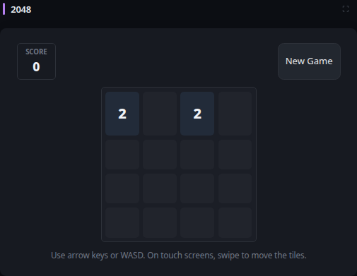
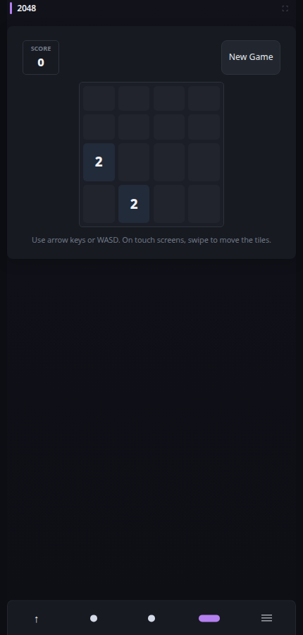

# 2048

[Widgets](../widgets.md) · [Configuration](../configuration.md) · [Glance README](../../README.md)

Play the classic 2048 sliding-tile game directly in Glance. The game runs entirely in the browser and requires no external service or network connection.

## Quick start

```yaml
- type: 2048
```

Preview:



**Mobile preview:**



Use the arrow keys or WASD to slide all tiles in one direction. On touch screens, swipe across the board. Tiles with the same value merge when they meet, and the merged tile value is added to the score. Each successful move adds one new tile.

Reaching a 2048 tile wins the game. Select **Continue** to keep playing beyond 2048, or **New Game** at any time to start over. The game ends when the board is full and no adjacent tiles can merge.

Use the widget expand control for a larger playing surface. The expanded view starts as a fresh game.

Game state is intentionally browser-local and transient. Reloading the page starts a new game.

## Configuration

The widget has no required configuration properties beyond the standard [shared widget properties](../widgets.md#shared-properties).

---

[Widgets](../widgets.md) · [Configuration](../configuration.md) · [Back to top](#2048)
