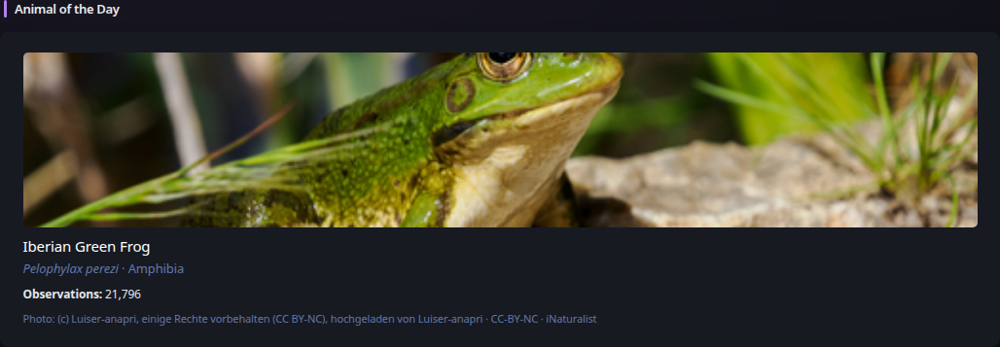
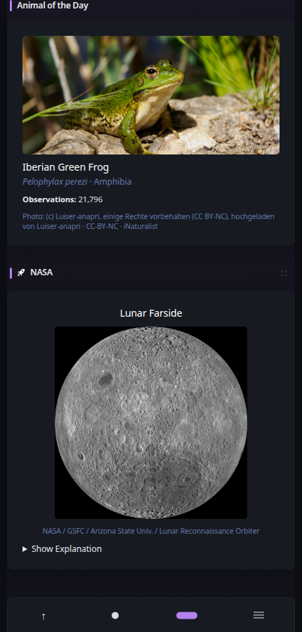

# Animal of the Day

[Widgets](../widgets.md) · [Configuration](../configuration.md) · [Glance README](../../README.md)

Discover an animal each day using iNaturalist research-grade observation data. Selection rotates deterministically across broad animal groups and chooses from well-observed species with a common name, Wikipedia reference, and reusable licensed default photo.

## Quick start

```yaml
- type: animal-of-the-day
```

Preview:



**Mobile preview:**



## Configuration

This widget supports the [shared widget properties](../widgets.md#shared-properties). It requires no API key and refreshes shortly after midnight by default. Photo attribution and license information are displayed. Candidates whose default photo has no supported Creative Commons license are excluded. Conservation status is shown when iNaturalist provides it.

---

[Widgets](../widgets.md) · [Configuration](../configuration.md) · [Back to top](#animal-of-the-day)
