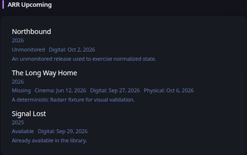

# ARR

[Widgets](../widgets.md) · [Configuration](../configuration.md) · [Glance README](../../README.md)

Display upcoming, recent, or missing media from Radarr, Sonarr, or Lidarr through one normalized widget.

## Quick start

```yaml
- type: arr
  service: radarr
  server: https://radarr.example.com
  api-key: ${RADARR_API_KEY}
  view: upcoming
```

Preview:



## Configuration

This widget also supports the [shared widget properties](../widgets.md#shared-properties).

| Name | Type | Required | Default |
| ---- | ---- | -------- | ------- |
| service | `radarr`, `sonarr`, or `lidarr` | yes | |
| server | string | yes | |
| api-key | string | yes | |
| view | `upcoming`, `recent`, or `missing` | no | `upcoming` |
| days | integer | no | `14` |
| limit | integer | no | `10` |
| collapse-after | integer | no | `0` |
| timeout | duration string | no | |
| allow-insecure | bool | no | `false` |

Radarr and Sonarr use API v3. Lidarr uses API v1. The API key is sent only from the Glance server in the `X-Api-Key` request header and is never rendered into browser URLs.

### Views

`upcoming` reads the provider calendar for the next `days` days. `recent` reads provider history newest first. `missing` reads the provider wanted/missing endpoint. Provider responses are normalized into the same title, subtitle, status, date, summary, and artwork presentation.

### Artwork and resource proxy

Artwork is only rendered through Glance's resource proxy. Add the artwork origin returned by your ARR service to `server.resource-proxy.allowed-origins`. If an artwork URL is absent or its origin is not allowed, the item remains visible without artwork; Glance never falls back to exposing the source artwork URL directly.

### HTTP behavior

`timeout` and `allow-insecure` use Glance's shared HTTP client behavior. Requests use the widget refresh context so cancellation propagates promptly. Structured HTTP status errors participate in the normal stale/degraded widget lifecycle.

---

[Widgets](../widgets.md) · [Configuration](../configuration.md) · [Back to top](#arr)
