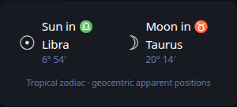
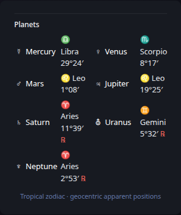
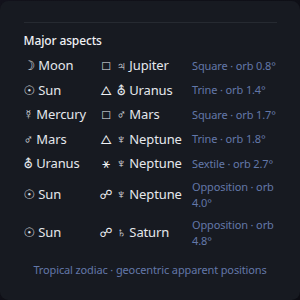
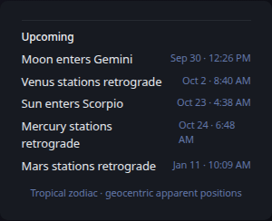

# Astrology

[Widgets](../widgets.md) · [Configuration](../configuration.md) · [Glance README](../../README.md)

Display the current astrological state derived from the same local celestial calculations used by the Astronomy widget. Astrology presents tropical-zodiac positions, retrograde state, major aspects, sign ingresses, and upcoming planetary stations. It does not fetch horoscope text or require an astrology API.

## Quick start

```yaml
- type: astrology
```

Recommended grouped presentation:

**Sun & Moon**



**Planets**



**Aspects**



**Upcoming**



For a combined sky dashboard, place the Astronomy and Astrology groups inside an outer Group. Each inner group can then expose its own compact tabs without creating a single very tall card.

## Configuration

This widget also supports the [shared widget properties](../widgets.md#shared-properties). The default cache duration is `30m`.

| Property | Type | Required | Default |
| --- | --- | --- | --- |
| `timezone` | IANA timezone | no | Glance process timezone |
| `hour-format` | string | no | `12h` |
| `sections` | list | no | all sections |
| `at` | RFC3339 timestamp | no | current time |

### `timezone`

Controls the displayed local time for upcoming sign ingresses and planetary stations. Zodiac positions themselves are geocentric and do not depend on observer location.

### `hour-format`

Use `12h` or `24h` for upcoming-event times.

### `sections`

By default, the widget displays every section in this order: `sun-moon`, `planets`, `aspects`, and `events`. Use `sections` to show only the parts that fit a particular widget instance.

```yaml
- type: astrology
  timezone: America/Chicago
  sections:
    - aspects
```

A useful four-tab layout is Sun & Moon (`sun-moon`), Planets (`planets`), Aspects (`aspects`), and Upcoming (`events`). Users can include any subset of these views in a Group.

### `at`

Normally leave `at` unset so the widget follows the current time. A pinned RFC3339 timestamp can be used to inspect or reproduce the astrological state at a specific instant.

## Interpretation model

The widget uses the Western tropical zodiac. It maps apparent geocentric ecliptic longitude into the twelve 30-degree zodiac signs. Retrograde state is derived from the most recent prograde-to-retrograde and retrograde-to-prograde station events.

Major aspects use fixed Glance presentation orbs: conjunction 6°, sextile 4°, square 6°, trine 6°, and opposition 6°. These are astrological conventions rather than astronomical observables, and other astrology systems may use different orbs.

The first release intentionally does not include birth charts, houses, ascendant/midheaven calculations, natal transits, or horoscopes.

> [!NOTE]
>
> Astrology is an interpretive tradition layered on astronomical positions. Glance keeps this separate from the Astronomy widget, which presents observational sky data.

---

[Widgets](../widgets.md) · [Configuration](../configuration.md) · [Back to top](#astrology)
