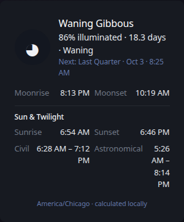
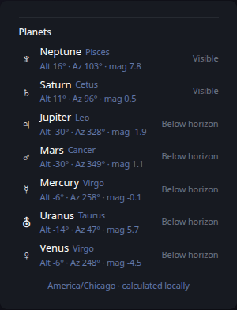
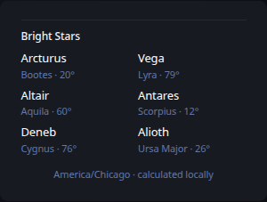
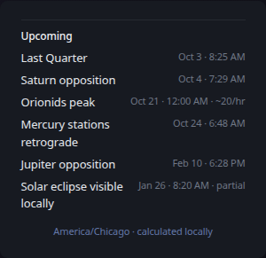
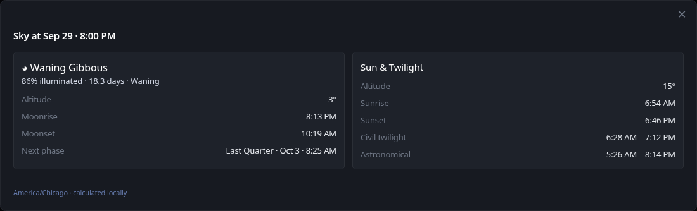

# Astronomy

[Widgets](../widgets.md) · [Configuration](../configuration.md) · [Glance README](../../README.md)

Display local observational astronomy information calculated from the configured observer location. The widget includes Sun and twilight times, lunar phase and illumination, local moonrise/moonset, planet visibility, bright stars above the horizon, and upcoming celestial events.

## Quick start

```yaml
- type: astronomy
  location: St. Louis, Missouri, United States
```

Recommended grouped presentation:

**Sun & Moon**



**Planets**



**Stars**



**Upcoming**



## Expanded view

Use the expand control in the widget header to open a larger view of the configured Astronomy sections. The expanded view presents the same calculated observation snapshot with additional room for Moon and Sun details, planet and bright-star tables, and upcoming celestial events when those sections are enabled.



Astronomical calculations run locally after the observer location is resolved. A location name uses the same cached Open-Meteo geocoding resource as the Weather widget. You can alternatively provide latitude, longitude, and timezone directly to avoid geocoding. No astronomy API key is required.

## Configuration

This widget also supports the [shared widget properties](../widgets.md#shared-properties). The default cache duration is `15m`.

| Property | Type | Required | Default |
| --- | --- | --- | --- |
| `location` | string | conditional | — |
| `latitude` | number | conditional | — |
| `longitude` | number | conditional | — |
| `timezone` | IANA timezone | conditional | — |
| `hour-format` | string | no | `12h` |
| `sections` | list | no | all sections |
| `at` | RFC3339 timestamp | no | current time |

### Observer location

Use either `location` or the complete `latitude` / `longitude` / `timezone` set. Do not combine the two forms.

```yaml
- type: astronomy
  latitude: 38.6270
  longitude: -90.1994
  timezone: America/Chicago
```

`latitude` must be between -90 and 90 and `longitude` between -180 and 180. `timezone` must be an IANA timezone recognized by Go.

### `hour-format`

Use `12h` or `24h` for rise, set, twilight, and event times.

### `sections`

By default, the widget displays every section in this order: `moon`, `sun`, `planets`, `stars`, and `events`. Use `sections` to show only the parts that fit a particular widget instance. The order of the configured values does not change the presentation order.

```yaml
- type: astronomy
  location: St. Louis, Missouri, United States
  sections:
    - moon
    - sun
```

This makes it practical to place several Astronomy instances in a Group without creating one very tall card. A useful four-tab layout is Sun & Moon (`moon`, `sun`), Planets (`planets`), Stars (`stars`), and Upcoming (`events`). Users can include any subset of these views in a Group.

Planet visibility labels are Glance presentation policy derived from current altitude, solar altitude, and apparent magnitude; the underlying altitude, azimuth, magnitude, and constellation values are astronomical calculations.

The events section combines locally visible solar eclipses, lunar phases, selected planetary events, and a small built-in catalog of major recurring meteor-shower peaks. Meteor-shower rates are representative zenithal-hourly-rate values and actual observing conditions vary.

### `at`

Normally leave `at` unset so the widget follows the current time. A pinned RFC3339 timestamp is useful for inspecting or reproducing the sky at a specific instant.

> [!NOTE]
>
> Glance uses `github.com/starainrt/astro` for amateur-observing-level celestial calculations. Results are intended for dashboard and observing-assistance use, not professional navigation or high-precision occultation work.

---

[Widgets](../widgets.md) · [Configuration](../configuration.md) · [Back to top](#astronomy)
