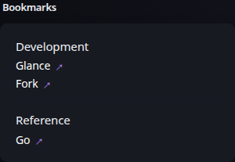

# Bookmarks

[Widgets](../widgets.md) · [Configuration](../configuration.md) · [Glance README](../../README.md)

Organize frequently used links into configurable groups with optional colors, icons, descriptions, and link-target behavior.

## Quick start

```yaml
- type: bookmarks
  groups:
    - links:
        - title: Gmail
          url: https://mail.google.com/mail/u/0/
        - title: Amazon
          url: https://www.amazon.com/
        - title: Github
          url: https://github.com/
        - title: Wikipedia
          url: https://en.wikipedia.org/
    - title: Entertainment
      color: 10 70 50
      links:
        - title: Netflix
          url: https://www.netflix.com/
        - title: Disney+
          url: https://www.disneyplus.com/
        - title: YouTube
          url: https://www.youtube.com/
        - title: Prime Video
          url: https://www.primevideo.com/
    - title: Social
      color: 200 50 50
      links:
        - title: Reddit
          url: https://www.reddit.com/
        - title: Twitter
          url: https://twitter.com/
        - title: Instagram
          url: https://www.instagram.com/
```

## Preview




## Configuration

| Property | Type | Required | Default |
| --- | --- | --- | --- |
| `groups` | array | yes | — |

All widgets also support the [shared widget properties](../widgets.md#shared-properties).

### `groups`
An array of groups which can optionally have a title and a custom color.

#### Group properties
| Property | Type | Required | Default |
| --- | --- | --- | --- |
| `title` | string | no | — |
| `color` | HSL | no | theme primary color |
| `links` | array | yes | — |
| `same-tab` | boolean | no | `false` |
| `hide-arrow` | boolean | no | `false` |
| `target` | string | no | — |

> [!TIP]
>
> You can set `same-tab`, `hide-arrow` and `target` either on the group which will apply them to all links in that group, or on each individual link which will override the value set on the group.

#### Link properties
| Property | Type | Required | Default |
| --- | --- | --- | --- |
| `title` | string | yes | — |
| `url` | string | yes | — |
| `description` | string | no | — |
| `icon` | string | no | — |
| `same-tab` | boolean | no | `false` |
| `hide-arrow` | boolean | no | `false` |
| `target` | string | no | — |

##### `icon`

See [Icons](../configuration.md#icons) for more information on how to specify icons.

##### `same-tab`

Whether to open the link in the same tab or a new one.

##### `hide-arrow`

Whether to hide the colored arrow on each link.

##### `target`

Set a custom value for the link's `target` attribute. Possible values are `_blank`, `_self`, `_parent` and `_top`, you can read more about what they do [here](https://developer.mozilla.org/en-US/docs/Web/HTML/Element/a#target). This property has precedence over `same-tab`.


---

[Widgets](../widgets.md) · [Configuration](../configuration.md) · [Back to top](#bookmarks)
