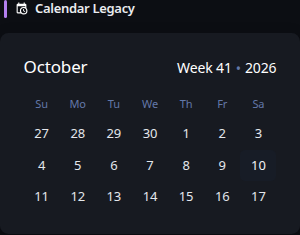
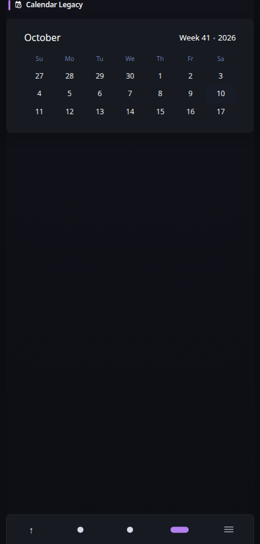

# Calendar (legacy)

[Widgets](../widgets.md) · [Configuration](../configuration.md) · [Glance README](../../README.md)

Display a calendar.

## Quick start

```yaml
- type: calendar-legacy
  start-sunday: false
```

## Preview



**Mobile preview:**



> [!NOTE]
>
> This widget is deprecated and may be removed in a future version.

## Configuration

This widget also supports the [shared widget properties](../widgets.md#shared-properties).

| Property | Type | Required | Default |
| --- | --- | --- | --- |
| `start-sunday` | boolean | no | `false` |

### `start-sunday`
Whether calendar weeks start on Sunday or Monday.

> [!NOTE]
>
> This widget has limited customizability. For new configurations, use the [Calendar](calendar.md) widget instead.


---

[Widgets](../widgets.md) · [Calendar](calendar.md) · [Configuration](../configuration.md) · [Back to top](#calendar-legacy)
