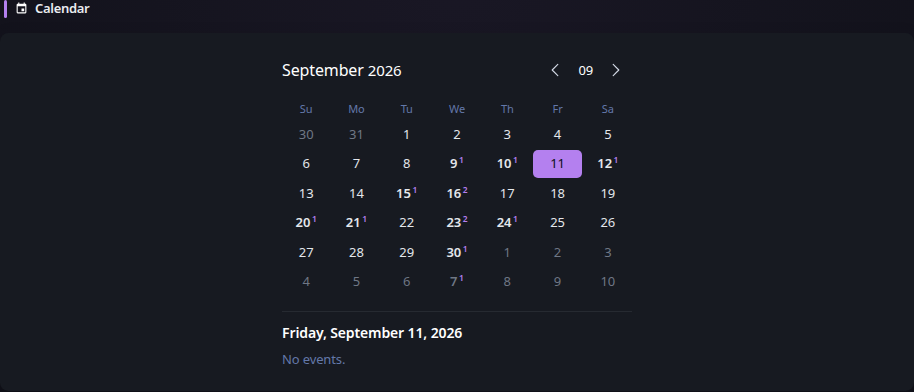

# Calendar

[Widgets](../widgets.md) · [Configuration](../configuration.md) · [Glance README](../../README.md)

Display an interactive monthly calendar. By default the widget works as a standalone calendar and does not make any network requests.

Optionally, one or more iCalendar (`.ics`) sources can be added to display events directly on the calendar. Sources can be remote HTTP/HTTPS URLs or local files. Events from all available sources are merged, and selecting a date shows the events for that day below the calendar.

Recurring events, recurrence dates and exclusions, recurrence overrides, cancellations, all-day events, multi-day events, and ICS timezones are supported.

## Quick start

```yaml
- type: calendar
  first-day-of-week: monday
```

## Add iCalendar sources

```yaml
- type: calendar
  first-day-of-week: monday
  sources:
    - url: https://example.com/calendar.ics
      title: Family
    - file: /config/calendars/maintenance.ics
      title: Maintenance
```

## Application calendar feeds

The Calendar can consume iCalendar feeds exposed by applications such as Radarr and Sonarr without requiring application-specific API integration:

```yaml
- type: calendar
  sources:
    - url: ${RADARR_ICS_URL}
      title: Movies
    - url: ${SONARR_ICS_URL}
      title: TV
```

## Preview



## Configuration

This widget also supports the [shared widget properties](../widgets.md#shared-properties).

| Property | Type | Required | Default |
| --- | --- | --- | --- |
| `first-day-of-week` | string | no | `monday` |
| `collapse-after` | integer | no | `-1` |
| `sources` | array | no | — |
| `cache` | duration | no | `30m` with sources |
| `new-tab` | boolean | no | `true` |

### `first-day-of-week`
The day of the week that the calendar starts on. All week days are available as possible values.

### `collapse-after`
The number of events to show for the currently selected day before displaying a **Show more** control. The default is `-1`, which shows all events.

`collapse-after` participates in the widget-default hierarchy at the Calendar type and individual widget levels. An individual Calendar can use `-1` to disable collapsing even when a type-level default is configured.

### `sources`
An optional array of iCalendar sources. Each source must specify exactly one of `url` or `file`.

When `sources` is omitted, the Calendar retains its standalone behavior and does not perform background refreshes.

When sources are configured, Glance loads events for the Calendar's bounded navigation range. The Calendar can navigate up to 12 months before or after the current month, with the additional spillover dates needed to render complete calendar grids.

Remote sources are fetched over HTTP or HTTPS and use conditional requests when the server provides `ETag` or `Last-Modified` headers. Local file paths refer to files accessible to the Glance process. When running Glance in a container, local calendar files must therefore be mounted into the container.

If one source fails while another succeeds, events from the successful sources remain available and the widget reports a degraded refresh. If all sources fail, previously fetched widget content is retained while the widget reports the refresh error.

Properties for each source:

| Property | Type | Required | Default |
| --- | --- | --- | --- |
| `url` | string | conditional | — |
| `file` | string | conditional | — |
| `title` | string | no | — |
| `timeout` | duration | no | — |
| `allow-insecure` | boolean | no | `false` |
| `headers` | key-value map | no | — |
| `basic-auth` | object | no | — |

#### `url`
The HTTP or HTTPS URL of a remote iCalendar source. Specify either `url` or `file`, but not both.

#### `file`
The path to a local iCalendar file. Specify either `file` or `url`, but not both.

#### `title`
An optional source label shown with events from this source.

#### `timeout`
For remote URL sources, the maximum time to wait for the HTTP request.

#### `allow-insecure`
For remote URL sources, whether to allow invalid/self-signed certificates.

#### `headers`
Optional HTTP headers sent when fetching a remote URL source.

#### `basic-auth`
Optional HTTP Basic Authentication credentials for a remote URL source. These HTTP properties do not affect local file sources.

### `cache`
The refresh interval used when iCalendar sources are configured. The default is `30m`.

`cache` participates in the normal widget-default hierarchy, so it can be configured globally, for the Calendar widget type, or on an individual Calendar. The most specific configured value wins.

A Calendar without sources remains a static widget and does not begin refreshing merely because a global or type-level cache value is configured.

### `new-tab`
Whether event links open in a new tab. The default is `true`.

`new-tab` participates in the normal widget-default hierarchy and can be configured globally, for the Calendar widget type, or on an individual Calendar.


---

[Widgets](../widgets.md) · [Configuration](../configuration.md) · [Back to top](#calendar)
