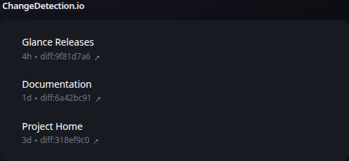

# ChangeDetection.io

[Widgets](../widgets.md) · [Configuration](../configuration.md) · [Glance README](../../README.md)

Display a list watches from changedetection.io.

Example
## Quick start


```yaml
- type: change-detection
  instance-url: https://changedetection.mydomain.com/
  token: ${CHANGE_DETECTION_TOKEN}
```

Preview:



## Configuration

This widget also supports the [shared widget properties](../widgets.md#shared-properties).

| Name | Type | Required | Default |
| ---- | ---- | -------- | ------- |
| instance-url | string | no | `https://www.changedetection.io` |
| token | string | no |  |
| timeout | duration string | no | |
| allow-insecure | boolean | no | false |
| headers | key & value | no | |
| limit | integer | no | 10 |
| collapse-after | integer | no | 5 |
| watches | array of strings | no |  |

### `instance-url`
The URL pointing to your instance of `changedetection.io`.

### `token`
The API access token which can be found in `SETTINGS > API`. Optionally, you can specify this using an environment variable with the syntax `${VARIABLE_NAME}`.

### `timeout`
The maximum time to wait for requests to the ChangeDetection.io instance.

### `allow-insecure`
Whether to allow invalid/self-signed certificates when contacting the ChangeDetection.io instance.

### `headers`
Optional HTTP headers sent with requests to the ChangeDetection.io instance. The dedicated `token` setting remains authoritative for its authentication header.

### `limit`
The maximum number of watches to show.

### `collapse-after`
How many watches are visible before the "SHOW MORE" button appears. Set to `-1` to never collapse.

### `watches`
By default all of the configured watches will be shown. Optionally, you can specify a list of UUIDs for the specific watches you want to have listed:

```yaml
  - type: change-detection
    watches:
      - 1abca041-6d4f-4554-aa19-809147f538d3
      - 705ed3e4-ea86-4d25-a064-822a6425be2c
```


---

[Widgets](../widgets.md) · [Configuration](../configuration.md) · [Back to top](#changedetectionio)
