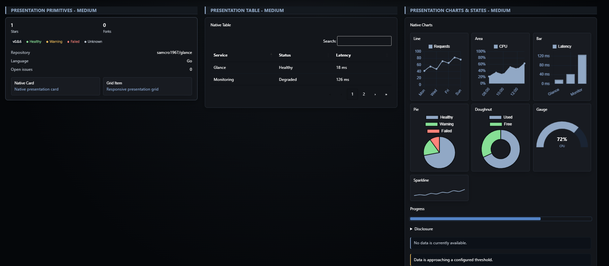
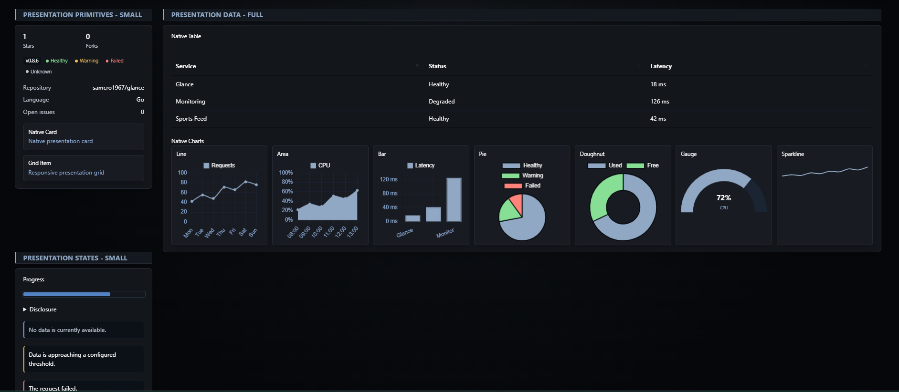
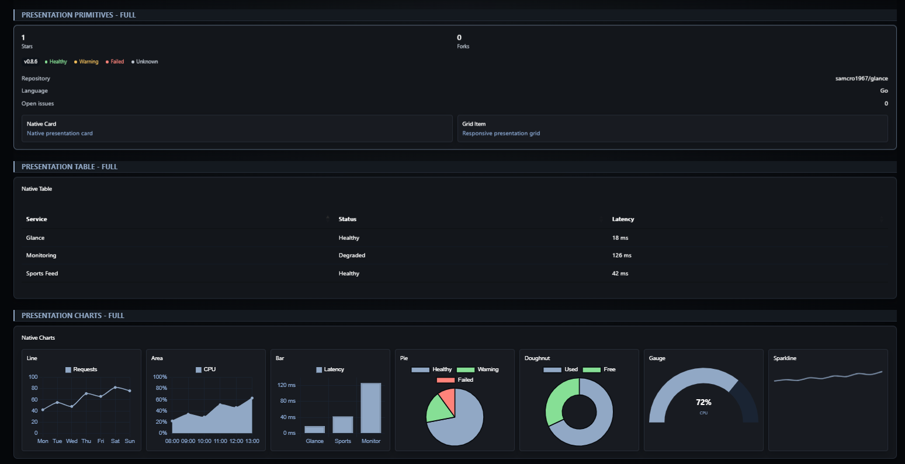

# Custom API

[Widgets](../widgets.md) · [Configuration](../configuration.md) · [Glance README](../../README.md)

Fetch data from an HTTP API and render it with a Go template. Custom API supports configurable requests, query parameters, authentication, subrequests, reusable template options, native presentation components, and stale-data fallback.

> [!NOTE]
>
> Custom API is intended for users comfortable with HTTP APIs, HTML, and Go templates. This page is the complete reference for configuring and authoring Custom API widgets.

## Quick start

```yaml
- type: custom-api
  title: Random Fact
  cache: 6h
  url: https://uselessfacts.jsph.pl/api/v2/facts/random
  template: |
    <p class="size-h4 color-paragraph">{{ .JSON.String "text" }}</p>
```


## Configuration

| Property | Type | Required | Default |
| --- | --- | --- | --- |
| `url` | string | no | — |
| `headers` | map | no | — |
| `method` | string | no | `GET` |
| `body-type` | string | no | `json` |
| `body` | any | no | — |
| `basic-auth` | object | no | — |
| `frameless` | boolean | no | `false` |
| `allow-insecure` | boolean | no | `false` |
| `skip-json-validation` | boolean | no | `false` |
| `template` | string | yes* | — |
| `options` | map | no | — |
| `parameters` | map | no | — |
| `subrequests` | map | no | — |
| `timeout` | duration | no | `5s` |
| `tables` | map | no | — |
| `charts` | map | no | — |

All widgets also support the [shared widget properties](../widgets.md#shared-properties).

`template` is required for a normal Custom API widget. A Custom API embedded directly in a [Status Bar](status-bar.md) uses the Status Bar compact response contract instead and does not accept a template.

### `url`

The URL to fetch the data from. It must be accessible from the server that Glance is running on.

### `headers`

Optionally specify the headers that will be sent with the request.

```yaml
headers:
  x-api-key: your-api-key
  Accept: application/json
```

### `method`

The HTTP method to use when making the request. Possible values are `GET`, `POST`, `PUT`, `PATCH`, `DELETE`, `OPTIONS` and `HEAD`.

### `body-type`

The type of the body that will be sent with the request. Possible values are `json` and `string`.

### `body`

The body that will be sent with the request. It can be a string or a map.

```yaml
body-type: json
body:
  key1: value1
  key2: value2
  multiple-items:
    - item1
    - item2
```

Or:

```yaml
body-type: string
body: |
  key1=value1&key2=value2
```

### `basic-auth`

Optionally specify credentials to be sent with the request using HTTP basic authentication.

```yaml
basic-auth:
  username: your-username
  password: your-password
```

### `frameless`

When set to `true`, removes the border and padding around the widget.

### `allow-insecure`

Whether to ignore invalid or self-signed certificates.

### `skip-json-validation`

When set to `true`, skips the JSON validation step. This is useful when the API returns JSON Lines/newline-delimited JSON, which consists of several JSON objects separated by newlines.

### `template`

The template used to display the data. Templates use Go's [`html/template`](https://pkg.go.dev/html/template) package and [tidwall/gjson](https://github.com/tidwall/gjson) for JSON selection.

Templates can contain arbitrary HTML and use the existing Glance utility classes. Native [presentation components](#native-presentation-components) are optional and can be mixed with ordinary template HTML.

### `options`

A map of options passed to the template and used to modify the behavior of a reusable template.

Instead of defining options inside a template:

```yaml
- type: custom-api
  template: |
    {{ $collapseAfter := 5 }}
    {{ $showThumbnails := true }}

    <ul class="list list-gap-10 collapsible-container" data-collapse-after="{{ $collapseAfter }}">
      {{ if $showThumbnails }}
        <li>
          
        </li>
      {{ end }}
    </ul>
```

you can read values from `.Options` and provide defaults:

```yaml
- type: custom-api
  template: |
    <ul class="list list-gap-10 collapsible-container" data-collapse-after="{{ .Options.IntOr "collapse-after" 5 }}">
      {{ if (.Options.BoolOr "show-thumbnails" true) }}
        <li>
          
        </li>
      {{ end }}
    </ul>
```

Then configure the options separately:

```yaml
- type: custom-api
  options:
    collapse-after: 5
    show-thumbnails: true
```

This also allows the same template to be reused by multiple widgets with different options.

The available methods on `.Options` are `StringOr`, `IntOr`, `FloatOr`, `BoolOr`, and `JSON`.

### `parameters`

A list of keys and values sent to the Custom API as query parameters.

```yaml
parameters:
  param1: value1
  param2:
    - item1
    - item2
```

> [!NOTE]
>
> Setting this property overrides query parameters already present in the URL.

### `subrequests`

A map of additional requests executed concurrently and made available to the template through `.Subrequest`.

```yaml
- type: custom-api
  cache: 2h
  url: https://uselessfacts.jsph.pl/api/v2/facts/random
  subrequests:
    another-one:
      url: https://uselessfacts.jsph.pl/api/v2/facts/random
  title: Random Fact
  template: |
    <p class="size-h4 color-paragraph">{{ .JSON.String "text" }}</p>
    <p class="size-h4 color-paragraph margin-top-15">{{ (.Subrequest "another-one").JSON.String "text" }}</p>
```

Subrequests support the same request properties as the primary request except for `subrequests` itself.

You can assign a subrequest to a variable:

```yaml
template: |
  {{ $anotherOne := .Subrequest "another-one" }}
  <p>{{ $anotherOne.JSON.String "text" }}</p>
```

The response is also available:

```yaml
template: |
  {{ $anotherOne := .Subrequest "another-one" }}
  <p>{{ $anotherOne.Response.StatusCode }}</p>
```

### `timeout`

The maximum amount of time to wait for the API response. The value must be an integer followed by `s` (seconds), `m` (minutes), `h` (hours), or `d` (days), for example `10s`, `1m`, or `2h`.

The timeout can be configured independently for the primary request and each subrequest.

Defaults to `5s`.

### `tables`

Defines named configurations for [native tables](#native-tables). Tables are opt-in; ordinary HTML tables continue to work unchanged.

```yaml
tables:
  services:
    responsive: true
    sortable: true
    search: true
    pagination: true
    page-size: 25
    columns:
      service:
        type: text
        priority: 1
      latency:
        type: number
        priority: 2
```

A named table is referenced from the template with `data-glance-table`:

```html
<table class="glance-table" data-glance-table="services">
  ...
</table>
```

### `charts`

Defines named configurations for [native charts](#native-charts).

```yaml
charts:
  resources:
    type: line
    height: 180
    legend: true
    min: 0
    max: 100
    unit: "%"
```

A chart configuration is referenced from the template with `data-glance-chart`:

```html
<div class="glance-chart" data-glance-chart="resources">
  <script type="application/json">
    {"labels":["Mon","Tue","Wed"],"series":[{"name":"CPU","values":[42,55,48]}]}
  </script>
</div>
```

## Status Bar usage

When `custom-api` is a direct child of a [Status Bar](status-bar.md), it uses the Status Bar compact JSON contract instead of the normal template renderer.

In this mode, `template`, `subrequests`, `options`, `skip-json-validation`, `tables`, and `charts` are not supported. See the Status Bar documentation for the exact response envelope and item fields.

## Stale fallback

After a `custom-api` widget has completed at least one successful refresh, Glance preserves that last successfully rendered content if a later refresh fails. The previous content remains visible and is marked with a `STALE` indicator showing how long ago the last successful refresh occurred.

The `cache` setting continues to control how often fresh data is requested. A failed refresh does not replace the last successful content or reset its age. Glance retries the update according to its normal retry schedule, and the stale indicator is automatically cleared when a later refresh succeeds.

If the initial request fails before any content has been successfully rendered, there is no previous content to fall back to and the normal widget error behavior is used.

A non-success HTTP response with an empty body is treated as a failed refresh. Non-success responses containing a body retain the existing Custom API behavior and remain available to templates through `.Response`, allowing templates to handle status codes explicitly.

## Native presentation components

Custom API templates can use Glance-owned presentation components for common dashboard presentation without implementing equivalent styling and browser behavior in every template.

Presentation components are entirely optional. Existing Custom API templates continue to work without modification, and native components can be mixed with arbitrary template HTML and existing Glance utility classes.

The public interface is deliberately declarative:

- YAML configures table and chart behavior.
- Templates provide content and layout.
- Glance owns styling, responsive behavior, lifecycle management, theme integration, and browser enhancement.
- Third-party rendering libraries are private implementation details and their configuration APIs are not exposed.

Presentation components participate in normal Custom API rendering and live widget replacement. Browser-side behavior is cleaned up before refreshed widget content is replaced and initialized again after replacement.



*Native presentation components combine Glance primitives, enhanced tables, and charts while adapting to the available widget width.*

### Metrics and statistics

Use `glance-metrics` to create a responsive collection of statistics and `glance-stat` for each statistic.

```html
<div class="glance-metrics">
  <div class="glance-stat">
    <div class="glance-stat-value">{{ .JSON.Int "requests" }}</div>
    <div class="glance-stat-label">Requests</div>
  </div>

  <div class="glance-stat">
    <div class="glance-stat-value">{{ .JSON.Int "errors" }}</div>
    <div class="glance-stat-label">Errors</div>
  </div>
</div>
```

The metric layout adapts to the width of the widget rather than relying only on the page viewport.

### Badges

Use `glance-badge` for compact labels.

```html
<span class="glance-badge">Production</span>
```

### Status

Use `glance-status` for semantic status values.

Supported variants are:

- `positive`
- `negative`
- `warning`
- `neutral`

```html
<span class="glance-status glance-status-positive">Healthy</span>
<span class="glance-status glance-status-warning">Degraded</span>
<span class="glance-status glance-status-negative">Offline</span>
<span class="glance-status glance-status-neutral">Unknown</span>
```

### Key/value layouts

Use `glance-key-value` for compact labeled values.

```html
<div class="glance-key-value">
  <span>Version</span>
  <span>{{ .JSON.String "version" }}</span>
</div>

<div class="glance-key-value">
  <span>Uptime</span>
  <span>{{ .JSON.String "uptime" }}</span>
</div>
```

### Cards

Use `glance-card` for a Glance-themed contained surface.

```html
<div class="glance-card">
  <div class="size-h4">API</div>
  <div class="color-subdue">Primary service</div>
</div>
```

### Responsive grids

Use `glance-grid` to arrange cards or other content in a responsive grid.

```html
<div class="glance-grid">
  <div class="glance-card">Service A</div>
  <div class="glance-card">Service B</div>
  <div class="glance-card">Service C</div>
</div>
```

The grid responds to the available widget width, including small, medium, and full-width Glance columns.

### Progress meters

Use `glance-progress` with `glance-progress-value`.

```html
<div class="glance-progress">
  <div class="glance-progress-value" style="width: {{ .JSON.Int "percent" }}%"></div>
</div>
```

The template remains responsible for calculating the percentage represented by the meter.

### Details and disclosure

Use `glance-details` and `glance-summary` for expandable content.

```html
<details class="glance-details">
  <summary class="glance-summary">More information</summary>
  <div>
    {{ .JSON.String "details" }}
  </div>
</details>
```

### Empty, warning, error, and degraded states

Glance provides semantic state components for common widget conditions.

```html
<div class="glance-state glance-state-empty">
  No data available.
</div>

<div class="glance-state glance-state-warning">
  Data may be incomplete.
</div>

<div class="glance-state glance-state-error">
  Unable to load this section.
</div>

<div class="glance-state glance-state-degraded">
  Some sources are unavailable.
</div>
```

These states are intended for conditions handled explicitly by the template. They do not replace Glance's normal widget refresh, stale-content, or error lifecycle.

## Native tables

Native tables enhance semantic HTML tables with Glance-owned behavior while retaining the underlying table as a usable fallback.

Native table behavior is opt-in through `data-glance-table`.

### Anonymous tables

The simplest form requires no YAML table configuration:

```html
<table class="glance-table" data-glance-table>
  <thead>
    <tr>
      <th>Service</th>
      <th>Status</th>
      <th>Latency</th>
    </tr>
  </thead>
  <tbody>
    <tr>
      <td>Glance</td>
      <td>Healthy</td>
      <td>18 ms</td>
    </tr>
  </tbody>
</table>
```

Anonymous tables use these defaults:

| Option | Default |
| --- | --- |
| Responsive | `true` |
| Sortable | `true` |
| Search | `false` |
| Pagination | `false` |
| Page size | `10` |

### Named tables

Named configurations allow behavior to be controlled from YAML:

```yaml
- type: custom-api
  url: https://api.example.com/services
  tables:
    services:
      responsive: true
      sortable: true
      search: true
      pagination: true
      page-size: 10
      columns:
        service:
          type: text
          priority: 1
        status:
          type: text
          priority: 2
        latency:
          type: number
          priority: 3
  template: |
    <table class="glance-table" data-glance-table="services">
      <thead>
        <tr>
          <th data-column="service">Service</th>
          <th data-column="status">Status</th>
          <th data-column="latency">Latency</th>
        </tr>
      </thead>
      <tbody>
        {{ range .JSON.Array "services" }}
          <tr>
            <td>{{ .String "name" }}</td>
            <td>{{ .String "status" }}</td>
            <td>{{ .Int "latency" }} ms</td>
          </tr>
        {{ end }}
      </tbody>
    </table>
```

Supported table options are:

| Option | Type | Default | Description |
| --- | --- | --- | --- |
| `responsive` | boolean | `true` | Adapts the table to available widget width. |
| `sortable` | boolean | `true` | Allows columns to be sorted. |
| `search` | boolean | `false` | Displays table search. |
| `pagination` | boolean | `false` | Enables pagination. |
| `page-size` | integer | `10` | Number of rows per page when pagination is enabled. |
| `columns` | map | — | Defines semantic column behavior. |

### Semantic columns

Column configuration uses names rather than physical column indexes.

```yaml
columns:
  latency:
    type: number
    priority: 2
```

The corresponding table header identifies the column:

```html
<th data-column="latency">Latency</th>
```

Supported column types are:

- `text`
- `number`
- `date`

`priority` controls which columns are retained longest when a responsive table must reduce the number of visible columns. Lower values represent higher responsive priority.

Column names keep configuration independent of the physical position of the column in the template.

### Table failure behavior

If browser enhancement of a native table fails, Glance leaves the semantic HTML table in place rather than replacing the entire widget with an error.

This makes the table itself the fallback presentation.

## Native charts

Native charts render declarative JSON data using a Glance-owned chart configuration.

A chart requires a named entry under `charts` and a matching `data-glance-chart` value in the template.

Supported chart types are:

- `line`
- `area`
- `bar`
- `pie`
- `doughnut`
- `sparkline`
- `gauge`

### Chart configuration

```yaml
charts:
  resources:
    type: line
    height: 180
    legend: true
    min: 0
    max: 100
    unit: "%"
    stacked: false
```

Supported chart options are:

| Option | Type | Default | Description |
| --- | --- | --- | --- |
| `type` | string | required | Chart type. |
| `height` | integer | type-dependent | Chart height in pixels. |
| `legend` | boolean | type-dependent | Controls legend visibility. |
| `min` | number | — | Minimum value for applicable charts. |
| `max` | number | — | Maximum value for applicable charts. |
| `unit` | string | — | Unit displayed with applicable values. |
| `stacked` | boolean | `false` | Enables stacked axes for applicable charts. |

Default heights are:

- `48` for `sparkline`
- `140` for `gauge`
- `180` for all other chart types

Legends default to `false` for `sparkline` and `gauge`, and `true` for the other chart types.

When both `min` and `max` are configured, `min` must be less than `max`.

### Line, area, and bar data

Line, area, and bar charts use `labels` and `series`.

```html
<div class="glance-chart" data-glance-chart="resources" data-glance-chart-label="Resource usage">
  <script type="application/json">
    {
      "labels": ["Mon", "Tue", "Wed", "Thu"],
      "series": [
        {
          "name": "CPU",
          "values": [42, 55, 48, 61]
        },
        {
          "name": "Memory",
          "values": [58, 60, 63, 65]
        }
      ]
    }
  </script>
</div>
```

An `area` chart uses the same data model as a line chart but fills the area beneath each series.

A `bar` chart also uses the same labels/series model. Set `stacked: true` to stack applicable datasets.

### Pie and doughnut data

Pie and doughnut charts use labels and values:

```html
<div class="glance-chart" data-glance-chart="storage" data-glance-chart-label="Storage usage">
  <script type="application/json">
    {
      "labels": ["Used", "Free"],
      "values": [72, 28]
    }
  </script>
</div>
```

For example:

```yaml
charts:
  storage:
    type: doughnut
    height: 180
    legend: true
```

### Sparkline data

Sparklines use a single `values` array:

```yaml
charts:
  requests:
    type: sparkline
```

```html
<div class="glance-chart" data-glance-chart="requests" data-glance-chart-label="Request trend">
  <script type="application/json">
    {"values":[18,24,21,32,29,41,38]}
  </script>
</div>
```

Sparklines are intended for compact trend visualization and default to a height of `48` pixels.

### Gauge data

Gauges use a single value and optional label:

```yaml
charts:
  cpu:
    type: gauge
    min: 0
    max: 100
    unit: "%"
```

```html
<div class="glance-chart" data-glance-chart="cpu" data-glance-chart-label="CPU usage">
  <script type="application/json">
    {"value":72,"label":"CPU"}
  </script>
</div>
```

Gauge range and units belong to the YAML configuration rather than the data payload.

### Theme and responsive behavior

Native charts use Glance theme colors and update when the active theme changes.



*Presentation components adapt to narrow widget layouts while preserving the same Glance-owned styling and behavior.*



*Full-width widgets provide additional space for tables, charts, and multi-column presentation.*

Chart dimensions adapt to the available widget width while respecting the configured height. This allows the same chart template to be used in small, medium, full-width, and mobile layouts.

`data-glance-chart-label` can be used to provide an accessible label for the chart. When no label is provided, Glance supplies a generic chart label.

### Chart failure behavior

Chart failures are isolated to the affected chart. A malformed or otherwise unrenderable chart displays a local Glance error state rather than failing the entire Custom API widget or preventing sibling charts from rendering.

Chart instances are cleaned up during live widget replacement and recreated for refreshed content.

## Template examples

### Accessing object fields

JSON response:

```json
{
  "title": "My Title",
  "content": "My Content"
}
```

Template:

```html
<div>{{ .JSON.String "title" }}</div>
<div>{{ .JSON.String "content" }}</div>
```

### Looping through arrays

JSON response:

```json
{
  "author": "John Doe",
  "posts": [
    {
      "title": "My Title",
      "content": "My Content"
    },
    {
      "title": "My Title 2",
      "content": "My Content 2"
    }
  ]
}
```

Template:

```html
{{ range .JSON.Array "posts" }}
  <div>{{ .String "title" }}</div>
  <div>{{ .String "content" }}</div>
{{ end }}
```

Inside `range`, the context is the current array element. Use `$` to access the top-level context:

```html
{{ range .JSON.Array "posts" }}
  <div>{{ .String "title" }}</div>
  <div>{{ $.JSON.String "author" }}</div>
{{ end }}
```

### Arrays of basic values

For a top-level array:

```json
[
  "Apple",
  "Banana",
  "Cherry",
  "Watermelon"
]
```

use an empty key:

```html
{{ range .JSON.Array "" }}
  <div>{{ .String "" }}</div>
{{ end }}
```

An item can also be accessed by index:

```html
<div>{{ .JSON.String "0" }}</div>
```

### Nested objects

Nested values can be accessed with dot notation:

```html
<div>{{ .JSON.String "user.address.city" }}</div>
<div>{{ .JSON.String "user.address.state" }}</div>
```

Indexes can appear in a path:

```html
<div>{{ .JSON.String "users.0.name" }}</div>
<div>{{ .JSON.String "users.1.name" }}</div>
```

### Checking whether a field exists

```html
{{ if .JSON.Exists "user.age" }}
  <div>{{ .JSON.Int "user.age" }}</div>
{{ else }}
  <div>Age not provided</div>
{{ end }}
```

### Calculations

```html
<div>{{ sub (.JSON.Int "price") (.JSON.Int "discount") }}</div>
```

Other arithmetic helpers include `add`, `mul`, `div`, and `mod`.

### Relative times

```html
{{ range .JSON.Array "posts" }}
  <div>{{ .String "title" }}</div>
  <div {{ .String "date" | parseTime "rfc3339" | toRelativeTime }}></div>
{{ end }}
```

`toRelativeTime` returns an HTML attribute used by Glance to keep the displayed relative time updated in the browser.

### Response status and headers

The main response status is available through `.Response`:

```html
{{ if eq .Response.StatusCode 200 }}
  <p>Success!</p>
{{ else }}
  <p>Failed to fetch data</p>
{{ end }}
```

Response headers are also available:

```html
<div>{{ .Response.Header.Get "Content-Type" }}</div>
```

### JSON Lines

For JSON Lines/newline-delimited JSON:

```json
{"name": "Steve", "age": 30}
{"name": "Alex", "age": 25}
{"name": "John", "age": 35}
```

disable normal JSON validation:

```yaml
- type: custom-api
  skip-json-validation: true
```

and iterate with `.JSONLines`:

```html
{{ range .JSONLines }}
  <p>{{ .String "name" }} is {{ .Int "age" }} years old</p>
{{ end }}
```

GJSON selectors can also be used with JSON Lines:

```html
{{ range .JSON.Array "..#.name" }}
  <p>{{ .String "" }}</p>
{{ end }}
```

## Dynamic requests from templates

Additional HTTP requests can be created from within a template when later requests depend on data returned by an earlier request.

```yaml
- type: custom-api
  url: https://api.example.com/get-id-of-something
  template: |
    {{ $theID := .JSON.String "id" }}

    {{
      $something := newRequest (concat "https://api.example.com/something/" $theID)
        | withParameter "key" "value"
        | withHeader "Authorization" "Bearer token"
        | getResponse
    }}

    {{ $something.JSON.String "title" }}
```

The following functions are available for building dynamic requests:

- `newRequest(url string) Request`: Creates a new request. Requests without a body default to `GET`.
- `withMethod(method string, request Request) Request`: Sets the HTTP method. Methods are normalized to uppercase when the request is initialized.
- `withHeader(key string, value string, request Request) Request`: Adds a request header.
- `withParameter(key string, value string, request Request) Request`: Adds a query parameter.
- `withStringBody(body string, request Request) Request`: Adds a string body. Requests with a body default to `POST` when no method is explicitly set.
- `withBasicAuth(username string, password string, request Request) Request`: Sets HTTP basic authentication credentials.
- `withAllowInsecure(value bool|string, request Request) Request`: Controls whether invalid or self-signed TLS certificates are accepted.
- `getResponse(request Request) Response`: Executes the request and returns its response.

These functions can be chained using Go template pipelines:

```go-html-template
{{
  $response := newRequest "https://api.example.com/resource"
    | withMethod "PUT"
    | withHeader "Content-Type" "application/json"
    | withStringBody `{"enabled":true}`
    | getResponse
}}
```

A widget does not need a top-level `url` when all requests are constructed dynamically:

```yaml
- type: custom-api
  title: Events from the last 24h
  template: |
    {{
      $events := newRequest "https://api.example.com/events"
        | withParameter "after" (offsetNow "-24h" | formatTime "rfc3339")
        | getResponse
    }}

    {{ if eq $events.Response.StatusCode 200 }}
      {{ range $events.JSON.Array "events" }}
        <div>{{ .String "title" }}</div>
        <div {{ .String "date" | parseTime "rfc3339" | toRelativeTime }}></div>
      {{ end }}
    {{ else }}
      <p>Failed to fetch data: {{ $events.Response.Status }}</p>
    {{ end }}
```

When using dynamic requests, templates are responsible for checking response status where required.

## Template functions

### JSON

The following functions are available on the `JSON` object:

- `String(key string) string`: Returns the value of the key as a string.
- `Int(key string) int`: Returns the value of the key as an integer.
- `Float(key string) float`: Returns the value of the key as a float.
- `Bool(key string) bool`: Returns the value of the key as a boolean.
- `Array(key string) []JSON`: Returns the value of the key as an array of `JSON` objects.
- `Exists(key string) bool`: Returns true if the key exists in the JSON object.

### Options

The following functions are available on the `Options` object:

- `StringOr(key string, default string) string`: Returns the value of the key as a string, or the default value if the key does not exist.
- `IntOr(key string, default int) int`: Returns the value of the key as an integer, or the default value if the key does not exist.
- `FloatOr(key string, default float) float`: Returns the value of the key as a float, or the default value if the key does not exist.
- `BoolOr(key string, default bool) bool`: Returns the value of the key as a boolean, or the default value if the key does not exist.
- `JSON(key string) JSON`: Returns the value of the key as a stringified `JSON` object, or throws an error if the key does not exist.

### Glance helpers

The following helper functions provided by Glance are available:

- `toFloat(i int) float`: Converts an integer to a float.
- `toInt(f float) int`: Converts a float to an integer.
- `toRelativeTime(t time.Time) template.HTMLAttr`: Converts a time to a dynamically updated relative time such as `2h` or `1d`. The returned value must be used as an HTML attribute, for example `<span {{ toRelativeTime .Time }}></span>`.
- `now() time.Time`: Returns the current time.
- `offsetNow(offset string) time.Time`: Returns the current time with an offset such as `3h`, `-1h`, or `2h30m10s`.
- `duration(str string) time.Duration`: Parses a duration such as `1h`, `24h`, or `5h30m`.
- `parseTime(layout string, s string) time.Time`: Parses a string into a time. The layout may use Go's date format or `unix`, `RFC3339`, `RFC3339Nano`, `DateTime`, or `DateOnly`.
- `formatTime(layout string, s string) time.Time`: Formats a time using the same layout conventions as `parseTime`.
- `parseLocalTime(layout string, s string) time.Time`: Parses a time without a timezone using the local timezone rather than UTC.
- `parseRelativeTime(layout string, s string) time.Time`: Shorthand for parsing a time for use with `toRelativeTime`.
- `add(a, b float) float`: Adds two numbers.
- `sub(a, b float) float`: Subtracts two numbers.
- `mul(a, b float) float`: Multiplies two numbers.
- `div(a, b float) float`: Divides two numbers.
- `mod(a, b int) int`: Returns the remainder after dividing `a` by `b`.
- `formatApproxNumber(n int) string`: Formats a number in compact form, for example `1000` as `1k`.
- `formatNumber(n float|int) string`: Formats a number with separators, for example `1000` as `1,000`.
- `safeHTML(str string) template.HTML`: Marks a string as trusted HTML so it is rendered without HTML escaping.
- `trimPrefix(prefix string, str string) string`: Trims a prefix.
- `trimSuffix(suffix string, str string) string`: Trims a suffix.
- `trimSpace(str string) string`: Trims surrounding whitespace.
- `toLower(str string) string`: Converts a string to lowercase.
- `toUpper(str string) string`: Converts a string to uppercase.
- `equalFold(a, b string) bool`: Compares strings using Unicode case-folding.
- `contains(substr string, str string) bool`: Reports whether a string contains a substring.
- `hasPrefix(prefix string, str string) bool`: Reports whether a string begins with a prefix.
- `hasSuffix(suffix string, str string) bool`: Reports whether a string ends with a suffix.
- `split(separator string, str string) []string`: Splits a string around a separator.
- `join(separator string, strings []string) string`: Joins strings with a separator.
- `replaceAll(old string, new string, str string) string`: Replaces all occurrences of a string.
- `replaceMatches(pattern string, replacement string, str string) string`: Replaces regular-expression matches.
- `findMatch(pattern string, str string) string`: Finds the first regular-expression match.
- `findSubmatch(pattern string, str string) string`: Finds the first regular-expression submatch.
- `sortByString(key string, order string, arr []JSON) []JSON`: Sorts JSON objects by a string key.
- `sortByInt(key string, order string, arr []JSON) []JSON`: Sorts JSON objects by an integer key.
- `sortByFloat(key string, order string, arr []JSON) []JSON`: Sorts JSON objects by a float key.
- `sortByTime(key string, layout string, order string, arr []JSON) []JSON`: Sorts JSON objects by a time key.
- `concat(strings ...string) string`: Concatenates strings.
- `unique(key string, arr []JSON) []JSON`: Returns unique JSON objects based on a key.
- `percentChange(current float, previous float) float`: Calculates percentage change.
- `startOfDay(t time.Time) time.Time`: Returns the start of the day.
- `endOfDay(t time.Time) time.Time`: Returns the end of the day.

> [!WARNING]
>
> Values rendered by Custom API templates are HTML-escaped by default. `safeHTML` bypasses that protection and should only be used with HTML from a source you trust. Untrusted HTML may contain scripts, event handlers, or other active content that executes in the browser.

### Sprout functions

Custom API templates provide a curated set of functions from [Sprout](https://github.com/go-sprout/sprout), currently based on Sprout v1.1.1.

Sprout functions use a `sprout` prefix so they do not replace or change existing Glance helpers. For example, Glance `add` remains `add`, while Sprout `add` is available as `sproutAdd`.

Only the functions listed below are part of the supported Custom API Sprout surface.

#### Conversion

`sproutToBool`, `sproutToInt`, `sproutToInt64`, `sproutToUint`, `sproutToUint64`, `sproutToFloat64`, `sproutToOctal`, `sproutToString`, `sproutToDate`, `sproutToLocalDate`, `sproutToDuration`

#### Strings

`sproutNospace`, `sproutTrim`, `sproutTrimAll`, `sproutTrimPrefix`, `sproutTrimSuffix`, `sproutContains`, `sproutHasPrefix`, `sproutHasSuffix`, `sproutToLower`, `sproutToUpper`, `sproutReplace`, `sproutRepeat`, `sproutJoin`, `sproutTrunc`, `sproutEllipsis`, `sproutEllipsisBoth`, `sproutInitials`, `sproutPlural`, `sproutWrap`, `sproutWrapWith`, `sproutQuote`, `sproutSquote`, `sproutToCamelCase`, `sproutToKebabCase`, `sproutToPascalCase`, `sproutToDotCase`, `sproutToPathCase`, `sproutToConstantCase`, `sproutToSnakeCase`, `sproutToTitleCase`, `sproutUntitle`, `sproutSwapCase`, `sproutCapitalize`, `sproutUncapitalize`, `sproutSplit`, `sproutSplitn`, `sproutSubstr`, `sproutIndent`, `sproutNindent`, `sproutSeq`, `sproutEscape`, `sproutUnescape`

#### Slices

`sproutList`, `sproutAppend`, `sproutPrepend`, `sproutConcat`, `sproutChunk`, `sproutUniq`, `sproutCompact`, `sproutFlatten`, `sproutFlattenDepth`, `sproutSlice`, `sproutHas`, `sproutWithout`, `sproutRest`, `sproutInitial`, `sproutFirst`, `sproutLast`, `sproutReverse`, `sproutSortAlpha`, `sproutSplitList`, `sproutStrSlice`, `sproutUntil`, `sproutUntilStep`

#### Maps

`sproutDict`, `sproutGet`, `sproutSet`, `sproutUnset`, `sproutKeys`, `sproutValues`, `sproutPluck`, `sproutPick`, `sproutOmit`, `sproutDig`, `sproutHasKey`, `sproutMerge`, `sproutMergeOverwrite`

#### Regular expressions

`sproutRegexFind`, `sproutRegexFindAll`, `sproutRegexMatch`, `sproutRegexSplit`, `sproutRegexReplaceAll`, `sproutRegexReplaceAllLiteral`, `sproutRegexQuoteMeta`, `sproutRegexFindGroups`, `sproutRegexFindAllGroups`, `sproutRegexFindNamed`, `sproutRegexFindAllNamed`

#### Numeric

`sproutFloor`, `sproutCeil`, `sproutRound`, `sproutAdd`, `sproutAdd1`, `sproutSub`, `sproutMul`, `sproutMulf`, `sproutDiv`, `sproutDivf`, `sproutMod`, `sproutMin`, `sproutMinf`, `sproutMax`, `sproutMaxf`

#### Standard helpers

`sproutDefault`, `sproutEmpty`, `sproutAll`, `sproutAny`, `sproutCoalesce`, `sproutTernary`, `sproutCat`

#### Encoding

`sproutBase64Encode`, `sproutBase64Decode`, `sproutBase32Encode`, `sproutBase32Decode`, `sproutFromJSON`, `sproutToJSON`, `sproutToPrettyJSON`, `sproutToRawJSON`, `sproutFromYAML`, `sproutToYAML`, `sproutToIndentYAML`

#### Semantic versions

`sproutSemver`, `sproutSemverCompare`

The Sprout `shuffle` and `hello` functions are intentionally not exposed. Custom API also does not expose Sprout checksum, crypto, environment, filesystem, random, network, reflection, time, UUID/unique-ID, or deprecated regexp registries. Sprout aliases, including `must*` compatibility aliases, are not exposed.

Existing Glance helpers keep their existing behavior even when Sprout provides a similarly named function. For example, Glance `div` returns `0` when dividing by zero, while `sproutDiv` reports a template execution error.

Sprout slice helpers work directly with arrays returned by `.JSON.Array`. The resulting JSON elements retain their normal `String`, `Int`, `Float`, `Bool`, `Exists`, `Array`, and `Get` methods.

```go-html-template
{{ $items := .JSON.Array "items" }}
First: {{ ($items | sproutFirst).String "name" }}
Last: {{ ($items | sproutLast).String "name" }}

{{ range $items | sproutReverse }}
  <div>{{ .String "name" }}</div>
{{ end }}
```

Sprout helpers can also be used independently of JSON data:

```go-html-template
{{ sproutToUpper "glance" }}
{{ sproutDefault "fallback" "" }}
{{ sproutRegexMatch "^g.*e$" "glance" }}
{{ sproutAdd 2 3 }}
```

See the [Sprout documentation](https://docs.atom.codes/sprout) for detailed behavior and argument conventions. Add the `sprout` prefix to the supported function names when using them in Custom API templates.

### Go template helpers

The following helper functions provided by Go's `text/template` are available:

- `eq(a, b any) bool`: Compares two values for equality.
- `ne(a, b any) bool`: Compares two values for inequality.
- `lt(a, b any) bool`: Compares two values for less than.
- `le(a, b any) bool`: Compares two values for less than or equal to.
- `gt(a, b any) bool`: Compares two values for greater than.
- `ge(a, b any) bool`: Compares two values for greater than or equal to.
- `and(args ...bool) bool`: Returns true if all arguments are true.
- `or(args ...bool) bool`: Returns true if any argument is true.
- `not(a bool) bool`: Returns the opposite of the value.
- `index(item any, indexes ...any) any`: Returns the result of indexing an array, slice, map, or other indexable value.
- `slice(item any, indexes ...int) any`: Returns a slice using Go slice syntax.
- `len(item any) int`: Returns the length of an item.
- `print(args ...any) string`: Formats arguments using Go's default formatting.
- `printf(format string, args ...any) string`: Formats arguments according to a format specifier.
- `println(args ...any) string`: Formats arguments using Go's default formatting and appends a newline.

## Presentation security and compatibility

Native presentation components do not change the trust model of ordinary Custom API templates.

Existing templates continue to support arbitrary HTML and existing Glance classes. Presentation components are an opt-in convenience layer rather than a replacement template language or migration requirement.

Native table and chart behavior is declarative. Templates identify components with Glance classes and `data-glance-*` attributes, while chart data is supplied in `<script type="application/json">` elements. These elements contain data, not executable JavaScript.

Glance owns the browser implementation of native tables and charts. Custom API configuration does not expose arbitrary third-party callbacks, plugin loading, executable configuration, external script URLs, or runtime CDN dependencies.

Invalid static table or chart configuration is rejected during widget initialization. Runtime enhancement failures are isolated to the affected presentation component where possible.

---

[Widgets](../widgets.md) · [Configuration](../configuration.md) · [Glance README](../../README.md) · [Back to top](#custom-api)
