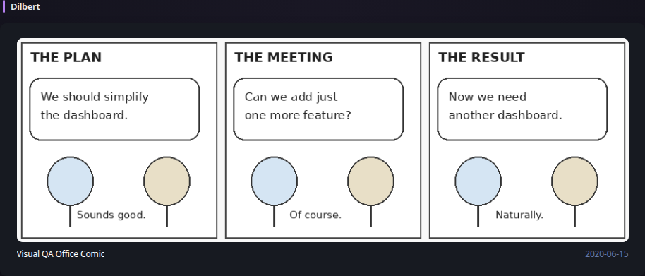
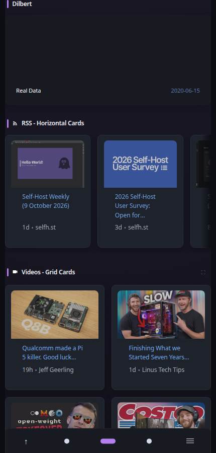

# Dilbert

[Widgets](../widgets.md) · [Configuration](../configuration.md) · [Glance README](../../README.md)

Display an archived Dilbert comic from the Internet Archive Wayback Machine. By default, the widget chooses a random comic from the original daily-strip archive range and changes it on the normal widget refresh schedule.

## Quick start

```yaml
- type: dilbert
```

Preview:



**Mobile preview:**



The comic is scaled to the available widget width. Click or keyboard-activate the comic to open a larger viewport-constrained view; press Escape, use the close button, or click the backdrop to close it.

## Configuration

This widget also supports the [shared widget properties](../widgets.md#shared-properties). Its default cache duration is `24h`.

| Name | Type | Required | Default |
| ---- | ---- | -------- | ------- |
| date | string (`YYYY-MM-DD`) | no | random |
| archive-url | URL | no | `https://web.archive.org` |

### `date`

Pin the widget to a specific comic date instead of choosing a random date. Supported dates are `1989-04-16` through `2023-03-12`, inclusive.

```yaml
- type: dilbert
  date: 2011-05-12
```

When `date` is omitted, a date is selected randomly whenever the widget performs a successful scheduled refresh.

### `archive-url`

Base URL of the Wayback-compatible archive endpoint. Most users should leave this unset. The option exists for compatible archive mirrors, proxies, and deterministic development fixtures.

```yaml
- type: dilbert
  archive-url: https://web.archive.org
```

The widget does not require an API key. It fetches the archived Dilbert strip page server-side, validates that the returned comic date matches the requested date, and uses the rendered archived comic image rather than Open Graph metadata. If an archived page is reachable but does not contain the requested comic, Glance can try another random date up to a small bounded limit. HTTP failures such as rate limiting are returned immediately so the widget does not multiply requests to the archive.

After a successful refresh, the normal Glance stale/degraded behavior preserves the previous comic if a later archive request fails.

> [!NOTE]
>
> Comic images are retrieved from third-party archival material. Availability and response times depend on the Internet Archive or the configured compatible archive endpoint.

---

[Widgets](../widgets.md) · [Configuration](../configuration.md) · [Back to top](#dilbert)
