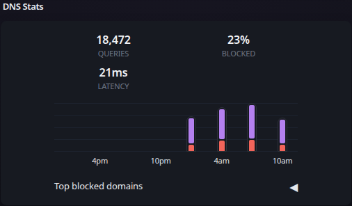

# DNS Stats

[Widgets](../widgets.md) · [Configuration](../configuration.md) · [Glance README](../../README.md)

Display statistics from a self-hosted ad-blocking DNS resolver such as AdGuard Home, Pi-hole, or Technitium.

Example:
## Quick start


```yaml
- type: dns-stats
  service: adguard
  url: https://adguard.domain.com/
  username: admin
  password: ${ADGUARD_PASSWORD}
```

Preview:



> [!NOTE]
>
> When using AdGuard Home the 3rd statistic on top will be the average latency and when using Pi-hole or Technitium it will be the total number of blocked domains from all adlists.

## Configuration

This widget also supports the [shared widget properties](../widgets.md#shared-properties).

| Name | Type | Required | Default |
| ---- | ---- | -------- | ------- |
| service | string | no | pihole |
| timeout | duration string | no | |
| allow-insecure | bool | no | false |
| url | string | yes |  |
| username | string | when service is `adguard` |  |
| password | string | when service is `adguard` or `pihole-v6` |  |
| token | string | when service is `pihole` |  |
| hide-graph | bool | no | false |
| hide-top-domains | bool | no | false |
| hour-format | string | no | 12h |

### `service`
Either `adguard`, `technitium`, or `pihole` (major version 5 and below) or `pihole-v6` (major version 6 and above).

### `timeout`
The maximum time to wait for a response from the DNS service.

### `allow-insecure`
Whether to allow invalid/self-signed certificates when making the request to the service.

### `url`
The base URL of the service.

### `username`
Only required when using AdGuard Home. The username used to log into the admin dashboard.

### `password`
Required when using AdGuard Home, where the password is the one used to log into the admin dashboard.

For Pi-hole version 6+, this field is required if you have set a password to log into Pi-hole. You can either use the password you use to log into the admin dashboard or the application password, which can be found in `Settings -> Web Interface / API -> Configure app password`.

### `token`
Required when using Pi-hole major version 5 or earlier. The API token which can be found in `Settings -> API -> Show API token`.

Also required when using Technitium, an API token can be generated at `Administration -> Sessions -> Create Token`.

### `hide-graph`
Whether to hide the graph showing the number of queries over time.

### `hide-top-domains`
Whether to hide the list of top blocked domains.

### `hour-format`
Whether to display the relative time in the graph in `12h` or `24h` format.


---

[Widgets](../widgets.md) · [Configuration](../configuration.md) · [Back to top](#dns-stats)
