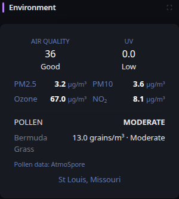

# Environment

[Widgets](../widgets.md) · [Configuration](../configuration.md) · [Glance README](../../README.md)

Display current air quality, UV index, pollutant concentrations, and optional pollen conditions and forecasts for a specific location. Air quality and UV data are provided by https://open-meteo.com/. Pollen data is provided by https://atmospore.com/ when an AtmoSpore API key is configured.

## Quick start

```yaml
- type: environment
  location: St. Louis, Missouri, United States
```

To include pollen data:

```yaml
- type: environment
  location: St. Louis, Missouri, United States
  pollen-api-key: ${ATMOSPORE_API_KEY}
```

## Preview



The compact view emphasizes the current US AQI and UV index, followed by PM2.5, PM10, ozone, and nitrogen dioxide measurements. When pollen is configured, it also displays the current overall pollen risk and up to three active pollen species.

Use the expand control in the widget header for additional detail. The expanded view includes US and European AQI, additional pollutant measurements, the available air-quality and UV forecast, the pollen forecast, and all currently active pollen species.

Air quality and pollen are fetched independently. If one provider temporarily fails while previously fetched data is available, the widget keeps that data visible and reports the failed refresh rather than discarding data from the successful provider.

## Configuration

This widget also supports the [shared widget properties](../widgets.md#shared-properties).

| Property | Type | Required | Default |
| --- | --- | --- | --- |
| `location` | string | yes | — |
| `pollen-api-key` | string | no | — |

### `location`

The location to fetch environmental information for. Location resolution uses the same Open-Meteo geocoding resource as the Weather widget. Glance uses the first result when multiple locations match, so include the state or administrative area when needed to disambiguate common city names.

### `pollen-api-key`

Optional AtmoSpore API key used to add pollen conditions and forecast data. Air quality, UV, and pollutant measurements continue to work without this property.

Keep the API key outside the Glance configuration and reference it through an environment variable:

```yaml
- type: environment
  location: St. Louis, Missouri, United States
  pollen-api-key: ${ATMOSPORE_API_KEY}
```

Pollen concentrations are displayed in grains/m³. The widget uses AtmoSpore-provided risk classifications and displays only species with a non-zero current concentration.

> [!NOTE]
>
> Air quality and UV data are provided by Open-Meteo. Pollen data is provided by AtmoSpore and requires an AtmoSpore API key. Provider availability, forecasts, and classifications are controlled by those services.

---

[Widgets](../widgets.md) · [Configuration](../configuration.md) · [Back to top](#environment)
