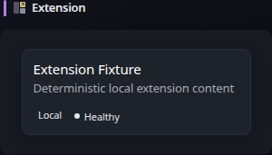

# Extension

[Widgets](../widgets.md) · [Configuration](../configuration.md) · [Glance README](../../README.md)

Display content supplied by an external Glance extension endpoint. The widget supports request parameters, headers, authentication, TLS controls, and extension-provided presentation metadata.




## Quick start


Display a widget provided by an external source (third party). For extension development, see the [Extensions guide](../extensions.md).

```yaml
- type: extension
  url: https://domain.com/widget/display-a-message
  allow-potentially-dangerous-html: true
  parameters:
    message: Hello, world!
```


## Configuration
| Property | Type | Required | Default |
| --- | --- | --- | --- |
| `url` | string | yes | — |
| `fallback-content-type` | string | no | — |
| `allow-potentially-dangerous-html` | boolean | no | `false` |
| `timeout` | duration | no | inherited |
| `allow-insecure` | boolean | no | `false` |
| `headers` | map | no | — |
| `basic-auth` | object | no | — |
| `parameters` | map | no | — |

All widgets also support the [shared widget properties](../widgets.md#shared-properties). The Extension widget uses a default `cache` duration of `30m`.

## Response metadata

Extension endpoints can control widget presentation with response headers including `Widget-Title`, `Widget-Title-URL`, `Widget-Content-Type`, and `Widget-Content-Frameless`. See the [extension development guide](../extensions.md) for the complete producer-side contract.

### `url`
The absolute HTTP or HTTPS URL of the extension. Userinfo and URL fragments are not allowed. If `parameters` is configured, those values replace any query string already present in `url`.

### `fallback-content-type`
Optionally specify the fallback content type of the extension if the URL does not return a valid `Widget-Content-Type` header. Currently the only supported value for this property is `html`.

### `timeout`
The maximum time to wait for the extension request.

### `allow-insecure`
Whether to allow invalid/self-signed certificates when requesting the extension.

### `headers`
Optionally specify the headers that will be sent with the request. Example:

```yaml
headers:
  x-api-key: ${SECRET_KEY}
```

### `basic-auth`
Optional HTTP Basic Authentication credentials for the extension request.

### `allow-potentially-dangerous-html`
Whether to trust the extension endpoint to return raw HTML that is rendered directly inside the Glance page.

> [!WARNING]
>
> Enabling this grants the extension same-page HTML trust, not just formatting permission. Only enable it for endpoints you fully trust and control or have independently verified.

### `parameters`
A list of keys and values that will be sent to the extension as query parameters. When present, these parameters replace any query string already included in `url`. Avoid putting secrets in query parameters because URLs may be recorded by upstream servers or proxies; prefer `headers` or `basic-auth` for credentials.


---

[Widgets](../widgets.md) · [Configuration](../configuration.md) · [Back to top](#extension)
