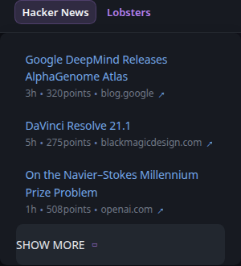

# Group

[Widgets](../widgets.md) · [Configuration](../configuration.md) · [Glance README](../../README.md)

Group multiple widgets into a tabbed interface. Each child widget becomes a tab, making Group useful when several widgets should share the same dashboard space.

Groups can contain other groups for nested tab navigation. A `split-column` widget cannot be placed inside a Group.

## Quick start

```yaml
- type: group
  widgets:
    - type: reddit
      subreddit: gamingnews
      show-thumbnails: true
      collapse-after: 6
    - type: reddit
      subreddit: games
    - type: reddit
      subreddit: pcgaming
      show-thumbnails: true
```

### Preview



## Configuration

This widget also supports the [shared widget properties](../widgets.md#shared-properties).

| Property | Type | Required | Default |
| --- | --- | --- | --- |
| `widgets` | array | yes | — |

### `widgets`

Child widgets displayed as tabs. The child widget title is used as its tab label.

Group hides its own header and the headers of its immediate child widgets because those child titles are rendered as tabs instead.

## Nesting rules

- Groups can contain other Groups.
- A `split-column` cannot be placed inside a Group.
- Other widget types can be used as normal child widgets.

## Nested groups

A group can contain other group widgets to create multiple levels of tabs. The title of each nested group is used as the tab title in its parent group.

### Example

```yaml
- type: group
  widgets:
    - type: group
      title: Major Leagues
      widgets:
        - type: custom-api
          title: MLB
          url: https://example.com/mlb.json
          template: |
            <p>{{ .JSON.String "name" }}</p>

        - type: custom-api
          title: NFL
          url: https://example.com/nfl.json
          template: |
            <p>{{ .JSON.String "name" }}</p>

    - type: group
      title: College
      widgets:
        - type: custom-api
          title: NCAAF
          url: https://example.com/ncaaf.json
          template: |
            <p>{{ .JSON.String "name" }}</p>

        - type: custom-api
          title: NCAAM
          url: https://example.com/ncaam.json
          template: |
            <p>{{ .JSON.String "name" }}</p>
```

This produces an outer set of tabs for `Major Leagues` and `College`, with each tab containing its own inner set of tabs.

### Preview


## Reusing configuration with YAML anchors

To avoid repetition you can use [YAML anchors](https://support.atlassian.com/bitbucket-cloud/docs/yaml-anchors/) and share properties between widgets.

### Example

```yaml
- type: group
  define: &shared-properties
      type: reddit
      show-thumbnails: true
      collapse-after: 6
  widgets:
    - subreddit: gamingnews
      <<: *shared-properties
    - subreddit: games
      <<: *shared-properties
    - subreddit: pcgaming
      <<: *shared-properties
```


---

[Widgets](../widgets.md) · [Configuration](../configuration.md) · [Back to top](#group)
