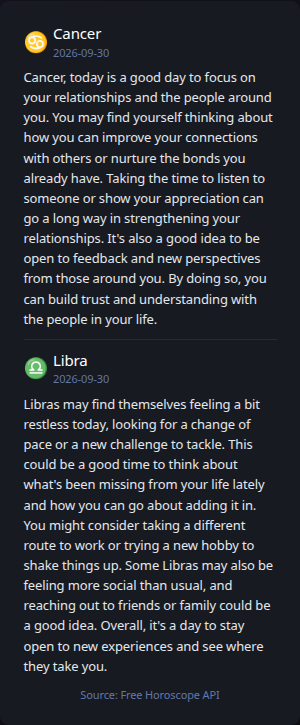
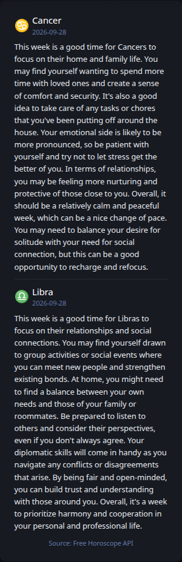
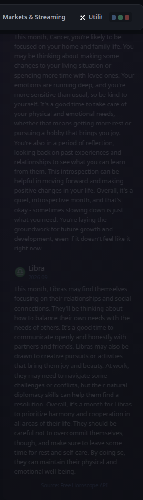

# Horoscope

[Widgets](../widgets.md) · [Configuration](../configuration.md) · [Glance README](../../README.md)

Display daily, weekly, or monthly sun-sign horoscope readings. The widget keeps the selected zodiac signs explicit rather than deriving them from birthdays, and supports a replaceable provider contract so the presentation is not tied permanently to one horoscope source.

## Quick start

```yaml
- type: horoscope
  signs:
    - cancer
    - libra
```

Recommended grouped presentation:

**Daily**



**Weekly**



**Monthly**



The default provider is `free-horoscope-api`, which currently exposes free keyless JSON endpoints for all twelve zodiac signs. No birthday, birth year, birth time, location, account, or API key is sent by this widget.

## Configuration

This widget also supports the [shared widget properties](../widgets.md#shared-properties).

| Property | Type | Required | Default |
| --- | --- | --- | --- |
| `signs` | list | yes | — |
| `periods` | list | no | `daily` |
| `provider` | string | no | `free-horoscope-api` |

### `signs`

Configure one or more zodiac signs explicitly. Valid values are `aries`, `taurus`, `gemini`, `cancer`, `leo`, `virgo`, `libra`, `scorpio`, `sagittarius`, `capricorn`, `aquarius`, and `pisces`.

```yaml
- type: horoscope
  signs:
    - cancer
    - libra
```

Duplicate signs are ignored while preserving the first configured order.

### `periods`

Valid values are `daily`, `weekly`, and `monthly`. A single widget may display any combination:

```yaml
- type: horoscope
  signs:
    - cancer
    - libra
  periods:
    - daily
    - weekly
    - monthly
```

For a more compact tabbed presentation, configure focused instances inside a Group:

```yaml
- type: group
  title: Horoscope
  widgets:
    - type: horoscope
      title: Daily
      signs: [cancer, libra]
      periods: [daily]

    - type: horoscope
      title: Weekly
      signs: [cancer, libra]
      periods: [weekly]

    - type: horoscope
      title: Monthly
      signs: [cancer, libra]
      periods: [monthly]
```

By default, Horoscope refreshes once per day shortly after midnight using the Glance process timezone. This keeps daily readings aligned with the calendar without assuming an undocumented publication boundary for weekly or monthly content. The shared `cache` or `cache-cron` properties can override that behavior.

### `provider`

`free-horoscope-api` is currently the only implemented provider and is therefore the default. The provider setting is explicit so additional legitimate horoscope sources can be added later without changing the public widget model.

> [!NOTE]
>
> Horoscope readings are provider-authored entertainment content rather than standardized data. Different horoscope publishers can produce different readings for the same zodiac sign and period.

---

[Widgets](../widgets.md) · [Configuration](../configuration.md) · [Back to top](#horoscope)
