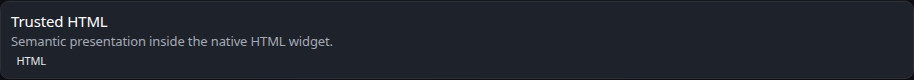

# HTML

[Widgets](../widgets.md) · [Configuration](../configuration.md) · [Glance README](../../README.md)

Render trusted HTML directly inside a Glance page.




## Quick start

```yaml
- type: html
  source: |
    <p>Hello, <span class="color-primary">World</span>!</p>
```

## Configuration

| Property | Type | Required | Default |
| --- | --- | --- | --- |
| `source` | string | yes | — |

All widgets also support the [shared widget properties](../widgets.md#shared-properties).

### `source`

HTML rendered directly by Glance. Use YAML block syntax (`|`) for multiline content.

> [!WARNING]
>
> The HTML widget renders trusted HTML without sanitizing it. Only configure content you control and trust.


---

[Widgets](../widgets.md) · [Configuration](../configuration.md) · [Back to top](#html)
