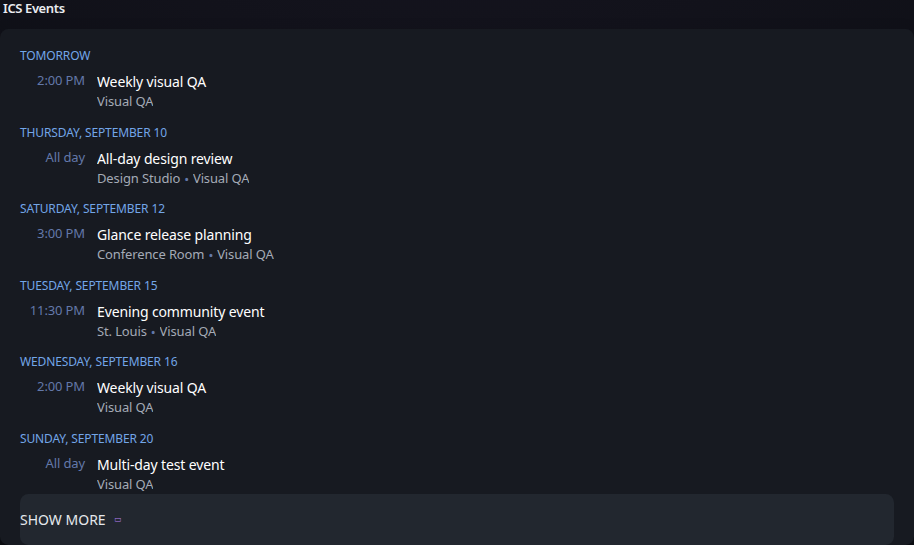

# ICS Events

[Widgets](../widgets.md) · [Configuration](../configuration.md) · [Glance README](../../README.md)

Display upcoming events from one or more iCalendar (`.ics`) sources as a chronological agenda.

Sources can be remote HTTP/HTTPS URLs or local files. Events from all available sources are merged and sorted by start time. Recurring events, recurrence dates and exclusions, recurrence overrides, cancellations, all-day events, multi-day events, and ICS timezones are supported.

## Quick start

```yaml
- type: ics-events
  title: Upcoming Events
  days-ahead: 14
  limit: 25
  collapse-after: 5
  sources:
    - url: https://example.com/calendar.ics
      title: Family
    - file: /config/calendars/maintenance.ics
      title: Maintenance
```

## Preview



## Configuration

This widget also supports the [shared widget properties](../widgets.md#shared-properties).

| Property | Type | Required | Default |
| --- | --- | --- | --- |
| `sources` | array | yes | — |
| `days-ahead` | integer | no | `14` |
| `limit` | integer | no | `25` |
| `collapse-after` | integer | no | `5` |

### `sources`
An array of iCalendar sources. Each source must specify exactly one of `url` or `file`.

Remote sources are fetched over HTTP or HTTPS and use conditional requests when the server provides `ETag` or `Last-Modified` headers. Local file paths refer to files accessible to the Glance process. When running Glance in a container, local calendar files must therefore be mounted into the container.

If one source fails while another succeeds, events from the successful sources remain available and the widget reports a degraded refresh. If all sources fail, previously fetched widget content is retained while the widget reports the refresh error.

Properties for each source:

| Property | Type | Required | Default |
| --- | --- | --- | --- |
| `url` | string | conditional | — |
| `file` | string | conditional | — |
| `title` | string | no | — |
| `timeout` | duration | no | — |
| `allow-insecure` | boolean | no | `false` |
| `headers` | key-value map | no | — |
| `basic-auth` | object | no | — |

#### `url`
The HTTP or HTTPS URL of a remote iCalendar source. Specify either `url` or `file`, but not both.

#### `file`
The path to a local iCalendar file. Specify either `file` or `url`, but not both.

#### `title`
An optional source label shown with events from this source.

#### `timeout`
For remote URL sources, the maximum time to wait for the HTTP request.

#### `allow-insecure`
For remote URL sources, whether to allow invalid/self-signed certificates.

#### `headers`
Optional HTTP headers sent when fetching a remote URL source.

#### `basic-auth`
Optional HTTP Basic Authentication credentials for a remote URL source. These HTTP properties do not affect local file sources.

### `days-ahead`
The number of days ahead to include when loading events. Recurring events are expanded only within this bounded time window.

### `limit`
The maximum number of events shown after all sources have been merged and sorted.

### `collapse-after`
The number of events to show before the remaining events are collapsed. Set to `-1` to disable collapsing.


---

[Widgets](../widgets.md) · [Configuration](../configuration.md) · [Back to top](#ics-events)
