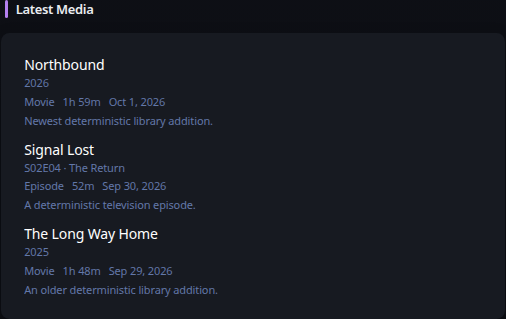

# Latest Media

[Widgets](../widgets.md) · [Configuration](../configuration.md) · [Glance README](../../README.md)

Display the newest library additions from Plex, Jellyfin, Emby, or Navidrome through one normalized widget.

## Quick start

```yaml
- type: latest-media
  service: plex
  server: https://plex.example.com
  api-key: ${PLEX_TOKEN}
```

Preview:



## Configuration

This widget also supports the [shared widget properties](../widgets.md#shared-properties).

| Name | Type | Required | Default |
| ---- | ---- | -------- | ------- |
| service | `plex`, `jellyfin`, `emby`, or `navidrome` | yes | |
| server | string | yes | |
| api-key | string | Plex/Jellyfin/Emby | |
| username | string | Navidrome | |
| password | string | Navidrome | |
| limit | integer | no | `10` |
| collapse-after | integer | no | `0` |
| timeout | duration string | no | |
| allow-insecure | bool | no | `false` |

Plex reads `/library/recentlyAdded`. Jellyfin and Emby read `/Items` ordered by creation date. Navidrome uses the Subsonic `getAlbumList2` API with `type=newest`. Provider responses are normalized into title, subtitle, media type, date, duration, summary, and artwork fields before rendering.

### Authentication

Plex uses `X-Plex-Token`. Jellyfin uses `Authorization: MediaBrowser Token="..."`; Emby uses `X-Emby-Token`. Navidrome uses Subsonic token authentication derived from `username` and `password`. Credentials remain server-side and are never rendered into the widget HTML.

### Artwork and resource proxy

Artwork is rendered only through Glance's resource proxy. Add each media server origin to `server.resource-proxy.allowed-origins`. Provider credentials needed to retrieve protected artwork are used only in the server-side source URL passed to the proxy; the browser receives only the opaque resource-proxy URL. If artwork cannot be proxied, the item remains visible without artwork.

### HTTP behavior

`timeout` and `allow-insecure` use Glance's shared HTTP client behavior. Requests use the widget refresh context so cancellation propagates promptly. Structured HTTP status errors participate in the normal stale/degraded widget lifecycle.

---

[Widgets](../widgets.md) · [Configuration](../configuration.md) · [Back to top](#latest-media)
