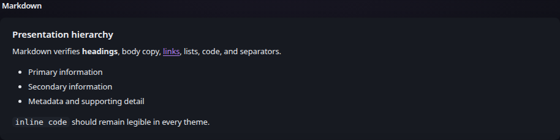

# Markdown

[Widgets](../widgets.md) · [Configuration](../configuration.md) · [Glance README](../../README.md)

Render GitHub Flavored Markdown from inline configuration or a file accessible to Glance.

## Quick start

### Inline Markdown

```yaml
- type: markdown
  title: Notes
  source: |
    ## Hello

    This is **Markdown**.
```

### File-backed Markdown

```yaml
- type: markdown
  title: Notes
  file: /config/notes.md
  cache: 5m
```

## Preview



## Configuration
| Property | Type | Required | Default |
| --- | --- | --- | --- |
| `source` | string | conditional | — |
| `file` | string | conditional | — |

Exactly one of `source` or `file` must be configured.

All widgets also support the [shared widget properties](../widgets.md#shared-properties). File-backed Markdown uses a default `cache` duration of `5m`; inline Markdown does not periodically refresh.

### `source`
Inline Markdown content. Inline Markdown is rendered when the configuration is loaded and does not require periodic refreshes.

### `file`
Path to a Markdown file accessible from inside the Glance container. File-backed Markdown is refreshed every 5 minutes by default. Use the standard `cache` property to change the refresh interval.

If a file cannot be read during a refresh, the last successfully rendered content remains visible and the widget reports the refresh error through the normal Glance widget status.

Markdown uses GitHub Flavored Markdown features including tables, strikethrough, autolinks and task lists. Raw HTML embedded in Markdown is not rendered, and potentially dangerous link destinations are not emitted as executable links. Use the [HTML](html.md) widget when trusted arbitrary HTML is intentionally required.


---

[Widgets](../widgets.md) · [Configuration](../configuration.md) · [Back to top](#markdown)
