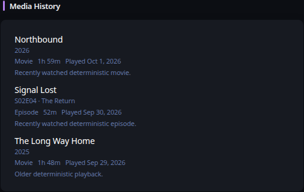

# Media History

[Widgets](../widgets.md) · [Configuration](../configuration.md) · [Glance README](../../README.md)

Display recently consumed media from Plex, Jellyfin, or Emby through the same normalized media presentation used by Latest Media.

## Quick start

```yaml
- type: media-history
  service: plex
  server: https://plex.example.com
  api-key: ${PLEX_TOKEN}
```

Preview:



## Configuration

This widget also supports the [shared widget properties](../widgets.md#shared-properties).

| Name | Type | Required | Default |
| ---- | ---- | -------- | ------- |
| service | `plex`, `jellyfin`, or `emby` | yes | |
| server | string | yes | |
| api-key | string | yes | |
| user-id | string | Jellyfin/Emby | |
| limit | integer | no | `10` |
| collapse-after | integer | no | `0` |
| timeout | duration string | no | |
| allow-insecure | bool | no | `false` |

### Provider semantics

Plex uses its playback history endpoint and therefore represents true history records. Jellyfin and Emby query the selected user's played items ordered by `DatePlayed`; those providers therefore represent **recently played state**, not an immutable event-by-event playback log. The widget deliberately labels both presentations as recently played media without claiming identical provider semantics.

Navidrome is intentionally not supported by this widget because the Subsonic API does not provide an equivalent playback-history contract suitable for this normalized view.

### Authentication and artwork

Plex uses `X-Plex-Token`; Jellyfin uses `Authorization: MediaBrowser Token="..."`; Emby uses `X-Emby-Token`. Credentials remain server-side. Artwork follows the same resource-proxy contract as Latest Media: protected provider artwork URLs are supplied only to Glance's server-side resource proxy, while the browser receives the opaque proxy URL. Add the media server origin to `server.resource-proxy.allowed-origins`.

### HTTP behavior

`timeout` and `allow-insecure` use Glance's shared HTTP client behavior. Requests use the widget refresh context so cancellation propagates promptly. Structured HTTP status errors participate in the normal stale/degraded widget lifecycle.

---

[Widgets](../widgets.md) · [Configuration](../configuration.md) · [Back to top](#media-history)
