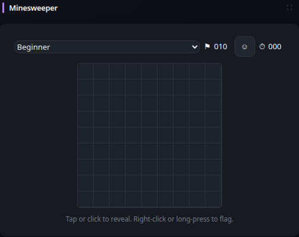

# Minesweeper

[Widgets](../widgets.md) · [Configuration](../configuration.md) · [Glance README](../../README.md)

Play classic Minesweeper directly in Glance. The game runs entirely in the browser and requires no external service or network connection.

## Quick start

```yaml
- type: minesweeper
```

Preview:



The default difficulty is `beginner`. The widget also supports `intermediate` and `expert`:

```yaml
- type: minesweeper
  difficulty: intermediate
```

| Difficulty | Board | Mines |
| --- | ---: | ---: |
| `beginner` | 9 x 9 | 10 |
| `intermediate` | 16 x 16 | 40 |
| `expert` | 30 x 16 | 99 |

Click or tap a cell to reveal it. Right-click or long-press a cell to flag or unflag it. Revealed numbered cells support chording when the surrounding flag count matches the number. The first revealed cell is always safe.

Use the widget expand control for a larger playing surface, especially for the 30 x 16 Expert board. The expanded game starts as a fresh game using the configured initial difficulty.

Game state is intentionally browser-local and transient. Reloading the page starts a new game.

## Configuration

### `difficulty`

Optional. Sets the initial board difficulty to `beginner`, `intermediate`, or `expert`. Defaults to `beginner`. The difficulty can also be changed directly in the widget while playing.

The widget has no required configuration properties beyond the standard [shared widget properties](../widgets.md#shared-properties).

---

[Widgets](../widgets.md) · [Configuration](../configuration.md) · [Back to top](#minesweeper)
