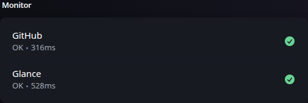

# Monitor

[Widgets](../widgets.md) · [Configuration](../configuration.md) · [Glance README](../../README.md)


Display a list of sites and whether they are reachable (online) or not. This is determined by sending a GET request to the specified URL, if the response is 200 then the site is OK. The time it took to receive a response is also shown in milliseconds.

Example:
## Quick start


```yaml
- type: monitor
  cache: 1m
  title: Services
  sites:
    - title: Jellyfin
      url: https://jellyfin.yourdomain.com
      icon: /assets/jellyfin-logo.png
    - title: Gitea
      url: https://gitea.yourdomain.com
      icon: /assets/gitea-logo.png
    - title: Immich
      url: https://immich.yourdomain.com
      icon: /assets/immich-logo.png
    - title: AdGuard Home
      url: https://adguard.yourdomain.com
      icon: /assets/adguard-logo.png
    - title: Vaultwarden
      url: https://vault.yourdomain.com
      icon: /assets/vaultwarden-logo.png
```

Preview:



You can hover over the "ERROR" text to view more information.

## Configuration

This widget also supports the [shared widget properties](../widgets.md#shared-properties).

| Name | Type | Required | Default |
| ---- | ---- | -------- | ------- |
| sites | array | yes | |
| style | string | no | |
| show-failing-only | boolean | no | false |

### `show-failing-only`
Shows only a list of failing sites when set to `true`.

### `style`
Used to change the appearance of the widget. Possible values are `compact`.

Preview of `compact`:


### `sites`

Properties for each site:

| Name | Type | Required | Default |
| ---- | ---- | -------- | ------- |
| title | string | yes | |
| url | string | yes | |
| check-url | string | no | |
| error-url | string | no | |
| icon | string | no | |
| timeout | string | no | 3s |
| allow-insecure | boolean | no | false |
| headers | key & value | no | |
| same-tab | boolean | no | false |
| alt-status-codes | array | no | |
| basic-auth | object | no | |

`title`

The title used to indicate the site.

`url`

The URL of the monitored service, which must be reachable by Glance, and will be used as the link to go to when clicking on the title. If `check-url` is not specified, this is used as the status check.

`check-url`

The URL which will be requested and its response will determine the status of the site. If not specified, the `url` property is used.

`error-url`

If the monitored service returns an error, the user will be redirected here. If not specified, the `url` property is used.

`icon`

See [Icons](../configuration.md#icons) for more information on how to specify icons.

`timeout`

How long to wait for a response from the server before considering it unreachable. The value is a string and must be a number followed by one of s, m, h, d. Example: `5s` for 5 seconds, `1m` for 1 minute, etc.

`allow-insecure`

Whether to ignore invalid/self-signed certificates.

`same-tab`

Whether to open the link in the same or a new tab.

`alt-status-codes`

Status codes other than 200 that you want to return "OK".

```yaml
alt-status-codes:
  - 403
```

`basic-auth`

HTTP Basic Authentication credentials for protected sites.

```yaml
basic-auth:
  username: your-username
  password: your-password
```


---

[Widgets](../widgets.md) · [Configuration](../configuration.md) · [Back to top](#monitor)
