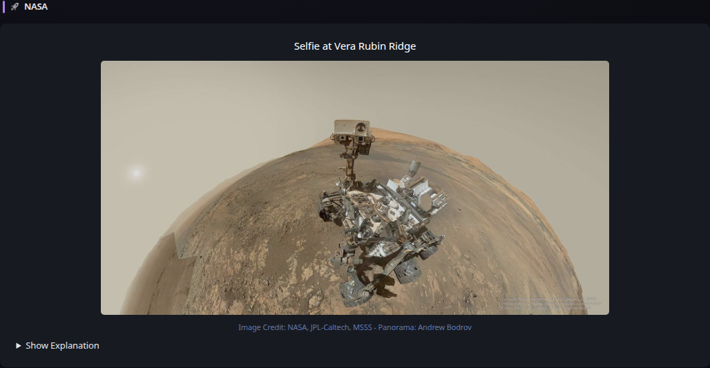

# NASA Astronomy Picture of the Day

[Widgets](../widgets.md) · [Configuration](../configuration.md) · [Glance README](../../README.md)

Display NASA's Astronomy Picture of the Day using the official NASA Science APOD feed. Image entries show the APOD title, image, available credit and copyright information, and an optional explanation. Select the image to open the shared click-to-enlarge viewer.

## Quick start

```yaml
- type: nasa-apod
  icon: mdi:rocket-launch
```

Preview:



## Configuration

This widget supports the [shared widget properties](../widgets.md#shared-properties). It requires no API key and caches successful APOD data for 24 hours by default; normal cache overrides remain available. The current presentation displays image APOD entries. When the current entry uses another media type, the widget displays `No image available today.`

Provider explanation, credit, and copyright fields are normalized to plain text rather than rendering provider HTML directly. Remote APOD imagery uses Glance's resource handling, and later provider failures preserve previously successful content through the standard stale/degraded lifecycle.

---

[Widgets](../widgets.md) · [Configuration](../configuration.md) · [Back to top](#nasa-astronomy-picture-of-the-day)
