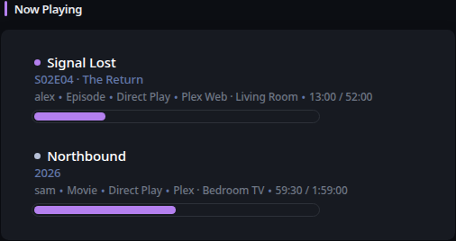

# Now Playing

[Widgets](../widgets.md) · [Configuration](../configuration.md) · [Glance README](../../README.md)

Display active playback sessions from Plex, Jellyfin, Emby, or Navidrome through one normalized native widget.

## Quick start

```yaml
- type: now-playing
  service: plex
  server: https://plex.example.com
  api-key: ${PLEX_TOKEN}
```

Preview:



## Configuration

This widget also supports the [shared widget properties](../widgets.md#shared-properties).

| Name | Type | Required | Default |
| ---- | ---- | -------- | ------- |
| service | `plex`, `jellyfin`, `emby`, or `navidrome` | yes | |
| server | string | yes | |
| api-key | string | Plex/Jellyfin/Emby | |
| username | string | Navidrome | |
| password | string | Navidrome | |
| limit | integer | no | `10` |
| show-paused | bool | no | `false` |
| show-thumbnail | bool | no | `false` |
| show-progress-bar | bool | no | `false` |
| show-progress-info | bool | no | `true` |
| timeout | duration string | no | |
| allow-insecure | bool | no | `false` |

The default cache duration is 30 seconds.

## Provider semantics

Plex reads `/status/sessions`. Jellyfin and Emby read `/Sessions` and ignore connected clients that do not contain a `NowPlayingItem`. Navidrome uses the Subsonic `getNowPlaying` API. Provider responses are normalized into media title, subtitle, user, client/device, playback state, play method, position, duration, progress, and artwork.

Paused sessions are hidden by default and can be included with `show-paused: true`. An empty successful response renders `Nothing is playing right now.` rather than an error state.

### Authentication

Plex uses `X-Plex-Token`. Jellyfin uses `Authorization: MediaBrowser Token="..."`. Emby uses `X-Emby-Token`. Navidrome uses Subsonic token authentication derived from `username` and `password`. Credentials remain server-side and are never rendered into widget HTML.

### Artwork and resource proxy

Artwork is rendered only through Glance's resource proxy. Add each media server origin to `server.resource-proxy.allowed-origins`. If artwork cannot be proxied, the session remains visible without artwork.

### HTTP behavior

`timeout` and `allow-insecure` use Glance's shared HTTP client behavior. Requests use the widget refresh context so cancellation propagates promptly. Structured HTTP status errors participate in the normal stale/degraded widget lifecycle.

---

[Widgets](../widgets.md) · [Configuration](../configuration.md) · [Back to top](#now-playing)
