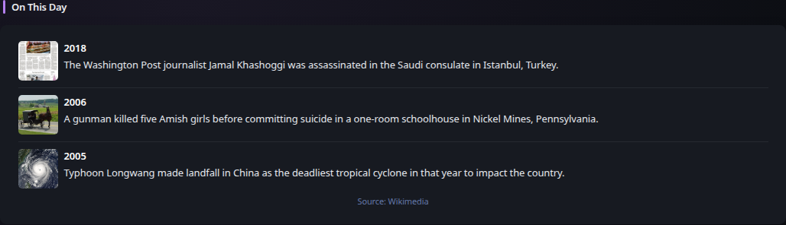

# On This Day

[Widgets](../widgets.md) · [Configuration](../configuration.md) · [Glance README](../../README.md)

Display curated historical events for the current month and day from Wikimedia’s On This Day feed.

## Quick start

```yaml
- type: on-this-day
  limit: 3
```

Preview:



## Configuration

This widget supports the [shared widget properties](../widgets.md#shared-properties) plus `limit`, which defaults to `3`. It requires no API key and refreshes shortly after midnight by default. Article links and thumbnails are optional enrichment; an event remains usable without either.

---

[Widgets](../widgets.md) · [Configuration](../configuration.md) · [Back to top](#on-this-day)
