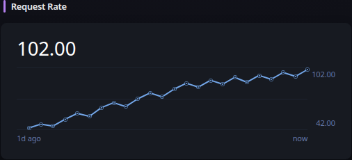

# Prometheus

[Widgets](../widgets.md) · [Configuration](../configuration.md) · [Glance README](../../README.md)

Display a responsive line graph for a PromQL range query. The query must return exactly one time series; aggregate or filter queries that can return multiple series so the displayed result is deterministic.

## Quick start

```yaml
- type: prometheus
  title: Request Rate
  server: https://prometheus.example.com
  query: sum(rate(http_requests_total[5m]))
  link: https://grafana.example.com/d/example
  range: 24h
  unit: compact-number
```

Preview:



## Configuration

This widget also supports the [shared widget properties](../widgets.md#shared-properties).

| Name | Type | Required | Default |
| ---- | ---- | -------- | ------- |
| server | string | yes | |
| query | string | yes | |
| link | string | no | |
| range | duration | no | 24h |
| step | duration | no | automatic |
| headers | key/value map | no | |
| timeout | duration string | no | |
| allow-insecure | bool | no | false |
| unit | string | no | number |
| show-value | bool | no | true |
| show-scale | bool | no | false |
| show-time-labels | bool | no | false |

### `server`
The base URL of the Prometheus-compatible server. Glance appends `/api/v1/query_range`. HTTP and HTTPS URLs are supported, including path prefixes; query strings and fragments are not.

### `query`
The PromQL expression to evaluate. It must return exactly one matrix series. Use aggregation such as `sum(...)` or label matchers when the underlying metric can return multiple series.

### `link`
An optional URL opened when the graph is clicked, such as a Grafana dashboard or Prometheus expression view.

### `range`
How far back the graph queries. The value must be positive. The default is `24h`.

### `step`
The Prometheus query resolution. When configured, the value must be positive. When omitted, Glance targets approximately 120 samples across the configured range, with a minimum step of one second.

### `headers`
Optional request headers, for example an authorization header required by a reverse proxy.

### `timeout`
The maximum time to wait for the Prometheus request.

### `allow-insecure`
Whether to accept invalid or self-signed TLS certificates.

### `unit`
Controls value formatting. Supported values are `number`, `compact-number`, `bytes`, `duration`, and `percent`. `percent` appends `%` without scaling, so ratios should be multiplied by 100 in PromQL when appropriate.

### `show-value`
Whether to show the latest finite sample above the graph.

### `show-scale`
Whether to show minimum and maximum values on the graph.

### `show-time-labels`
Whether to show the configured range and `now` below the graph.

---

[Widgets](../widgets.md) · [Configuration](../configuration.md) · [Back to top](#prometheus)
