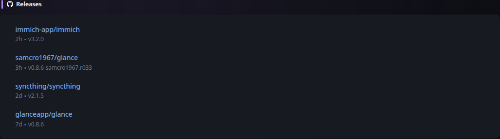

# Releases

[Widgets](../widgets.md) · [Configuration](../configuration.md) · [Glance README](../../README.md)

Display a list of latest releases for specific repositories on Github, GitLab, Codeberg or Docker Hub.

Example:
## Quick start


```yaml
- type: releases
  show-source-icon: true
  repositories:
    - go-gitea/gitea
    - jellyfin/jellyfin
    - samcro1967/glance
    - codeberg:redict/redict
    - gitlab:fdroid/fdroidclient
    - dockerhub:gotify/server
```

Preview:



## Configuration

This widget also supports the [shared widget properties](../widgets.md#shared-properties).

| Name | Type | Required | Default |
| ---- | ---- | -------- | ------- |
| repositories | array | yes |  |
| show-source-icon | boolean | no | false |  |
| token | string | no | |
| gitlab-token | string | no | |
| limit | integer | no | 10 |
| collapse-after | integer | no | 5 |

### `repositories`
A list of repositores to fetch the latest release for. Only the name/repo is required, not the full URL. A prefix can be specified for repositories hosted elsewhere such as GitLab, Codeberg and Docker Hub. Example:

```yaml
repositories:
  - gitlab:inkscape/inkscape
  - dockerhub:grafana/grafana
  - codeberg:redict/redict
```

Official images on Docker Hub can be specified by omitting the owner:

```yaml
repositories:
  - dockerhub:nginx
  - dockerhub:node
  - dockerhub:alpine
```

You can also specify exact tags for Docker Hub images:

```yaml
repositories:
  - dockerhub:nginx:latest
  - dockerhub:nginx:stable-alpine
```

To include prereleases you can specify the repository as an object and use the `include-prereleases` property:

**Note: This feature is currently only available for GitHub repositories.**

```yaml
repositories:
  - gitlab:inkscape/inkscape
  - repository: samcro1967/glance
    include-prereleases: true
  - codeberg:redict/redict
```

### `show-source-icon`
Shows an icon of the source (GitHub/GitLab/Codeberg/Docker Hub) next to the repository name when set to `true`.

### `token`
Without authentication Github allows for up to 60 requests per hour. You can easily exceed this limit and start seeing errors if you're tracking lots of repositories or your cache time is low. To circumvent this you can [create a read only token from your Github account](https://github.com/settings/personal-access-tokens/new) and provide it here.

You can also specify the value for this token through an ENV variable using the syntax `${GITHUB_TOKEN}` where `GITHUB_TOKEN` is the name of the variable that holds the token. If you've installed Glance through docker you can specify the token in your docker-compose:

```yaml
services:
  glance:
    image: ghcr.io/samcro1967/glance:latest
    environment:
      - GITHUB_TOKEN=<your token>
```

and then use it in your `glance.yml` like this:

```yaml
- type: releases
  token: ${GITHUB_TOKEN}
  repositories: ...
```

This way you can safely check your `glance.yml` in version control without exposing the token.

### `gitlab-token`
Same as the above but used when fetching GitLab releases.

### `limit`
The maximum number of releases to show.

## `collapse-after`
How many releases are visible before the "SHOW MORE" button appears. Set to `-1` to never collapse.


---

[Widgets](../widgets.md) · [Configuration](../configuration.md) · [Back to top](#releases)
