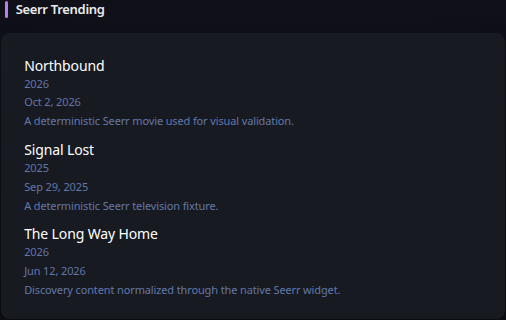

# Seerr

[Widgets](../widgets.md) · [Configuration](../configuration.md) · [Glance README](../../README.md)

Display discovery, requests, recently added media, or watchlist content from Seerr.

## Quick start

```yaml
- type: seerr
  server: https://seerr.example.com
  api-key: ${SEERR_API_KEY}
  view: trending
```

Preview:



## Configuration

This widget also supports the [shared widget properties](../widgets.md#shared-properties).

| Name | Type | Required | Default |
| ---- | ---- | -------- | ------- |
| server | string | yes | |
| api-key | string | yes | |
| view | `trending`, `movies`, `tv`, `upcoming-movies`, `upcoming-tv`, `requests`, `recently-added`, or `watchlist` | no | `trending` |
| limit | integer | no | `10` |
| collapse-after | integer | no | `0` |
| timeout | duration string | no | |
| allow-insecure | bool | no | `false` |

The API key is sent only from the Glance server in the `X-Api-Key` request header and is never rendered into browser URLs. The widget uses Seerr's `/api/v1` API.

### Views

`trending` combines trending movies and TV. `movies` and `tv` show Seerr discovery results. `upcoming-movies` and `upcoming-tv` use Seerr's upcoming discovery feeds. `requests` shows newest requests, `recently-added` shows newly available media, and `watchlist` shows the Seerr/Plex watchlist exposed by the configured account.

### Artwork and resource proxy

Poster paths returned by Seerr are resolved through TMDB and are rendered only through Glance's resource proxy. Add `https://image.tmdb.org` to `server.resource-proxy.allowed-origins`. If artwork is absent or the origin is not allowed, the item remains visible without artwork; Glance never falls back to exposing the source artwork URL directly.

### HTTP behavior

`timeout` and `allow-insecure` use Glance's shared HTTP client behavior. Requests use the widget refresh context so cancellation propagates promptly. Structured HTTP status errors participate in the normal stale/degraded widget lifecycle.

---

[Widgets](../widgets.md) · [Configuration](../configuration.md) · [Back to top](#seerr)
