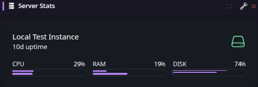
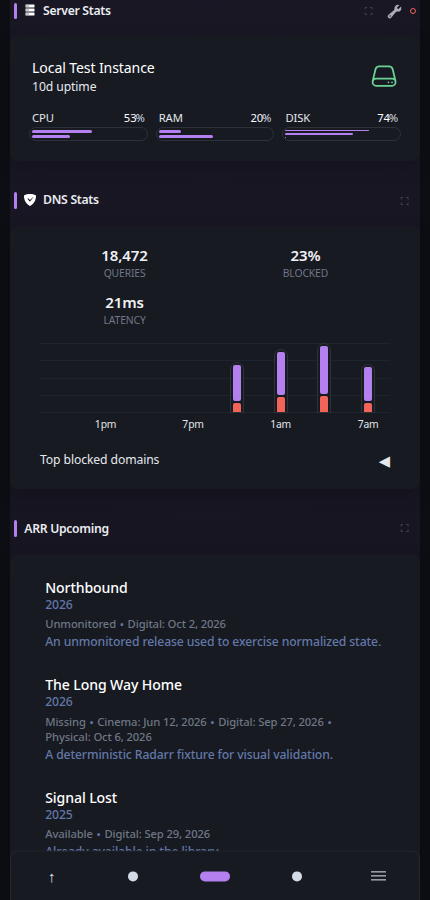
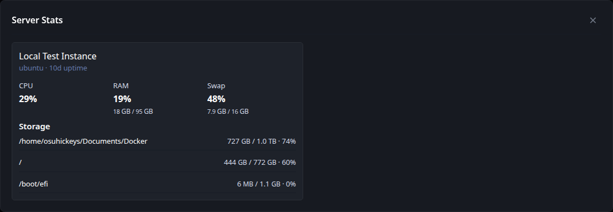

# Server Stats

[Widgets](../widgets.md) · [Configuration](../configuration.md) · [Glance README](../../README.md)

Display statistics such as CPU usage, memory usage and disk usage of the server Glance is running on or other servers.

Example:
## Quick start


```yaml
- type: server-stats
  servers:
    - type: local
      name: Services
```

Preview:


> [!NOTE]
>
> This widget is currently under development, some features might not function as expected or may change.

To display data from a remote server you need to have the Glance Agent running on that server. You can download the agent from [here](https://github.com/glanceapp/agent), though keep in mind that it is still in development and may not work as expected. Support for other providers such as Glances will be added in the future.

In the event that the CPU temperature goes over 80°C, a flame icon will appear next to the CPU. The progress indicators will also turn red (or the equivalent of your negative color) to hopefully grab your attention if anything is unusually high:




**Mobile preview:**



## Expanded view

Use the expand control in the widget header to open detailed cards for the configured servers. The expanded view shows reachability, platform and uptime information, CPU load and temperature, RAM and optional swap usage, and each visible mountpoint with its individual storage usage.



## Configuration

This widget also supports the [shared widget properties](../widgets.md#shared-properties).
| Name | Type | Required | Default |
| ---- | ---- | -------- | ------- |
| servers | array | no |  |

### `servers`
If not provided it will display the statistics of the server Glance is running on.

### Properties for both `local` and `remote` servers
| Name | Type | Required | Default |
| ---- | ---- | -------- | ------- |
| type | string | yes |  |
| name | string | no |  |
| hide-swap | boolean | no | false |

#### `type`
Whether to display statistics for the local server or a remote server. Possible values are `local` and `remote`.

#### `name`
The name of the server which will be displayed on the widget. If not provided it will default to the server's hostname.

#### `hide-swap`
Whether to hide the swap usage.

### Additional properties for the `local` server
| Name | Type | Required | Default |
| ---- | ---- | -------- | ------- |
| cpu-temp-sensor | string | no |  |

### Mountpoint properties for both `local` and `remote` servers
| Name | Type | Required | Default |
| ---- | ---- | -------- | ------- |
| hide-mountpoints-by-default | boolean | no | false |
| mountpoint-order | string | no | usage |
| mountpoints | map\[string\]object | no |  |

#### `cpu-temp-sensor`
The name of the sensor to use for the CPU temperature. When not provided the widget will attempt to find the correct one, if it fails to do so the temperature will not be displayed. To view the available sensors you can use `sensors` command.

#### `hide-mountpoints-by-default`
If set to `true` you'll have to manually make each mountpoint visible by adding a `hide: false` property to it like so:

```yaml
- type: server-stats
  servers:
    - type: local
      hide-mountpoints-by-default: true
      mountpoints:
        "/":
          hide: false
        "/mnt/data":
          hide: false
```

This is useful if you're running Glance inside of a container which usually mounts a lot of irrelevant filesystems.

#### `mountpoint-order`
Controls the order in which mountpoints are displayed. Possible values are:

- `usage` — highest disk usage first. This is the default and preserves the existing behavior.
- `name` — alphabetical by the displayed mountpoint name. If no custom name is configured, the mountpoint path is used.
- `path` — alphabetical by mountpoint path.

The selected order applies consistently to the disk percentage shown in the widget, the combined disk progress bar, and the mountpoint popover.

Example:

```yaml
- type: server-stats
  servers:
    - type: local
      mountpoint-order: name
      mountpoints:
        "/mnt/disk1":
          name: Disk 1
        "/mnt/disk2":
          name: Disk 2
        "/mnt/cache":
          name: Cache
```

#### `mountpoints`
A map of mountpoints to display disk usage for. The key is the path to the mountpoint and the value is an object with optional properties. For remote servers, these settings filter and rename mountpoints reported by the remote agent; they cannot add paths that the agent did not report. Example:

```yaml
mountpoints:
  "/":
    name: Root
  "/mnt/data":
    name: Data
  "/boot/efi":
    hide: true
```

### Properties for each `mountpoint`
| Name | Type | Required | Default |
| ---- | ---- | -------- | ------- |
| name | string | no |  |
| hide | boolean | no | false |

#### `name`
The name of the mountpoint which will be displayed on the widget. If not provided it will default to the mountpoint's path.

#### `hide`
Whether to hide this mountpoint from the widget.

### Properties for `remote` servers
| Name | Type | Required | Default |
| ---- | ---- | -------- | ------- |
| url | string | yes |  |
| token | string | no |  |
| timeout | string | no | 3s |
| allow-insecure | boolean | no | false |

#### `url`
The URL and port of the server to fetch the statistics from.

#### `token`
The authentication token to use when fetching the statistics.

#### `timeout`
The maximum time to wait for a response from the server. The value is a string and must be a number followed by one of s, m, h, d. Example: `10s` for 10 seconds, `1m` for 1 minute, etc.

#### `allow-insecure`
Whether to allow invalid/self-signed certificates when fetching statistics from a remote server.


---

[Widgets](../widgets.md) · [Configuration](../configuration.md) · [Back to top](#server-stats)
