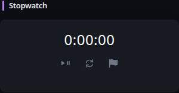

# Stopwatch

[Widgets](../widgets.md) · [Configuration](../configuration.md) · [Glance README](../../README.md)


Measure elapsed time directly in the browser, with pause, resume, reset, and lap controls. Stopwatch state is intentionally ephemeral and resets when the page is reloaded or revisited.

Example:
## Quick start


```yaml
- type: stopwatch
  start-on-open: false
```

Preview:



Use the play/pause control to start, pause, or resume the stopwatch. The reset control clears elapsed time and recorded laps. The lap control records the current elapsed time without stopping the stopwatch.

## Configuration

This widget also supports the [shared widget properties](../widgets.md#shared-properties).

| Name | Type | Required | Default |
| ---- | ---- | -------- | ------- |
| start-on-open | boolean | no | false |

### `start-on-open`

Start measuring elapsed time as soon as the widget is initialized. When disabled, the stopwatch waits for the play control.

The Stopwatch widget runs entirely in the browser. It does not refresh on the server, persist state, or synchronize state between browsers.


---

[Widgets](../widgets.md) · [Configuration](../configuration.md) · [Back to top](#stopwatch)
