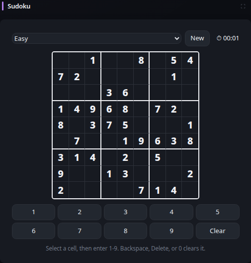

# Sudoku

[Widgets](../widgets.md) · [Configuration](../configuration.md) · [Glance README](../../README.md)

Play standard 9 x 9 Sudoku directly in Glance. Puzzles are generated locally in the browser, have a unique solution, and require no external service or network connection.

## Quick start

```yaml
- type: sudoku
```

Preview:



The default difficulty is `easy`. The widget also supports `medium` and `hard`:

```yaml
- type: sudoku
  difficulty: medium
```

Select a cell and enter a number from 1 through 9 using the keyboard or the on-screen keypad. Backspace, Delete, `0`, or the Clear button clears an editable cell. Given cells cannot be changed. The selected row, column, and 3 x 3 box are highlighted, matching numbers are emphasized, and incorrect entries are rejected immediately.

The elapsed timer starts with each new puzzle. Use the New button to generate another puzzle at the current difficulty, or change the difficulty directly in the widget. The expanded widget starts as a fresh puzzle using the configured initial difficulty.

Game state is intentionally browser-local and transient. Reloading the page starts a new puzzle.

## Configuration

### `difficulty`

Optional. Sets the initial puzzle difficulty to `easy`, `medium`, or `hard`. Defaults to `easy`. Difficulty controls how many clues the generator attempts to retain while preserving exactly one solution. The difficulty can also be changed directly in the widget while playing.

The widget has no required configuration properties beyond the standard [shared widget properties](../widgets.md#shared-properties).

---

[Widgets](../widgets.md) · [Configuration](../configuration.md) · [Back to top](#sudoku)
