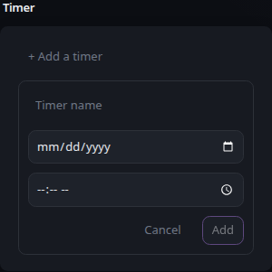

# Timer

[Widgets](../widgets.md) · [Configuration](../configuration.md) · [Glance README](../../README.md)


Create countdown timers for specific dates and times. Timers can be added, edited, deleted, and reordered directly in the widget.

Timer data is stored in the browser's local storage and is not stored or synchronized by the Glance server. Timers therefore remain specific to the browser and browser profile where they were created.

Example:
## Quick start


```yaml
- type: timer
  id: important-dates
  hour-format: 12h
```

Preview:



To edit a timer, click its name or target date and time. To reorder timers, drag and drop them by grabbing the top side of a timer. Use the trash icon to delete a timer.

Countdowns display days, hours, and minutes as applicable. Once a target time has passed, the timer remains visible and shows the elapsed time followed by `ago`.

## Configuration

This widget also supports the [shared widget properties](../widgets.md#shared-properties).

| Name | Type | Required | Default |
| ---- | ---- | -------- | ------- |
| id | string | no | |
| hour-format | string | no | 12h |

### `id`

The ID used to store the timers in the browser's local storage. Timer widgets with the same ID share the same timers when viewed in the same browser profile. Specify different IDs for independent timer lists.

### `hour-format`

Whether target times are displayed in 12-hour or 24-hour format. Possible values are `12h` and `24h`.

Dates and times entered in the widget are interpreted as local calendar time in the browser. The Timer widget does not perform server-side timezone conversion or synchronization.


---

[Widgets](../widgets.md) · [Configuration](../configuration.md) · [Back to top](#timer)
