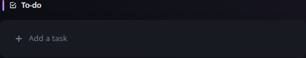
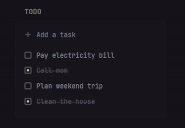

# Todo

[Widgets](../widgets.md) · [Configuration](../configuration.md) · [Glance README](../../README.md)


A simple to-do list that allows you to add, edit and delete tasks. The tasks are stored in the browser's local storage.

Example:
## Quick start


```yaml
- type: to-do
```

Preview:



To reorder tasks, drag and drop them by grabbing the top side of the task:



To delete a task, hover over it and click on the trash icon.

## Configuration

This widget also supports the [shared widget properties](../widgets.md#shared-properties).

| Name | Type | Required | Default |
| ---- | ---- | -------- | ------- |
| id | string | no | |

### `id`

The ID of the todo list. If you want to have multiple todo lists, you must specify a different ID for each one. By default, the ID is used to store tasks in the browser's local storage, so todo widgets with the same ID share the same tasks in that browser profile.

When authenticated [server-side personal state](../configuration.md#personal-state) is enabled, the same ID scopes the user's server-side todo list instead. Existing valid browser-local tasks are migrated the first time no server value exists for that user and ID.

## Keyboard shortcuts
| Keys | Action | Condition |
| ---- | ------ | --------- |
| <kbd>Enter</kbd> | Add a task to the bottom of the list | When the "Add a task" field is focused |
| <kbd>Ctrl</kbd> + <kbd>Enter</kbd> | Add a task to the top of the list | When the "Add a task" field is focused |
| <kbd>Down Arrow</kbd> | Focus the last task that was added | When the "Add a task" field is focused |
| <kbd>Escape</kbd> | Focus the "Add a task" field | When a task is focused |


---

[Widgets](../widgets.md) · [Configuration](../configuration.md) · [Back to top](#todo)
