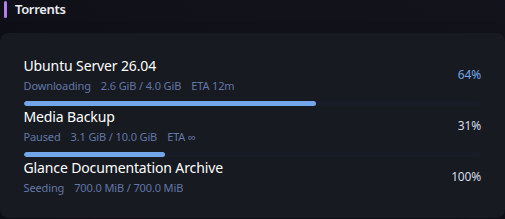

# Torrenting

[Widgets](../widgets.md) · [Configuration](../configuration.md) · [Glance README](../../README.md)

Display qBittorrent download and seeding activity with normalized state, progress, transferred size, and ETA information. The widget uses qBittorrent's Web API and keeps authentication server-side.

## Quick start

```yaml
- type: torrenting
  server: https://qbittorrent.example.com
  api-key: ${QBITTORRENT_API_KEY}
```

Username/password session authentication is also supported:

```yaml
- type: torrenting
  server: https://qbittorrent.example.com
  username: ${QBITTORRENT_USERNAME}
  password: ${QBITTORRENT_PASSWORD}
  hide-completed: true
  collapse-after: 5
```

Preview:



## Configuration

This widget also supports the [shared widget properties](../widgets.md#shared-properties).

| Name | Type | Required | Default |
| ---- | ---- | -------- | ------- |
| server | string | yes | |
| api-key | string | no | |
| username | string | no | |
| password | string | no | |
| hide-completed | bool | no | false |
| hide-inactive | bool | no | false |
| hide-progress | bool | no | false |
| collapse-after | integer | no | 0 |
| timeout | duration string | no | |
| allow-insecure | bool | no | false |

### Authentication

`api-key` sends a Bearer authorization header and is preferred when the qBittorrent deployment supports API-key authentication. When `username` and `password` are configured instead, Glance uses qBittorrent's login endpoint and an HTTP cookie jar to own the resulting session cookies. Session-cookie names are intentionally not hard-coded. A failed authenticated fetch performs at most one login and one retry.

### Filtering and presentation

`hide-completed` removes torrents at 100% progress. `hide-inactive` removes torrents that are not actively downloading or uploading. `hide-progress` suppresses progress bars. `collapse-after` uses Glance's standard collapsible-list behavior.

### HTTP behavior

`timeout` and `allow-insecure` use Glance's shared HTTP client behavior. Requests use the widget refresh context so cancellation propagates promptly. Credentials and session data are never rendered into browser URLs.

---

[Widgets](../widgets.md) · [Configuration](../configuration.md) · [Back to top](#torrenting)
