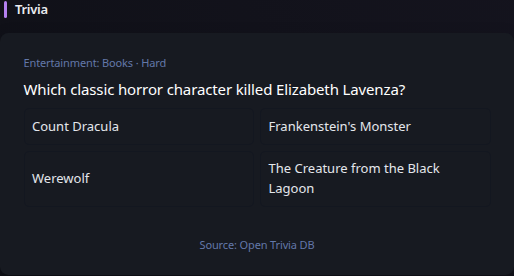
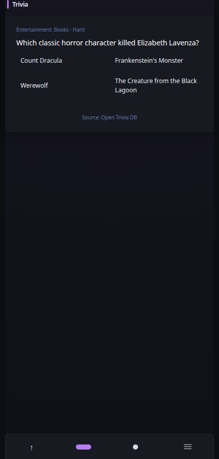

# Trivia

[Widgets](../widgets.md) · [Configuration](../configuration.md) · [Glance README](../../README.md)

Display one multiple-choice question from Open Trivia DB. Selecting an answer reveals the correct choice entirely in the browser; answer state is not persisted.

## Quick start

```yaml
- type: trivia
```

Preview:



**Mobile preview:**



## Configuration

This widget supports the [shared widget properties](../widgets.md#shared-properties). It requires no API key. It refreshes shortly after midnight by default. Provider HTML entities are decoded before rendering and answer choices are shuffled once when fresh content is accepted.

---

[Widgets](../widgets.md) · [Configuration](../configuration.md) · [Back to top](#trivia)
