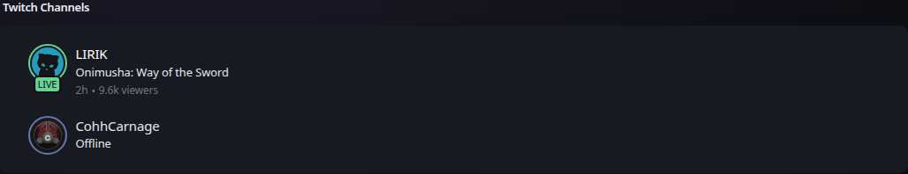

# Twitch Channels

[Widgets](../widgets.md) · [Configuration](../configuration.md) · [Glance README](../../README.md)

Display a list of channels from Twitch.

Example:
## Quick start


```yaml
- type: twitch-channels
  channels:
    - jembawls
    - giantwaffle
    - asmongold
    - cohhcarnage
    - j_blow
    - xQc
```

Preview:



## Configuration

This widget also supports the [shared widget properties](../widgets.md#shared-properties).
| Name | Type | Required | Default |
| ---- | ---- | -------- | ------- |
| channels | array | yes | |
| collapse-after | integer | no | 5 |
| sort-by | string | no | viewers |

### `channels`
A list of channels to display.

### `collapse-after`
How many channels are visible before the "SHOW MORE" button appears. Set to `-1` to never collapse.

### `sort-by`
Can be used to specify the order in which the channels are displayed. Possible values are `viewers` and `live`.


---

[Widgets](../widgets.md) · [Configuration](../configuration.md) · [Back to top](#twitch-channels)
